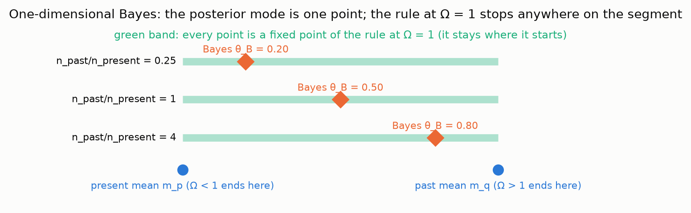
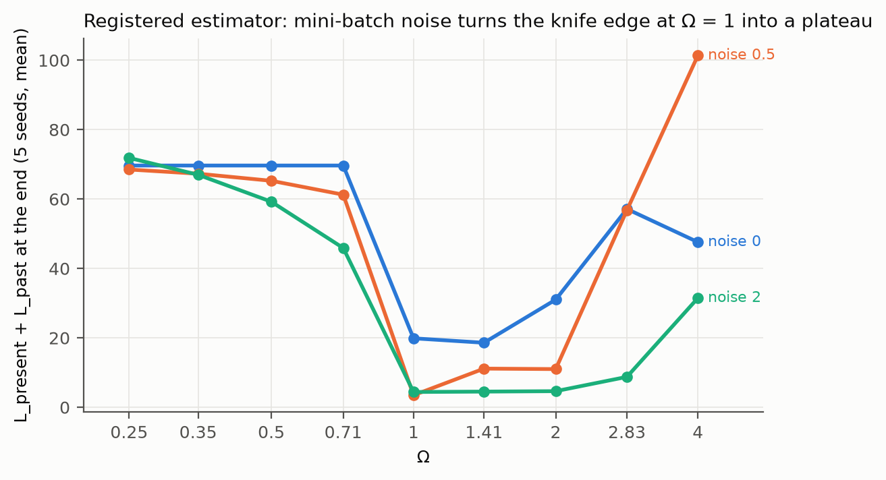
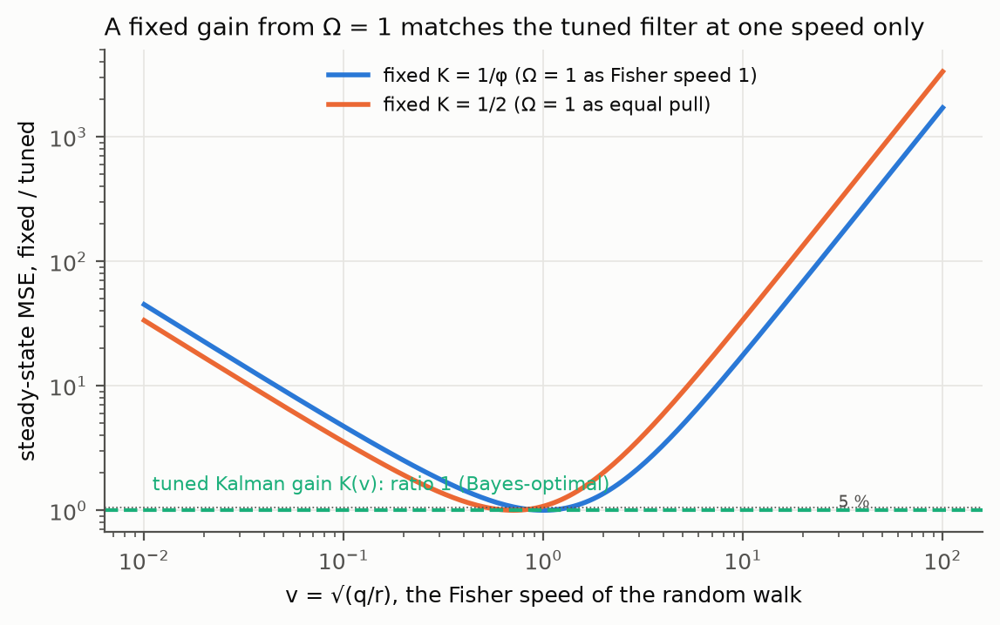
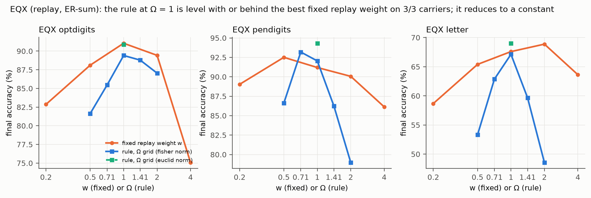

# Continuous Learning: the Ω = 1 normalised penalty step, from its mathematics to its tests

Technical specification and record, CRR re-validation repository, 2026-09-22. Owner request: prompt-log entry 72. Every number in this document is printed by a committed script whose output is pinned in the repository (rule R1): the study scorers (`runs/eq2/score.txt`, `runs/eq3/score.txt`), the mathematics check (`theory/checks/omega_sweeps.txt`), the gate (`prereg/eq3/gate_EQ2.txt`), the ledger (`ledger/LEDGER.md`) and the figure script of this folder (`figures/figures.txt`). The full code sets are reproduced in Appendix A and the pinned outputs in Appendix B. Nothing here is a finding under the repository's PASS levels; the status of every row is stated where it is quoted. Papers are cited where they were fetched on the day (PubMed) and otherwise named as context, not fetched (rule R10).

> This document is about one small rule for teaching a computer new things without making it forget old things. The rule has a dial on it called Omega. We did the mathematics of the dial, then we tested the rule on nine sets of data that nobody had used before, following strict rules so we could not fool ourselves. Boxes like this one say, in plain words, what each part means.

## 0. Summary of what was found

| question | answer | where |
|---|---|---|
| What does Ω mean? | The ratio between the length of the "past" pull and the length of the "present" pull after the rule has rescaled the past pull. Ω = 1 means equal lengths. | §3 |
| Is Ω = 1 a Bayes optimum? | No. The Bayes weight for combining two batches is a constant fixed by their sample counts. With exact gradients, Ω = 1 makes every point between the two task optima a fixed point, so the rule stops wherever it starts. | §4.3, §4.4, Fig. 12 |
| Is there a threshold either side of 1? | With exact gradients there is one knife edge at Ω = 1: below it the old task is eventually dropped, above it the new task is never learned. Smoothing and mini-batch noise turn the edge into a plateau. | §4.2, §4.6, Figs. 3–4 |
| Why does the rule help on an EWC penalty? | Its step is bounded by the present step, so it can run the penalty at or beyond the weight where a fixed λ diverges. | §4.5, Fig. 5, Fig. 8 |
| What did the tests find? | Replay (EQX): reduces to a constant. Online EWC (EQ2, three carriers): ahead of the tuned λ on 3/3, fragile. EQ2R: void. Online EWC (EQ3, six carriers): ahead on 5/6, behind on 1/6; both pre-registered controls violated; Ω a plateau over the whole grid. | §7 |
| Status under the repository's levels | EQ2-1b PASS-0 (provisional) with a failed replication recorded; nothing may be quoted as a finding. | §8 |

## 1. Introduction

A learning system trained on a sequence of tasks tends to lose what it learned first as it learns what comes later. The loss is called catastrophic forgetting, and the family of methods that fight it by adding a penalty on movement away from the parameters that served the earlier tasks is called regularisation-based continual learning. Elastic weight consolidation is the reference method of that family: according to PubMed, Kirkpatrick and colleagues (Proceedings of the National Academy of Sciences 2017, [doi 10.1073/pnas.1611835114](https://doi.org/10.1073/pnas.1611835114)) "remember old tasks by selectively slowing down learning on the weights important for those tasks", the importance being an estimate of the Fisher information. Every method in the family carries a weight λ on the penalty, and λ must be tuned, per dataset, by sweeping it.

The CRR framework (`theory/CRR.md`, hypothesis H-EQ) proposed an adaptive weight in place of the sweep. Its statement is that a learner updating from a present batch and a past term should "weight the past gradient so that settled past and present exert equal pull in the Fisher norm", with a dial Ω on the ratio and the theory value Ω = 1, which the framework calls equanimity. This document sets out the mathematics of that rule, the meaning of Ω, the behaviour of Ω = 1, the tests that were run under a pre-registration protocol, and what passed and what failed and why.

The document is organised as follows. §2 fixes the setting and the methods being compared, with their equations. §3 defines Ω exactly as the frozen scoring scripts compute it. §4 is the mathematics: the one-dimensional case, the fixed-point set in many dimensions, the Bayes comparison, the stability edge, the effect of smoothing and noise, and the Kalman filter as a second reading of Ω = 1. §5 sets the rule beside existing methods. §6 describes the protocol and the instrument. §7 reports every test, positive and negative, with the precise reason each failure is a failure. §8 states the standing of the results. §9 gives the implications if the results hold at scale. Appendix A holds the full code; Appendix B holds the pinned outputs.

> Imagine a student who has learned last year's lessons and is now learning this year's. Two forces pull on the student: this year's homework pulls toward new answers, and a "remember last year" rule pulls back toward the old ones. Most methods set the strength of the pull-back by trial and error. The rule in this document sets it automatically: make the pull-back exactly as strong as the pull-forward. Omega is the knob that says "exactly as strong" (Omega = 1), "half as strong" (Omega = 0.5) or "twice as strong" (Omega = 2).

## 2. Setting, notation and the methods compared

### 2.1 The learning problem

A model with parameters θ ∈ ℝⁿ is trained on tasks 1, 2, …, T in order, each task being a set of classes of one classification problem (class-incremental learning, one shared output head). During task t the model sees mini-batches of that task only. At each step it has a present loss, the cross-entropy on the current mini-batch, and a past term that stands in for the tasks already seen. The scored quantity is the final accuracy over all classes after the last task, in percent, one number per seed.

Write g_p for the gradient of the present loss and g_q for the gradient of the past term, both with respect to θ, both computed at the current θ. Every method in this document performs the update

$$\theta \leftarrow \theta - \eta\,(g_p + w\,g_q)$$

with learning rate η and a scalar weight w on the past term. The methods differ in what the past term is and in how w is set. The methods' own weights (λ, α, c) are removed from g_q and carried in w, so that "w = λ" is a fixed EWC weight and "w from the rule" is the rule applied to the same past gradient.

### 2.2 The past terms

Elastic weight consolidation, online form (Kirkpatrick et al. 2017, cited above; the online accumulation follows the standard practice named as context): at each task boundary the diagonal empirical Fisher information F_t of the task just finished is estimated from squared gradients and accumulated, F ← F + F_t, and the anchor θ* is set to the current parameters. The past term is the quadratic penalty

$$L_q(\theta) = \sum_i F_i\,(\theta_i - \theta^*_i)^2,\quad g_q = 2\,F\odot(\theta - \theta^*)$$

Synaptic intelligence (according to PubMed: Zenke, Poole and Ganguli, Proceedings of Machine Learning Research 70, 2017, PMC6944509) uses the same quadratic form with an importance built from the path integral of the gradient times the parameter displacement during each task, normalised by the squared displacement plus a damping constant ξ. Memory-aware synapses (Aljundi et al. 2018, named, not fetched) uses the same form with importance equal to the absolute gradient of the squared output norm. Learning without forgetting (according to PubMed: Li and Hoiem, IEEE Transactions on Pattern Analysis and Machine Intelligence 40, 2018, [doi 10.1109/TPAMI.2017.2773081](https://doi.org/10.1109/TPAMI.2017.2773081)) uses a distillation term: the past term is the temperature-scaled Kullback–Leibler divergence between the outputs of the model frozen at the last task boundary and the current outputs on the current batch, so it is a constraint on the model's behaviour and not a loss on old data. Experience replay keeps a reservoir buffer of past samples and uses the cross-entropy on a replayed batch as the past term; with the two batch means summed (ER-sum) the natural weight is w = 1. DER++ (Buzzega et al. 2020, named, not fetched) replays stored logits and matches them by mean squared error, with a second replay cross-entropy term at β = 0.5 kept inside the present term at its published default.

| method | past term g_q is the gradient of | what its weight means |
|---|---|---|
| EWC (online) | Σ F_i (θ_i − θ*_i)², F accumulated at boundaries | λ, the Laplace-posterior precision scale |
| SI | same form, path-integral importance | c |
| MAS | same form, output-norm importance | λ |
| LwF | KL(frozen model ‖ current model) on the current batch, T = 2 | a distillation weight |
| ER-sum | cross-entropy on a replayed batch | 1 by construction |
| DER++ | mean squared error to stored logits | α |

### 2.3 Baselines that set w by a rule

Three published rules set w without a sweep and were run against the rule of this document. A-GEM (Chaudhry et al. 2019, named) projects g_p onto the half-space where it does not increase the past loss: w = −(g_p·g_q)/(g_q·g_q) when g_p·g_q < 0, and 0 otherwise. GradNorm (Chen et al. 2018, named) learns task weights online by gradient descent so that the weighted gradient norms move toward their mean; it was run at α = 0 with weights renormalised to sum to 2. MEGA-I (Guo et al. 2020, named) sets w to the ratio of the smoothed past loss to the smoothed present loss. The tuned fixed weight, found on a two-stage grid and tuned on the very seeds that are scored, is the strongest baseline and favours itself by construction.

## 3. Ω, precisely

### 3.1 The rule as the frozen scorers compute it

At each step where a past term exists, the scorers (`runs/eq3/frozen/eq3_score.py`, mode `eq`) form exponential moving averages of the two gradient vectors,

$$\hat g_p \leftarrow s\,\hat g_p + (1-s)\,g_p,\quad \hat g_q \leftarrow s\,\hat g_q + (1-s)\,g_q$$

with smoothing constant s = 0.9 registered before any data was opened, and set the weight

$$w = \min\left(\Omega\,\frac{\|\hat g_p\|}{\max(\|\hat g_q\|,\ 10^{-12})},\ w_{\max}\right)$$

with the cap w_max = 10⁴ and the floor 10⁻¹² also registered. The norm is Euclidean. The update is then θ ← θ − η(g_p + w g_q) with the raw, unsmoothed gradients. Ω is a dimensionless dial on the ratio of the two smoothed gradient lengths. The three constants s, w_max and the floor are parameters of the estimator, and the sensitivity table of every study sweeps s over {0.8, 0.9, 0.98} and w_max over {10, 100, 10⁴}.

### 3.2 What Ω means

Whatever the raw lengths of the two gradients, after the rule the past pull has length w‖ĝ_q‖ = Ω‖ĝ_p‖. So Ω is the length of the past pull measured in units of the present pull:

- Ω = 1: the past and the present pull with equal force. This is CRR's "equanimity".
- Ω < 1: the past pulls less than the present; the learner favours the new task.
- Ω > 1: the past pulls more than the present; the learner favours the old tasks.

Ω is not the penalty weight λ. The rule turns Ω into a λ that changes every step, and the derived w can be very large or very small depending on the units of g_q. On the EWC penalty of study EQ3 the median derived w at Ω = 1 was 4.76 on one carrier and 1065.84 on another (`runs/eq3/score.txt`), because the Fisher information carries the scale of the inputs and the number of tasks. Ω is scale-free; w is not.

> Think of two children pulling a rope in opposite directions. One child is "this year's lessons"; the other is "last year's lessons". The rule measures how hard the first child pulls, then tells the second child to pull exactly Omega times that hard, no matter how strong the second child really is. Omega = 1 means "pull exactly as hard as the other one". If you wanted the old lessons to matter more, you would turn Omega up.

### 3.3 The two readings of Ω = 1 in the framework

CRR gives Ω = 1 two readings that the retrodiction batteries found to differ (`theory/retrodictions/synthesis_batches/batch_06.txt`, row 3). Reading (i), "Fisher speed 1", sets a unit speed on the statistical manifold and, on the scalar Kalman filter of the framework's proposition P4, gives the steady-state gain K = 1/φ = 0.618034 (φ the golden ratio). Reading (ii), "equal pull", gives the prior and the datum equal precision, which is K = 1/2. The two are the same at no signal-to-noise speed: K(v) = 1/2 at v = 0.707107 and K(1) = 1/φ. §4.7 shows what each costs. In the learner, reading (ii) is the rule of §3.1.

## 4. The mathematics

### 4.1 One dimension: the knife edge

Let the parameter be a scalar θ and both terms be quadratic with minima at m_p (present) and m_q (past), unit curvature, so g_p = θ − m_p and g_q = θ − m_q. For θ strictly between the minima, g_p and g_q have opposite signs, and with instantaneous norms (no smoothing) the rule gives w‖g_q‖ = Ω‖g_p‖, so the update is

$$g_p + w\,g_q = g_p - \Omega\,|g_p|\,\mathrm{sign}(g_p) = (1-\Omega)\,g_p$$

Three cases follow at once. At Ω = 1 the update is zero at every θ between the minima: every point is a fixed point, and the learner stays where it started. At Ω < 1 the update is a positive fraction of g_p, so gradient descent converges to m_p, the present minimum, and the past is dropped. At Ω > 1 the update points away from m_p and the learner moves to m_q, the past minimum, where g_q = 0 and the ratio hits its floor; there it chatters. The pinned check (`theory/checks/omega_sweeps.txt`, part 1) confirms the three cases numerically with the registered estimator: starting from 0.1, 0.5 and 0.9 at Ω = 1 the endpoints are 0.1000, 0.5000 and 0.9000; at Ω = 0.5 every start ends at the present mean; at Ω = 2 every start ends at 1.0973, within 0.2 of the past mean.


> If two children pull a rope exactly equally hard, the rope does not move. That is Omega = 1 in one dimension: the rule makes the two pulls equal, so nothing moves, wherever the rope happens to be. Turn Omega below 1 and the rope slides all the way to the "new lessons" child; turn it above 1 and it slides all the way to the "old lessons" child. There is no in-between setting that stops the rope at a chosen spot, other than exactly 1, and at exactly 1 it stops wherever it already is.

### 4.2 Many dimensions: the fixed-point set is the Pareto curve

Let the present loss and the past penalty be quadratics in θ ∈ ℝᵈ,

$$L_p(\theta) = \frac{1}{2} (\theta - a)^T H (\theta - a),\quad L_q(\theta) = \frac{1}{2} (\theta - b)^T F (\theta - b)$$

with H and F symmetric positive definite, a the new-task optimum and b the old-task optimum. A fixed weight λ has the unique equilibrium

$$\theta(\lambda) = (H + \lambda F)^{-1}(H a + \lambda F b)$$

and as λ runs from 0 to ∞ this traces a curve from a to b, the Pareto curve of the two objectives: every point on it is the minimiser of L_p + λ L_q for its λ, and at every point on it the two gradients are antiparallel, g_p = −λ g_q.

The rule's update is g_p + Ω(‖g_p‖/‖g_q‖) g_q. It vanishes only if g_q is a negative multiple of g_p, that is, only on the Pareto curve. On the curve, write g_q = −g_p/λ; then

$$g_p + \Omega\,\frac{\|g_p\|}{\|g_q\|}\,g_q = g_p - \Omega\,\frac{\|g_p\|}{\|g_p\|/\lambda}\cdot\frac{g_p}{\lambda} = (1-\Omega)\,g_p$$

so the update has norm exactly |1 − Ω|·‖g_p‖ everywhere on the curve. At Ω = 1 every point of the curve is stationary: a continuum of equilibria, one for each fixed λ. At Ω ≠ 1 no point of the curve is stationary, and the update along the curve points toward a (Ω < 1) or toward b (Ω > 1). The pinned check verifies the identity at thirteen points of the curve in a five-dimensional model with F sixteen times H: the ratio ‖update‖/‖g_p‖ is 0.100000 at Ω = 0.9 and 1.1 and 0.000000 at Ω = 1 (`omega_sweeps.txt`, part 2 (i)); the figure script verifies it in two dimensions at λ = 0.1, 1 and 10: 0.300000 at Ω = 0.7, 0.000000 at Ω = 1, 0.400000 at Ω = 1.4 (`figures.txt`, F2).


Two consequences follow. First, the rule at Ω = 1 does not choose a trade-off between the tasks: it stops wherever its trajectory first meets the curve, which depends on the starting point, the learning rate and the estimator's lag. Second, Ω is a knife edge and not a dial with an optimum: infinitesimally below 1 the equilibria all disappear toward a, infinitesimally above 1 toward b. In the trajectories of Figure 3 (starting from b, as a continual learner does), the exact rule ends at the new-task optimum (2.0000, 1.0000) for Ω from 0.25 to 0.71 and within 0.05 of the old-task optimum for Ω from 1 to 4; at Ω = 1 it stops on the curve (distance 6.78 × 10⁻⁵) at λ_eff = 2.985 (`figures.txt`, F3).


> In one dimension the rope had only one line to sit on. With many knobs to turn, the places where "the two pulls exactly cancel" form a curved line running from the old answer to the new answer. At Omega = 1 the learner stops the moment it touches that line, wherever that is. It does not choose the best spot on the line; it just stops. The best spot is what Bayes chooses, next.

### 4.3 Bayes: what the optimal weight is

Let the present batch have n_p samples with mean m_p and the past batch n_q samples with mean m_q, both of a Gaussian mean with unit noise and a flat prior. The log posterior is

$$\log p(\theta \mid \mathrm{data}) = -\frac{n_p}{2}(\theta - m_p)^2 - \frac{n_q}{2}(\theta - m_q)^2 + \mathrm{const}$$

so the posterior mode is θ_B = (n_p m_p + n_q m_q)/(n_p + n_q). With batch-mean gradients g_p = θ − m_p and g_q = θ − m_q, the combination g_p + w g_q has fixed point (m_p + w m_q)/(1 + w), which equals θ_B if and only if

$$w_B = \frac{n_q}{n_p}$$

That is, the Bayes-optimal weight counts every sample once: summed log-likelihoods with weight 1 each, which in batch-mean units is the ratio of the sample counts. It is a constant fixed by the data sizes, not a norm ratio. With equal counts it is w = 1, exactly the summed-loss replay baseline ER-sum.

For the EWC penalty the same argument gives the Laplace weight. The Laplace approximation to the posterior after the past tasks is a Gaussian with precision Σ_k N_k F_k, N_k the number of samples in task k and F_k the per-sample Fisher information. The per-sample-normalised objective for the present task is then

$$\frac{1}{N_p}\sum_{\mathrm{present}} \ell(\theta) + \frac{1}{2N_p}(\theta-\theta^*)^T\left(\sum_k N_k F_k\right)(\theta-\theta^*)$$

The scorer's Fisher estimate is a per-sample quantity and its penalty loss is w·Σ_i F_i(θ_i − θ*_i)² with F the accumulated sum, so with equal task sizes the Laplace weight in the scorer's units is w = 1/2, and with unequal sizes it is 1/2 on the task-size-weighted accumulation Σ_k (N_k/N_p) F_k. Study EQ3 ran exactly this arm (mode `bayes`, §7.4).

The rule at Ω = 1 is therefore Bayes-optimal only by coincidence: in one dimension it stops where it starts, and the posterior mode is one point of that segment (Figure 12). The pinned check shows the gap: with n_q/n_p = 4 the mode is at 0.8000, and the rule's endpoints from starts 0.1, 0.5 and 0.9 are 0.1000, 0.5000 and 0.9000, at distances 0.7000, 0.3000 and 0.1000 from it (`omega_sweeps.txt`, part 1).



> "Bayes optimum" is the mathematician's name for the single best compromise between what last year's data say and what this year's data say. It is one exact spot, and where it sits depends on how much data each year had: more data pulls the spot its way. The Omega = 1 rule does not know how much data each year had; it only looks at how hard each pull feels right now. So it stops somewhere on the line, and only by luck at the Bayes spot. Equal pull is not the same as the best compromise.

### 4.4 Why the rule still helps: the step bound and the stability edge

Gradient descent on L_p + λ L_q with learning rate η converges only if η times the largest eigenvalue of H + λF is below 2. With diagonal H and F this is

$$\eta\,(h_{\max} + \lambda f_{\max}) < 2,\quad \lambda^* = \frac{2/\eta - h_{\max}}{f_{\max}}$$

Beyond λ* a fixed weight diverges; and because the Fisher information carries the scale of the inputs and grows with the number of tasks, on real carriers λ* can sit below the λ that best protects the old tasks, so that the tuned λ is pinned at the edge of divergence. The rule cannot diverge in that way. Its update satisfies

$$\|\,g_p + w\,g_q\,\| \leq \|g_p\| + w\,\|g_q\| = (1 + \Omega)\,\|g_p\|$$

when the norms are instantaneous, and approximately so with smoothing: the past step is never larger than Ω times the present step, whatever the scale of F. In the pinned five-dimensional model with F sixteen times H and η = 0.05, the edge is λ* = 1.2575: fixed λ = 1 converges (total loss 3.2770) and λ = 1.5 diverges; the registered rule at Ω = 1 stops at λ_eff = 0.0447 with total loss 19.8753 (`omega_sweeps.txt`, part 2 (ii) and (iii b); `figures.txt`, F5). In that model the rule stops well below the edge; on the real carriers of §7 the derived weight sits at or beyond the edge (Figure 8), which is where the fixed grid collapses and the rule does not.


> Turning the "remember last year" knob too high does not just make the student stubborn; past a certain setting the whole lesson blows up, because each correction overshoots and the next overshoots more. The rule never blows up in that way, because it never lets the remember-pull be bigger than Omega times the learn-pull, whatever units the remember-pull comes in. On real data that is where its advantage came from: it could run the remember-pull past the point where a fixed knob setting explodes.

### 4.5 Smoothing, noise and the plateau

The registered estimator smooths the gradients with s = 0.9 before taking norms. The smoothed ratio lags the instantaneous one, so the learner travels further along the curve before the norms balance: in the five-dimensional model the exact rule at Ω = 1 stops at λ_eff = 0.6237 and the registered estimator at 0.0447, and every Ω above 1 oscillates under the registered estimator (`omega_sweeps.txt`, part 2 (iii) and (iii b)). Mini-batch noise does the rest. With Gaussian noise of standard deviation 0, 0.5 and 2 on both gradients, the total loss L_p + L_q at the end, averaged over five seeds, is lowest at Ω = 1 in 11 of 15 cells over three smoothings and three caps, and the plateau, the set of grid values within 10 % of the best, has width 2, 1 and 3 at the three noise levels (`omega_sweeps.txt`, part 2 (iv); Figure 4). The cap binds in none of the 15 cells, because the derived weight in this model is of order 1; the cap matters where the tuned λ is in the hundreds, which is the regime of the real carriers.



> With a perfectly steady pull, Omega = 1 is a razor's edge: a hair below and the rope slides one way, a hair above and it slides the other. Real pulls jitter from step to step, and the rule averages them, so the edge gets smeared into a flat valley. That is why, on real data, Omega values from about 0.7 to 1.4 all did about the same: the valley has a flat floor, not a point at the bottom.

### 4.6 The reduction test: when the rule is a constant

If the ratio ‖ĝ_p‖/‖ĝ_q‖ is stationary over a run, the rule is a fixed weight equal to its median, and a fixed weight at that median (the reduction arm) must score the same. On replay with summed losses the two gradients have the same units and the ratio is stationary: this is the case of study EQX (§7.1), where the rule reduced to a constant on 3 of 3 carriers. On the EWC penalty the ratio is not stationary, the median derived weight sits beyond the stability edge, and the reduction arm diverges: EQ2 and EQ3 both read "does not reduce", with the fixed arm at the rule's median diverging on 2 to 3 seeds of 5 on most carriers (§7.2, §7.4). The reduction test is what separates a normalised-gradient method from a constant with a new name.

### 4.7 The Kalman filter: the two fixed gains of Ω = 1

The framework's proposition P4 concerns the scalar random walk x_{t+1} = x_t + w_t with process variance q, observed with noise variance r. The steady-state Kalman gain depends on the data only through v = √(q/r):

$$K(v) = \frac{v}{2}\left(\sqrt{v^2 + 4} - v\right)$$

and K(v) is the Bayes-optimal fixed weight on the innovation (Kalman 1960, named). A fixed-gain filter x̂ ← x̂ + K(y − x̂) has steady-state error variance

$$P(K) = \frac{(1-K)^2\,q + K^2\,r}{1 - (1-K)^2}$$

The two readings of Ω = 1 give two fixed gains: K = 1/φ = 0.618034 (Fisher speed 1) and K = 1/2 (equal pull), and the normalised-gradient rule applied to the filter update is K = 1/2 at every v. Against the tuned gain, the 1/φ rule is within 5 % of the optimum only at v = 1 and within 25 % only for v from 0.707 to 1.414; the 1/2 rule is within 5 % only at v = 0.707 and within 25 % for v from 0.5 to 1; at v = 100 the two lose by factors 1708.8220 and 3334.0000 (`omega_sweeps.txt`, part 3). Monte Carlo agrees with the closed form to the third decimal (0.6180 against 0.6206 and 0.6153 at v = 1). The tuned gain needs q/r, which an innovation-based estimator supplies from the data (Mehra 1970, named); a fixed gain from Ω = 1 does not.



> A Kalman filter is a way of guessing where something is when your measurements are noisy: how much should you trust the new measurement versus your old guess? The best trust level depends on how jumpy the thing is compared with how noisy the measuring is. "Trust them equally" (Omega = 1) is the best answer at exactly one jumpiness and wrong everywhere else. This is the same lesson as the Bayes box: "equal" is a fixed setting, and the best setting depends on the situation.

## 5. How the rule differs from existing methods, and why it works where it works

| method | what it balances | has a target value? | equilibria | needs |
|---|---|---|---|---|
| fixed λ (EWC, SI, MAS, LwF, DER++) | nothing; a hand-set weight | the sweep finds λ | one point on the Pareto curve per λ | a sweep per dataset |
| Bayes / Laplace weight | sample counts | yes: w = n_q/n_p (λ = 1/2 in scorer units) | one point | calibrated F |
| adaptive KL controller (Ziegler et al. 2019, named) | the measured KL to a target | yes: a KL target | one point per target | a target KL |
| GradNorm (Chen et al. 2018, named) | training rates of the tasks | rates equalised, α sets asymmetry | learned weights | a learning rate for the weights |
| A-GEM (Chaudhry et al. 2019, named) | nothing; projects out interference | no | the present optimum subject to no past increase | a reference batch |
| MEGA-I (Guo et al. 2020, named) | the two losses | loss ratio | one point | smoothed losses |
| the rule at Ω | the two gradient lengths | Ω, with no natural value | the whole Pareto curve at Ω = 1 | s, w_max, a floor |

The rule is closest to GradNorm at α = 0 and to gradient-normalisation methods in multi-task learning (Désidéri 2012, MGDA, named): it equalises gradient magnitudes. What distinguishes it is that it does so with an explicit multiplier on a fixed past term rather than learned weights, that it has no target quantity, and that at Ω = 1 its equilibrium set is the entire Pareto front. This last property is why Ω = 1 is a plateau in every study, and why the rule cannot be Bayes-optimal except by coincidence. What makes it useful on an EWC penalty is not any of that: it is the step bound of §4.4. Where the tuned λ sits at the stability edge, a fixed weight cannot go beyond it and the rule can, and on tabular carriers the tuned λ does sit there (Figure 8). Where the units of the two terms already match (replay), the rule is a constant. Where the past term is a constraint on behaviour rather than a loss on old data (LwF, DER++), the balance of lengths has no reason to be right, and the results say so with both signs.

> Other methods either let a person set the remember-knob by trial and error, or set it to a fixed rule such as "count every example once" (that is Bayes), or aim for a chosen target. This rule does something different: it keeps the two pulls the same length, always. That is not the best compromise, but it has one useful side effect: the remember-pull can never be bigger than the learn-pull, so it can never blow up. On the datasets where the best fixed knob setting was right at the blow-up point, that side effect won.

### 5.1 Cross-verification against existing methods, including 2026 work

Owner request 2026-09-22 (prompt-log entry 73). The paper-by-paper cross-reference is `Continuous_Learning/CROSS_VERIFICATION.md`; the literature record with its access statement is `docs/citations/continual_learning_2026-09-22.md` (every full-text host was blocked on the day; the 2026 preprints are known from search-engine renderings of their abstracts, marked [S] and unverified; five journal records were read on PubMed). The computational part is `theory/checks/omega_vs_methods.py`, which reduces the rule each method's paper states to the two-task quadratic of §4 and runs every rule with one knob setting, then with the past curvature multiplied by 16 (same knob), then with its own knob multiplied by 10; quality is measured against the best fixed weight tuned in sample on the same scale (R7). Every label is computed from the numbers (R15); the pinned output is Appendix B.6.

| method (paper's rule, reduced) | knob | total at F | /tuned | at 16F, same knob: /tuned | knob × 10 | computed label |
|---|---|---|---|---|---|---|
| fixed weight (EWC / L2-SP / KL penalty) | λ = 1 | 3.3168 | 1.000 | diverges | DIVERGES | not scale-robust; divergence edge in its knob |
| the rule | Ω = 1 | 3.4789 | 1.049 | 0.660 | finite | scale-robust; no edge found |
| learned weights (GradNorm α = 0) | — | 3.5306 | 1.064 | diverges | n/a | not scale-robust |
| loss ratio (MEGA-I) | — | 3.7309 | 1.125 | diverges | n/a | not scale-robust |
| conflict projection (A-GEM) | — | 40.3382 | 12.162 | 43.384 | n/a | not scale-robust (forgets) |
| soft conflict projection (PCR-style) | c = 0.5 | 65.2506 | 19.672 | 70.843 | finite | not scale-robust (forgets) |
| protected subspace (OGD / OGPSA / SafeAnchor-style) | k = 2 | 18.7439 | 5.651 | 17.313 | finite | not scale-robust (forgets) |
| target controller on the past loss (adaptive-KL-style) | target 1 | 3.7035 | 1.117 | diverges | finite | not scale-robust |
| gradient-based sample selection at λ = 1 | q = 0.8 | 3.3652 | 1.015 | diverges | n/a | not scale-robust |

The computed summary lines read: scale-robust methods `['omega']`; methods that diverge at 16F with the knob that worked at F `['fixed', 'gradnorm', 'mega', 'klctrl', 'select']`; methods that forget (past loss more than 10 × the tuned fixed weight's 0.1999) `['agem', 'softproj', 'subspace']`; methods with a divergence edge in their own knob `['fixed']`. The reading is not that the rule is the best method: at the original scale the tuned fixed weight is ahead on the total (3.3168 against 3.4789) and far ahead on the past loss (0.1999 against 0.6585), the learned-weight row is at ratio 1.064 and sample selection at 1.015. What the battery isolates is the property of §4.4: the rule is the one rule in the set with no number that carries the past term's units, so it is the one whose quality survives a change of that term's scale. It is robust to the *scale* of the past curvature and blind to its *shape*: every 2026 method that improves the importance estimate (EWC-DR, attribution-guided importance, the Fisher-computation caution, a Gaussian-mixture regulariser) composes with the rule and is untouched by it. The projection family (KeepLoRA, OGPSA, SafeAnchor, Muon-OGD, the PCR soft projection) has no past weight to normalise and is a competing mechanism, not a comparable one. The Bayes family (LaLoRA; the edRVFL-kF-Bayes papers, PubMed) sets the weight from a posterior and is exact where its approximation holds, which the rule is not (§4.3). The endpoint framing of forgetting at LLM scale (RL's Razor, ICLR 2026) is the framing the ledger row ARC-T1b already forced on H-T1. Two cautions the cross-verification adds for any GPU study: the optimiser is unstated in every study here (all SGD), and gradient modification upstream of Adam is a registered choice; and the softmax non-identifiability of distillation losses (Zhai et al., PubMed) is a candidate mechanism for the two-signed LwF control of §7.4 and an argument for narrowing H-EQ to past terms that are losses on the past, recorded as a v3.2 proposal, not a change.

> Twenty-four recent papers were read (most from their abstracts only, because the full texts could not be fetched) and sorted by how each decides how hard to pull back toward the old task. Then each way of deciding was tried on the same small problem, and the old task's pull was secretly made sixteen times stronger. The methods that use a number to set the pull blew up, because their number was now the wrong size; the methods that only push sideways never blew up but forgot most of the old task; the rule that keeps the two pulls the same length kept working. It was not the best on the original problem, and it does nothing about *which* parts of the old task matter, which is what most of the new papers improve.

## 6. The protocol and the instrument

### 6.1 The protocol

Every test in §7 ran under the repository's standing rules (`CLAUDE.md` §1). The ones that matter for reading the results: a number exists only if a committed script prints it (R1); the pre-registration and the frozen scoring script are hashed and committed before any data is downloaded (R2); a rule learned on one dataset is not used on another the same calendar day (R3); every hypothesis is first run on a synthetic battery and must fail on the surrogates that carry no effect and pass on the one built to carry it (R4); scoring is per seed and per carrier, never a median, with no post-hoc exemption for a carrier that failed (R6); every comparison includes the strongest simple baseline (R7); the ledger is the only curated record (R8); two reruns of one unit must be byte-identical (R9). A PASS carries a level: PASS-0 (provisional: the rules satisfied as written), PASS-1 (a result: the sensitivity table flips in at most one cell, no control violated, no reduction to a constant, strong anchoring), PASS-2 (a finding: PASS-1 replicated on a later day under a fresh pre-registration). OpenTimestamps anchoring and tag pushes were refused from the execution environment for every study, so every row is weakly anchored (the GitHub push time of the hashed pre-registration is the only external witness) and no row can reach PASS-1 on anchoring alone.

### 6.2 The instrument

A numpy multilayer perceptron with one hidden layer of 256 rectified units and one shared output head, trained by stochastic gradient descent at learning rate 0.05, batch size 10, three epochs per task, seeds 0 to 4, on PMLB classification streams split into tasks of two classes each in remapped label order (five tasks on ten-class carriers). Features standardised on the training split (fixed 80/20 stratified split, seed 12345). The score is the final class-incremental accuracy over all classes. The tuned fixed weight is found on a coarse grid {0.1, 0.3, 1, 3, 10, 30, 100, 300, 1000, 3000, 10000} refined by √2 steps around the coarse best, and tuned on the scored seeds. A resolvable step is max(1.0 point, 2 standard errors of the tuned arm). A run that ends with non-finite parameters scores 0 and is counted. The rule's estimator is that of §3.1. The cost of one run is about half a second on one CPU core for a 2000-row carrier.

### 6.3 The gate

Before the EWC form of the hypothesis was pre-registered it was run on the synthetic battery (`prereg/eq3/gate_EQ2.txt`, re-run on 2026-09-22 and byte-identical to the EQ2R copy). The statistic is the one scored on data: the rule at Ω = 1 is behind the tuned fixed weight by more than a step, or not. The table is the study's control that the instrument can see the effect and does not see one where there is none.

| surrogate | role | behind-by (rule − tuned, relative) | seeds behind | verdict |
|---|---|---|---|---|
| S-R convex replay, constant label scale | must FAIL (adaptivity idle) | +0.177 | 5/5 | FAIL |
| S-V convex replay, 16× label-scale swings | informational | +0.088 | 3/5 | FAIL |
| S-W EWC-Laplace convex replay, 16× curvature mismatch | must FAIL (reduces to a constant) | +0.156 | 5/5 | FAIL |
| S-X constraint learner (DER++/LwF style) | must FAIL | +0.071 | 4/5 | FAIL |
| S-Y softmax MLP, online EWC, 16× Fisher mismatch | must PASS (positive control) | −0.075 | 1/5 | PASS |
| S-Y at unit input scale | informational | +0.634 | 3/5 | FAIL |
| S-Y with cap 100 | informational | +0.438 | 5/5 | FAIL |
| S-Y with smooth 0.8 | informational | −0.182 | 1/5 | PASS |
| S-Y with smooth 0.98 | informational | +0.490 | 3/5 | FAIL |
| S-Y/LwF distillation constraint | must FAIL | +2.782 | 5/5 | FAIL |

The gate reads OPEN: every negative control fails and the positive control passes. Two informational rows already say what the sensitivity tables later confirmed: the pass depends on the cap and on the smoothing.

> Before betting on real data, we built pretend data where we knew the answer: some pretend sets where the rule should do nothing special, and one where it should help. The rule behaved correctly on all of them. That is the "gate": if it had helped on pretend data with nothing to help with, the whole idea would have been thrown out before any real test.

## 7. The tests, positive and negative

### 7.1 Study EQX: replay, three unseen carriers (2026-09-15): the rule reduces to a constant

Carriers PMLB optdigits, pendigits and letter; past term the cross-entropy on a replayed batch (ER-sum); Ω grid {0.5, 0.71, 1, 1.41, 2}; fixed replay weights {0.2, 0.5, 1, 2, 4}; Fisher and Euclidean norms in the rule. Ledger rows EQX-1 to EQX-5.

| row | prediction | observed | verdict |
|---|---|---|---|
| EQX-1 | rule at Ω = 1 within 1.0 point of the best fixed weight on ≥ 2/3 → reduces | −1.63700 (optdigits, vs w = 1), −0.46383 (pendigits, vs w = 0.5), −1.75 (letter, vs w = 2) | reduces on 3/3 |
| EQX-2 | Ω = 1 the best grid point, both neighbours > 1.0 behind, on ≥ 2/3 | 1/3 (letter) | FAIL |
| EQX-3 | rule ≥ fixed w = 1 by 1.0, positive in ≥ 4/5 seeds, on ≥ 2/3 | −1.63700 (0/5 positive), +0.84583 (5/5), letter behind | FAIL |
| EQX-4 | Fisher and Euclidean norms within 1.0 (metric immaterial) | −1.45911, −2.27383, −1.89913: the Euclidean norm better on 3/3 | FAIL |

Why this is a failure. The hypothesis needed the rule to beat the best fixed replay weight; it was behind it on every carrier, and behind the plain summed-loss baseline w = 1 on two of three. The mechanism is §4.6: with both terms cross-entropies on batches of the same size, the gradient lengths are of the same order, the ratio is stationary, and the rule is a fixed weight near 1 with extra variance. Figure 11 shows the rule's Ω landscape lying at or below the fixed-weight curve on all three carriers. The framework's own ledger entry reads: "H-EQ is retired as an adaptive rule; it survives only as the observation that summing the two batch means (w = 1) is a reasonable default." The Fisher-norm variant losing to the Euclidean one on 3/3 removed the metric from the rule as well.



> On the first real test the rule was supposed to beat "just add the two lessons together". It did not; adding them together was at least as good every time. When the two pulls already come in the same units, making them equal changes nothing, so the rule is just a complicated way of writing "1". That test was a failure of the original idea, and it was recorded as one.

### 7.2 Study EQ2: online EWC, three unseen carriers (2026-09-17): PASS-0, fragile, one control violated

Carriers PMLB mfeat_fourier (76 features), mfeat_pixel (240), texture (40, first ten classes). Past terms and arms as §2, Ω grid {0.5, 0.71, 1, 1.41, 2}. Hypothesis H-EQ2, restated after EQX: the rule is useful exactly when the past term is a Fisher-curvature penalty, redundant when the units already match (ER-sum), harmful when the past term is a constraint that is not a loss on the past task (DER++, LwF). Every number from `runs/eq2/score.txt`.

| row | prediction | observed (mfeat_fourier / mfeat_pixel / texture) | verdict |
|---|---|---|---|
| EQ2-0 | tuned λ spans ≥ 10× | 30 / 1410 / 100, span 47.00× | decidable |
| EQ2-1 | rule at Ω = 1 not behind tuned λ by a step on every carrier; no single λ transfers | +3.3000 / +2.1000 / +2.7800 (steps 1.0000 / 3.5121 / 3.6120; seeds not behind 5/5 each); best single λ = 30 loses 0.0000 / 15.4500 / 0.5600 | PASS, fragile |
| EQ2-2 | rule within a step of its reduction arm | +29.4000 / +10.0000 / +2.7800 (median w 1336.54 / 3183.87 / 110.561; the first arm diverges, the second on 1/5 seeds) | does not reduce |
| EQ2-3 | ER-sum: rule not ahead of the best fixed w; within a step of its reduction arm | −0.6000 / −0.2500 / −0.6600; vs reduction −0.5000 / −0.2500 / −0.3600 | holds |
| EQ2-4 | DER++ and LwF: rule at its best Ω behind the tuned weight by ≥ step on every carrier | DER++ −1.5500 / −0.7000 / +0.5800; LwF −11.3500 / −9.4000 / −18.6200 | VIOLATED (DER++ on 2/3) |
| EQ2-5 | SI, MAS (report) | SI −0.1000 / −7.9000 / +0.1600; MAS +1.3000 / −1.7500 / +1.6800 | no systematic miss |
| EQ2-6 | best Ω in {0.71, 1, 1.41} on every carrier | 0.5 / 2.0 / 1.41 | FAIL: a plateau |
| EQ2-7 | A-GEM, GradNorm, MEGA-I vs rule (report) | baseline − rule: A-GEM −4.2000 / −14.1000 / −4.9800; GradNorm −29.4000 / −52.1500 / −31.3400; MEGA-I −5.1500 / −19.1000 / −6.8400 | none dominates |
| EQ2-S | "not behind" flips in > 1 of 27 sensitivity cells | 6/27 (mfeat_pixel at cap 10 and 100) | fragile |
| EQ2-8 | features × 4 (report) | −0.4500 / −0.1500 / −16.6400 | the gate's regime does not reappear |

What passed and why. On all three carriers the rule at Ω = 1 was ahead of the in-sample-tuned λ, in every seed, and no single λ transferred (λ = 30 loses 15.45 points on mfeat_pixel, whose tuned λ is 1410). The mechanism is §4.4: on each carrier the fixed-λ grid collapses beyond an edge (between 30 and 42.3 on mfeat_fourier; between 1410 and 2000 on mfeat_pixel; between 100 and 141 on texture) and the rule's median derived weight sits beyond it (1336.54, 3183.87, 110.561) without collapsing, because its step is bounded by the present step.

What failed and why. Three things. First, EQ2-4: the mechanism statement said the rule would be harmful on every constraint-type past term; on DER++ it was within a step of the tuned weight on two of three carriers, where every DER++ arm scored 95 to 99 % and the weight was nearly inert. Under the pre-registration a control that does not hold falsifies the mechanism statement as written, whatever EQ2-1 reads; the report says so in its first line. Second, EQ2-6: Ω = 1 was not the best grid point on any carrier; the profile is flat within a step over 0.5 to 1.41 (§4.5 says why). Third, EQ2-S: the pass exists only at the registered cap 10⁴; with cap 10 or 100 the rule on mfeat_pixel is 13 to 17 points behind, because a capped rule is a weaker fixed weight than the tuned λ = 1410. Six of 27 cells flip; the pre-registered limit for "not fragile" is one. The row EQ2-1 was therefore labelled PASS-0 (ledger EQ2-1b), provisional, and could not rise on its own.

> The second test was the good one for the rule: with the "remember" pull being the EWC kind, the rule beat the best hand-set knob on all three datasets. But it was fragile: it only worked because the rule was allowed to make the remember-pull very large, and with a lower limit it lost badly. And one of the safety checks failed: the rule was supposed to do harm on a certain kind of remember-pull and it did no harm, because that pull did not matter on those datasets. A check that fails counts as a failure even when the main bet wins.

### 7.3 Study EQ2R (2026-09-21): void

The replication of EQ2 on its three pre-registered fallback carriers (mfeat_karhunen, mfeat_zernike, vowel) was hashed and the data fetched, and every carrier run crashed at the first DER++ arm: the scorer's edit had added a record field named `hid` for the hidden width, and the DER++, LwF and MAS branches rebound the local name `hid` to the hidden-activation array, which the JSON writer could not serialise. The script's own smoke mode reproduced the crash, and no smoke output had been committed with the pre-registration. Under the protocol a script that must change after the hash voids the study (`CLAUDE.md` §8): no row was scored, no partial row was reported, the 160 stage-1 records per carrier were committed as the record, and the three carriers became seen data (ledger EQ2R-VOID, CC-VOID; `notebook/AGENT_LOG.md` entry 40). Why this is a failure: not of the rule, but of the pipeline; it cost three unseen carriers and produced no evidence either way. The fix in EQ3 was mechanical (the width is `hidden`, the activations `act`, every record is serialised inside the run function) and, more to the point, EQ3 ran two smoke modes over every branch and pinned their outputs before the hash.

> The third test never happened: a typo in the program made it crash on the first run, and under our rules you are not allowed to fix a program after you have sealed it, because then you could fix it in a way that helps you. So the whole test was thrown away, the data it had touched could not be used again, and the next test was built with a check that every part of the program runs before sealing.

### 7.4 Study EQ3: online EWC, six unseen carriers (2026-09-22): the replication fails on 1/6, both controls violated

Carriers PMLB mfeat_factors (216 features), mfeat_morphological (6), led7 (7), led24 (24), krkopt (6; the first ten of 18 classes; stratified subsample 16944 → 5000 rows, seed 777), fars (29; 8 classes, four tasks; subsample 100968 → 5001 rows). The EQ2 design unchanged, the Ω grid on the EWC arm widened to nine points {0.25, 0.35, 0.5, 0.71, 1, 1.41, 2, 2.83, 4}, the constraint control narrowed to load-bearing cells (a cell is load-bearing if the finite cells of its fixed-weight grid span at least two steps), a Bayes arm (§4.3), a learning-rate × batch array and a capacity × epochs array on mfeat_factors, the cap axis and the empty-present diagnostic of EQ2R. Pre-registration hashed and pushed at 01:21:32Z, data fetched at 01:23Z. Every number from `runs/eq3/score.txt`; 3360 runs, 815 non-finite kept and scored 0 (`runs/eq3/exclusions.txt`).

| row | prediction | observed (fars / krkopt / led24 / led7 / mfeat_factors / mfeat_morphological) | verdict |
|---|---|---|---|
| EQ3-0 | tuned λ spans ≥ 10× | 283 / 3 / 30 / 0.212766 / 300 / 2.83, span 1410.00× | decidable |
| EQ3-1 | rule at Ω = 1 not behind tuned λ on every carrier; no single λ transfers | −3.7400 / +0.9790 / +0.6886 / +4.0625 / +3.9000 / +3.7000 (steps 3.3508 / 8.9180 / 4.3633 / 3.2031 / 4.5371 / 4.8719); best single λ = 1 loses 3.7200 / 1.3187 / 2.6917 / 3.6250 / 12.4500 / 6.5500 | FAIL (5/6 not behind) |
| EQ3-2 | rule within a step of its reduction arm | +2.4200 / +7.6923 / +0.6260 / +16.2500 / +23.5500 / +14.4000 (median w 426.287 / 4.76098 / 31.6972 / 2.77719 / 1065.84 / 14.6744) | does not reduce |
| EQ3-3 | ER-sum: rule not ahead of the best fixed w; within a step of its reduction arm | rule − best fixed −4.6800 / −4.3756 / −1.2520 / −3.5000 / −0.2000 / +1.9000; rule − reduction +4.6200 / +3.0969 / +0.5008 / −0.8125 / −0.2500 / +2.9500 | VIOLATED (fars) |
| EQ3-4 | DER++ and LwF, load-bearing cells: rule at best Ω behind tuned by ≥ step | load-bearing 5/12: fars/LwF +0.0200, led7/DER++ −0.5938, led7/LwF −7.1875, mfeat_factors/LwF −19.3000, mfeat_morphological/LwF +12.6000; 7 cells inert | VIOLATED (2/5 behind) |
| EQ3-5 | SI, MAS (report) | SI −1.2400 / −1.5984 / −2.7543 / +0.5312 / −5.6000 / +5.7000; MAS +3.1400 / +5.3746 / −0.0313 / +6.9062 / +1.6000 / +2.6000 | no systematic miss |
| EQ3-6 | best Ω in {0.71, 1, 1.41} on every carrier | 2.0 / 4.0 / 2.0 / 2.83 / 1.0 / 2.83 | FAIL: a plateau |
| EQ3-7 | A-GEM, GradNorm, MEGA-I vs rule (report) | baseline − rule: A-GEM +0.0200 / −5.2547 / −3.2238 / −4.2188 / −10.8000 / −10.1500; GradNorm +7.1000 / −17.8821 / −4.9139 / −26.0312 / −58.3500 / −37.9000; MEGA-I +0.0200 / −5.5744 / −3.5055 / −8.6562 / −16.5000 / −11.4500 | none dominates; GradNorm diverges on 4/6 |
| EQ3-S | "not behind" flips in > 1 of 54 cells | 6/54 (mfeat_factors at cap 10 and 100) | fragile |
| EQ3-8 | features × 4 (report) | −0.9200 / +2.5774 / +1.5336 / +1.3125 / +0.4000 / +6.8500 | as the primary regime |
| EQ3-C | cap axis: not behind iff cap ≥ tuned λ, 18 cells | 16/18 as predicted (fars/cap 10⁴ and led24/cap 10 mismatch) | FAIL |
| EQ3-D | late-w vs whole-run median (report) | ratio 0.762 / 1.095 / 1.433 / 1.035 / 0.821 / 1.246 | the past is not dropped |
| EQ3-A | capacity × epochs, ≥ 3/4 | +3.90 (step 4.54); −1.15 (1.11); −3.05 (1.88); +2.65 (5.09) | FAIL (2/4) |
| EQ3-I | lr × batch, ≥ 4/5 | +3.90 (4.54) / +3.00 (2.68) / +1.35 (2.42) / +0.85 (4.63) / +0.45 (3.26) | PASS-0 (5/5) |
| EQ3-B | Bayes (Laplace 1/2) arm (report) | Bayes − tuned −3.7200 / +1.2587 / −2.7543 / +0.0000 / −12.5000 / −7.6000; rule − Bayes −0.0200 / −0.2797 / +3.4429 / +4.0625 / +16.4000 / +11.3000 | Bayes = tuned on 2/6 |
| EQ3-P | plateau width (report) | 9 / 9 / 9 / 7 / 9 / 7 of 9 within a step of the best; median 9 | a plateau over the grid |


What held. On krkopt, led24, led7, mfeat_factors and mfeat_morphological the rule at Ω = 1 was not behind the in-sample-tuned λ, by +0.6886 to +4.0625, in 23 of 25 seeds; the best single λ loses 1.3 to 12.5 points somewhere; the rule's median derived weight (4.76 to 1065.84) sits at or beyond the point where the fixed grid collapses (Figure 8: the first fixed λ above the tuned value with mean accuracy under half the best is 6, 84.9, 3, 3000 and 30 on those carriers, `figures.txt` F8), and the reduction arm at that constant diverges on 2 to 3 seeds of 5 on four carriers. The learning-rate and batch perturbations did not move the verdict (5/5), while the tuned λ moved from 300 to 3000 across the cells. That is the stability-edge reading of §4.4, seen for the second time on new data.

What failed, and precisely why. First, EQ3-1 as pre-registered required "every carrier", and fars failed it: the rule is 3.7400 behind a tuned λ of 283 whose own accuracy is 13.0000 with per-seed values 18.00, 15.70, 9.20, 12.00 and 10.10, while the rule at every Ω, the Bayes arm, A-GEM and MEGA-I all sit at 9.26 to 9.28. The pre-registered 5000-row stratified subsample rounded fars's class 0, a tiny class in a 100968-row file, to 0 rows, left class 3 with 15 rows and class 7 with 45, so the first task had one class and the whole EWC family is at chance there (`runs/eq3/exclusions.txt`). Under rule R6 the carrier is scored as committed with no exemption: the pre-registration lacked a class floor beside the row cap, and the FAIL stands as the cost of that omission. Second, EQ3-3 is violated on fars only, through the reduction-arm clause: the rule is 4.6200 ahead of its own constant (which diverges on two seeds), against a step of 3.3508; the rule-versus-best-fixed clause holds on 6/6, as in EQ2. Third, EQ3-4 is violated: of the five load-bearing constraint cells the rule at its best Ω is behind the tuned weight by a step in two (led7/LwF −7.1875, mfeat_factors/LwF −19.3000) and not in three: it ties LwF on fars (+0.0200), ties DER++ on led7 (−0.5938) and is 12.6000 ahead of the tuned LwF weight on mfeat_morphological. The narrowing of the control to load-bearing cells, which the EQ2 report required, did not save the harm clause, which is retired. Fourth, EQ3-6 fails as EQ2-6 did: the best Ω is 2.0, 4.0, 2.0, 2.83, 1.0 and 2.83, and nine of nine grid points are within a step of the best on four carriers (EQ3-P). Fifth, EQ3-S: six of 54 cells flip, all on mfeat_factors at caps 10 and 100 (behind by 11.15 and 5.20 against +3.90 at the registered cap), the same cap dependence as EQ2's mfeat_pixel. Sixth, EQ3-C: the cap mechanism holds in 16 of 18 cells and fails on led24 at cap 10 (the capped rule is still within a step) and on fars at cap 10⁴; a pre-registered PASS needed all 18. Seventh, EQ3-A: at hidden width 64 the rule is behind the tuned λ by 1.15 and 3.05 against steps of 1.11 and 1.88, so the pass is specific to the wide network.


The Bayes arm. The Laplace weight of §4.3 matches the tuned λ exactly on led7 (tuned 0.212766; difference +0.0000) and within a step on krkopt (+1.2587), and is 7.6 to 12.5 points behind on the three carriers where the tuned λ is in the hundreds. On those carriers the rule's advantage over the Bayes arm (+3.4429 to +16.4000) is an advantage over a mis-calibrated Laplace approximation with a diagonal empirical Fisher, which is what the tuned λ corrects by hand and the rule corrects by its step bound; where the Laplace weight is calibrated the rule and Bayes agree (−0.0200, −0.2797).

> The fourth test used six new datasets and was the most demanding: the rule had to win or tie on all six. It won or tied on five, by a clear margin on three, and it did so without anyone setting the knob, at several learning speeds and batch sizes. It lost on the sixth, a dataset that our own sampling rule had broken (one of its classes ended up with no examples at all), and the rules say a loss is a loss even when we know why. Two safety checks also failed. So the honest score is: promising on five, failed on one, and the story we told about "why" it works was half wrong.

### 7.5 What the failures have in common

Every failure in §7 is one of four kinds, and each is a failure for a stated reason.

- A pre-registered "every carrier" or "every cell" criterion missed on one unit (EQX-2, EQ3-1, EQ3-C, EQ3-A). These are failures because the criterion was written before the data and the protocol forbids post-hoc exemption; they are not evidence that the rule failed everywhere.
- A pre-registered control did not hold (EQ2-4, EQ3-3, EQ3-4). These are failures of the mechanism statement, not of the measurement: the rule was predicted to be harmful or inert in a named situation and was not.
- A claimed value of Ω did not appear (EQX-2, EQ2-6, EQ3-6). These are failures of the framework's theory value: the mathematics of §4.2 and §4.5 says there is no value to find.
- A pipeline defect (EQ2R) or a reduction to a constant (EQX-1). The first produced no evidence; the second showed the rule to be a renaming of the baseline in the replay setting.

## 8. Standing of the results

| study | data | outcome | ledger |
|---|---|---|---|
| EQX (2026-09-15) | 3 unseen PMLB streams, replay | reduces to a fixed replay weight; behind ER-sum on 2/3; Euclidean norm beats Fisher on 3/3 | EQX-1..5, FAIL |
| EQ2 (2026-09-17) | 3 unseen PMLB streams, online EWC | ahead of the tuned λ on 3/3 (+3.30, +2.10, +2.78); 6/27 sensitivity cells flip; DER++ control violated; Ω a plateau | EQ2-1b, PASS-0 fragile |
| EQ2R (2026-09-21) | 3 unseen PMLB streams | frozen scorer crashed at the first DER++ arm; nothing scored | EQ2R-VOID |
| EQ3 (2026-09-22) | 6 unseen PMLB streams, online EWC | not behind on 5/6, behind on 1/6; both controls violated; Ω a plateau over the whole grid; lr × batch 5/5; capacity × epochs 2/4 | EQ3-0..P FAIL; EQ2-1c |

Under the repository's levels no result is above PASS-0. EQ2-1b is provisional with a failed replication recorded beside it (ledger EQ2-1c). Nothing may be quoted as a finding. The claim that survives, stated in its narrowest form: for a Fisher-curvature penalty on tabular class-incremental streams with a 256-unit network, setting the penalty weight each step to the ratio of the present and past gradient norms gives a tuning-free weight that sits at or beyond the fixed weight's stability edge, is never behind an in-sample-tuned weight on eight of nine carriers, is invariant to learning rate and batch size on the one carrier tested, and equals the Laplace weight where that weight is calibrated. It does nothing for replay, it is not a value of Ω, and it does not make constraints safer.

> After four tests the scoreboard reads: one loss (replay), one provisional win that could not be repeated cleanly, one void, and one mixed result with five wins and one loss. Under our own rules nothing counts as "proven". What is left is a small, real, useful trick for one family of methods, with a known reason why it works and a known list of where it does not.

## 9. Implications if the results hold on GPU image benchmarks and at LLM scale

The design this repository could not run is the one its own specification asks for: Split-CIFAR-100 and Split-TinyImageNet with reference implementations from the Mammoth framework, which need a GPU, PyTorch and dataset access the execution environment lacks. If that run reproduced the pattern of §7.4 (not behind the tuned λ, invariant to learning rate and batch size, fragile to the cap), the rule would be a hyperparameter-elimination trick for regularisation-type continual learning. Three places in large-language-model training have exactly the shape of objective the rule applies to: a reinforcement-learning-from-human-feedback step with a Kullback–Leibler penalty to a reference policy (where the reference is the past, β the weight, and an adaptive KL controller already exists, Ziegler et al. 2019, named); continual pretraining with an L2-SP or EWC anchor to the base model; and safety preservation under fine-tuning with anchor or projection constraints (2026 preprints seen in abstract only; `docs/citations/ontology_2026-09-21.md`, `docs/citations/continual_learning_2026-09-22.md`; §5.1). In each the value would be saved sweeps and a step that cannot diverge, not better final models; and the rule's unbounded response to a single extreme batch (`ontology/07_turing_safety_ingression.md`, row 6) means it is not itself a safety mechanism. The chat estimates given to the owner on 2026-09-22 (prompt-log entry 71) put the expected value of the technique in the open at a few million to a few tens of millions of dollars a year of saved compute under adoption, and the expected value to a patent holder at a few million dollars, with the prior art of gradient normalisation, GradNorm and the adaptive KL controller as the main risk; those are estimates in chat, not repository numbers, and they enter no ledger.

> If the same thing happens on big picture datasets and inside the training of language models, the payoff is that engineers can skip a slow, expensive search for the right knob setting, and their training runs cannot blow up from that knob. That is a real convenience, not a breakthrough, and the money it is worth is modest. The next step is the big test on a GPU, which someone else must run and seal.

## 10. References

- According to PubMed: Kirkpatrick J, Pascanu R, Rabinowitz N, Veness J, Desjardins G, Rusu AA, Milan K, Quan J, Ramalho T, Grabska-Barwinska A, Hassabis D, Clopath C, Kumaran D, Hadsell R. Overcoming catastrophic forgetting in neural networks. Proceedings of the National Academy of Sciences of the United States of America 2017;114(13):3521–3526. [doi 10.1073/pnas.1611835114](https://doi.org/10.1073/pnas.1611835114). Quoted in §1.
- According to PubMed: Li Z, Hoiem D. Learning without Forgetting. IEEE Transactions on Pattern Analysis and Machine Intelligence 2018;40(12):2935–2947. [doi 10.1109/TPAMI.2017.2773081](https://doi.org/10.1109/TPAMI.2017.2773081).
- According to PubMed: Zenke F, Poole B, Ganguli S. Continual Learning Through Synaptic Intelligence. Proceedings of Machine Learning Research 2017;70:3987–3995. PMC6944509.
- Named as context, not fetched (R10): Aljundi R et al., Memory Aware Synapses (2018); Buzzega P et al., Dark Experience for General Continual Learning, DER++ (2020); Chaudhry A et al., Efficient Lifelong Learning with A-GEM (2019); Chen Z et al., GradNorm (2018); Guo Y et al., MEGA (2020); Désidéri J-A, Multiple-gradient descent algorithm (2012); Ziegler DM et al., Fine-Tuning Language Models from Human Preferences (2019); Kalman RE, A New Approach to Linear Filtering and Prediction Problems (1960); Mehra RK, On the identification of variances and adaptive Kalman filtering (1970).
- 2026 continual-learning papers cross-referenced in §5.1 and `Continuous_Learning/CROSS_VERIFICATION.md`, known from search-engine renderings of their abstracts and unverified against the source ([S], R10; the access statement is in `docs/citations/continual_learning_2026-09-22.md`): Liu et al., EWC Done Right, arXiv:2603.18596 (CVPR 2026); Revisiting Weight Regularization for Low-Rank CL (EWC-LoRA), arXiv:2602.17559 (ICLR 2026); Sliwa et al., LaLoRA, arXiv:2512.17720; Ramesh, Lewandowski, Schmidhuber, FADE, arXiv:2604.27063; Attribution-Guided CL for LLMs, arXiv:2605.05285; van de Ven, On the Computation of the Fisher Information in CL, arXiv:2502.11756; KeepLoRA, arXiv:2601.19659 (ICLR 2026); OGPSA, arXiv:2602.07892; SafeAnchor, arXiv:2604.17691; Muon-OGD, arXiv:2605.08949; Probabilistic Conflict Resolution, arXiv:2602.06453; Hu et al., arXiv:2604.22407 (withdrawn by the authors; cited for the Adam caution only); Continual Safety Alignment via Gradient-Based Sample Selection, arXiv:2604.17215 (ACL Findings 2026); MANGO, arXiv:2605.19080; Mechanistic Analysis of Catastrophic Forgetting in LLMs, arXiv:2601.18699; TFGN, arXiv:2605.15053; Alssum et al., Unforgotten Safety, arXiv:2512.10150; Shenfeld et al., RL's Razor, arXiv:2509.04259 (ICLR 2026); Gauthier, Bach, Jordan, arXiv:2605.04266; Rethinking KL Regularization in RLHF, arXiv:2510.01555.
- According to PubMed: Wang J, Hu M, Li N, Al-Ali A, Suganthan PN. Randomized neural network with adaptive forward regularization for online task-free class incremental learning. Neural Networks 2026;203:109115. [doi 10.1016/j.neunet.2026.109115](https://doi.org/10.1016/j.neunet.2026.109115).
- According to PubMed: Wang J, Hu M, Li N, Al-Ali A, Suganthan PN. Incremental Online Learning of Randomized Neural Network With Forward Regularization. IEEE Transactions on Pattern Analysis and Machine Intelligence 2026;48(5):5277–5293. [doi 10.1109/TPAMI.2026.3652081](https://doi.org/10.1109/TPAMI.2026.3652081).
- According to PubMed: Liu S, Wang L, Yan R, Huo J, Li W, Gao Y. A continual learning framework with long-term and multiple short-term memory networks. Neural Networks 2026;200:108774. [doi 10.1016/j.neunet.2026.108774](https://doi.org/10.1016/j.neunet.2026.108774).
- According to PubMed: Tzanis E, Klontzas ME. ReclAIm: A Multiagent Framework for Monitoring and Correcting Performance Decline in Medical Imaging AI. Radiology: Artificial Intelligence 2026;8(4):e250923. [doi 10.1148/ryai.250923](https://doi.org/10.1148/ryai.250923).
- According to PubMed: Zhai Z et al. Rethinking softmax in incremental learning. Neural Networks 2025;193:108017. [doi 10.1016/j.neunet.2025.108017](https://doi.org/10.1016/j.neunet.2025.108017).
- Repository documents: `theory/CRR.md` (H-EQ, P4); `docs/notes/2026-09-22_omega_sweeps.md`; `reports/eqx.md`, `reports/eq2.md`, `reports/eq3.md`; `prereg/eq2/PREREG.md`, `prereg/eq2r/PREREG.md`, `prereg/eq3/PREREG.md`; `ledger/LEDGER.md`; `notebook/AGENT_LOG.md` entries 25, 40, 58, 59, 60, 62; `Continuous_Learning/CROSS_VERIFICATION.md`.

# Appendix A. The code sets

Every script below is reproduced verbatim from the repository at the commit of this document. A.1 is the frozen EQ3 scorer (the EQ2 scorer differs only by the additions its docstring lists). A.2 is the mathematics check. A.3 and A.4 are the surrogate learners and the gate statistic of the synthetic battery, frozen with the study. A.5 and A.6 are the figure and document builders of this folder.

## A.1 The frozen EQ3 scorer

```include:runs/eq3/frozen/eq3_score.py
```

## A.2 The mathematics check

```include:theory/checks/omega_sweeps.py
```

## A.3 The synthetic learners of the gate (frozen battery, excerpt)

```include:runs/eq3/frozen/battery.py:231-300
```

```include:runs/eq3/frozen/battery.py:373-445
```

```include:runs/eq3/frozen/battery.py:504-611
```

## A.4 The gate statistic (frozen gate, excerpt)

```include:runs/eq3/frozen/gate.py:191-245
```

## A.5 The figure script of this document

```include:Continuous_Learning/build/make_figures.py
```

## A.6 The document builder

```include:Continuous_Learning/build/build_pdf.py
```

## A.7 The cross-verification battery

```include:theory/checks/omega_vs_methods.py
```

# Appendix B. The pinned outputs

## B.1 EQ3 scoring (`runs/eq3/score.txt`)

```include:runs/eq3/score.txt
```

## B.2 EQ2 scoring (`runs/eq2/score.txt`)

```include:runs/eq2/score.txt
```

## B.3 The mathematics check (`theory/checks/omega_sweeps.txt`)

```include:theory/checks/omega_sweeps.txt
```

## B.4 The gate (`prereg/eq3/gate_EQ2.txt`)

```include:prereg/eq3/gate_EQ2.txt
```

## B.5 The figure numbers (`Continuous_Learning/figures/figures.txt`)

```include:Continuous_Learning/figures/figures.txt
```

## B.6 The cross-verification battery (`theory/checks/omega_vs_methods.txt`)

```include:theory/checks/omega_vs_methods.txt
```
