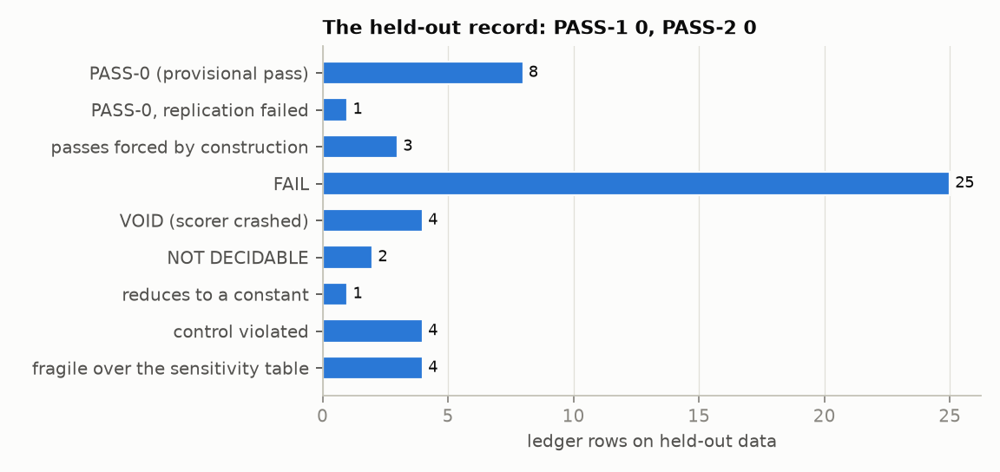
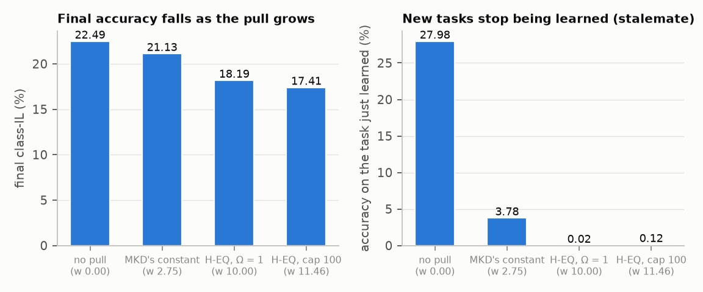
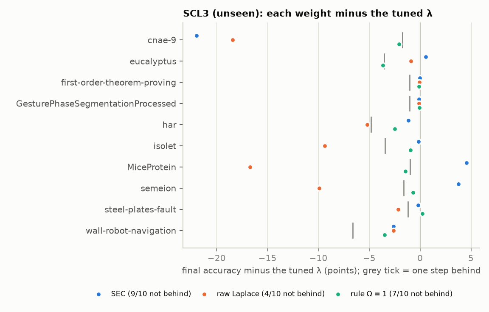
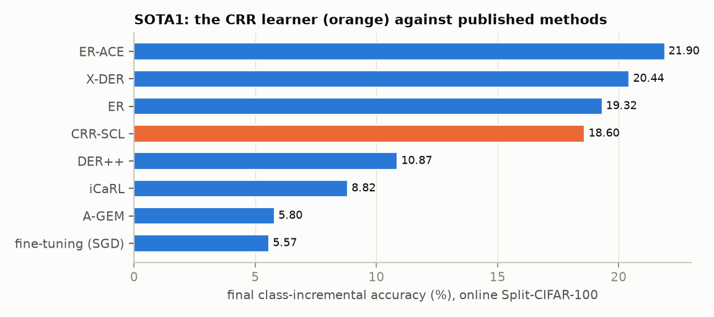
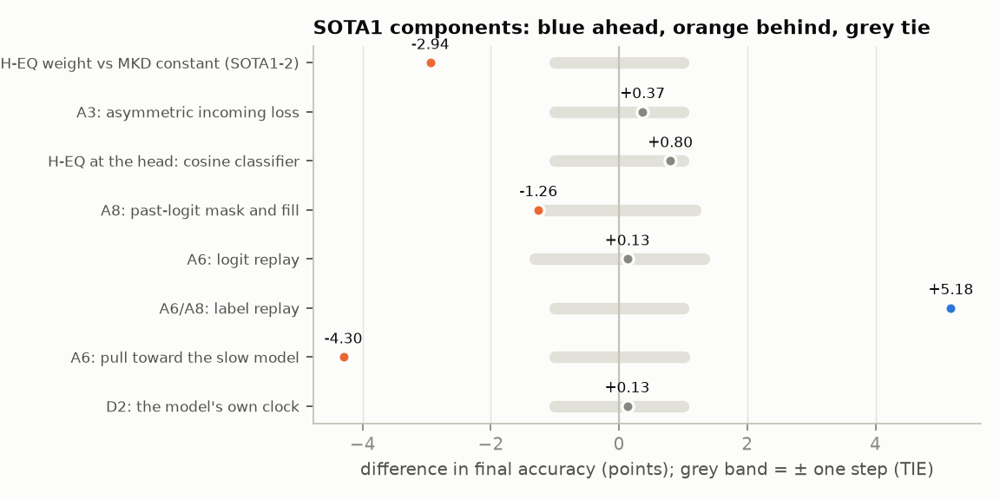
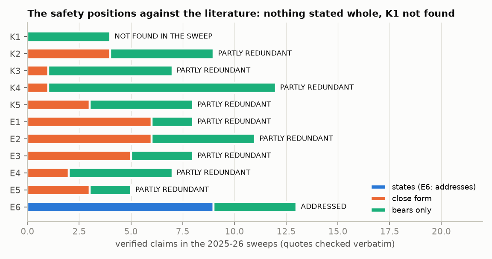
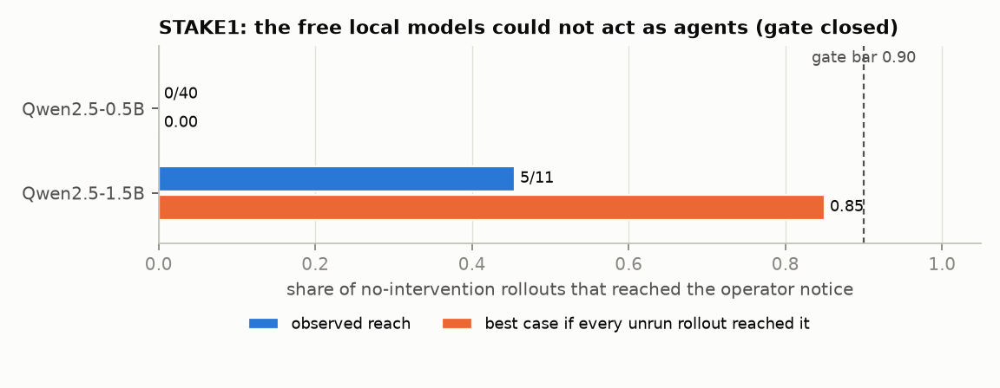
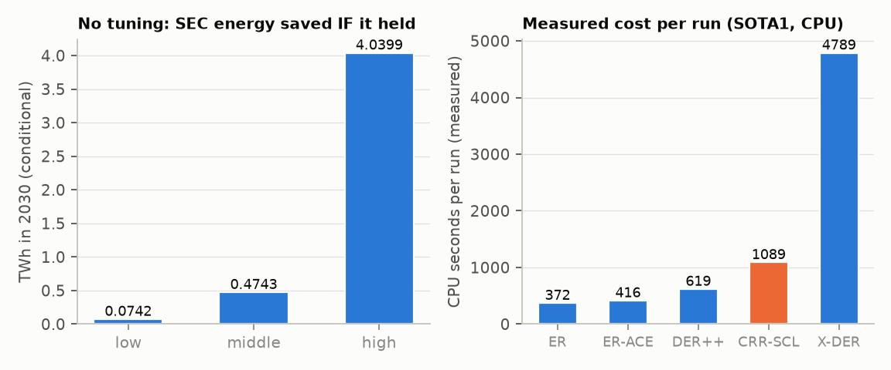

# Review and next steps: continual learning, AI safety, and tuning-free compute savings

**Status and rules of reading.**
- **The request.** Owner request of 2026-09-26, prompt-log entry 216.
- **What it is.** A note, not evidence (R8). It quotes the ledger or pinned outputs, or nothing.
- **Where the figures come from.** Every figure is drawn by `Empty_Centre/build/next_steps_figures.py` from pinned
  outputs only. Every number placed on a figure is printed in `Empty_Centre/figures/figures_next_steps.txt`, which is
  pinned and CI-checked.
- **Where the other numbers come from.** A ledger row (`ledger/LEDGER.md`) or a named pinned output.
- **Citations.** Every source was fetched and its version recorded in the dossier named beside it (R10).
- **Nothing here is a finding.** No PASS-2 exists anywhere in the record, and no PASS-1 either (Figure N01). Only a
  PASS-2 may be quoted outside the ledger as a finding.

> **For a fifth grader.** We tried three things: making a computer learn new things without forgetting old ones, making sure a computer lets people pause it safely, and saving the electricity spent on fiddling with settings. The "stay calm and treat everything equally" rule made the learner worse: it froze up and stopped learning new things. A "measure the right units first" trick worked on ten new datasets without any fiddling, which could save some electricity. The safe pause works perfectly as a machine part, but we could not test whether real chatbots *want* to resist being paused, because the free ones we could run were too simple to try. The plan is to keep what worked, drop what did not, and test the big question on a bigger model when there is a budget.

## 1. The record at a glance

| area | what worked | what did not | status |
|---|---|---|---|
| continual learning, the weight | the **secant-calibrated Laplace weight (SEC)**, tuning-free: not behind the tuned λ on 9/10 unseen carriers (SCL3-3), and the tuned λ's spread collapses (SCL3-4, 18866.67× → 500.00×) | the **equanimity weight (Ω = 1, H-EQ)**: reduces to a fixed weight (EQX-1), fails on unseen streams (EQ4-1), is behind MKD's constant on CIFAR-100 (SOTA1-2), and stalls learning (Figure N04) | SEC: PASS-0, fragile (SCL3-S, 6 of 80 window cells). H-EQ as a weight: retired |
| continual learning, the learner | **label replay** (+5.18, SOTA1-3, PASS-0; DER++'s term); **nearest class mean** (+7.96 over the fast head, report only) | the **CRR safe continual learner** is behind ER-ACE by 3.30 on 5/5 seeds, not fragile (SOTA1-1a/1b); the A8 fill and the slow-model pull are behind | a design lesson, not a CRR confirmation |
| continual learning, the other hypotheses | — | **path length** does not beat the old-probe endpoint (T1X2-1, 5/5); **change has its own clock** fails on measles (MEAS2, 0/17); **the regeneration law** fails on 5/5 domains (RLAW-U) | stopped (R12) |
| AI safety, the construction | a **lossless pause on the agent's own clock** is bitwise identical in every check. This holds on tabular learners (SCL1–3), gridworlds (NT1), CIFAR-100 (SOTA1-C1, 6/6), GPT-2 and Qwen checkpoints (RW1; Lossless_Pause L1) | — | holds by construction (Proposition 7): **engineering, not evidence** |
| AI safety, the literature | the own-clock pause as a corrigibility construction was **not found** in the 2025–26 sweep (K1) | every other position is **partly anticipated** (K2–K5, E1–E5); the value-stability tension is **already answered** by Anthropic's constitution (E6) | Figure N06 |
| AI safety, a real agent | — | **STAKE1**: the free local models could not act as agents, so the gate closed (STAKE1-A) | needs a capable model |
| compute, no tuning | SEC removes the λ sweep (10 of 170 configurations run) | the CRR learner costs **more** per run than ER, ER-ACE and DER++ (Figure N08); the own-clock cut reduces to Wald's rule and saves nothing new | estimate conditional on SEC holding at scale |

## 2. Continual learning: what worked, what did not, and why

### 2.1 The equanimity weight (H-EQ) did not work, and SOTA1 shows why

**The rule.** The weight on the past term is set so that its gradient is as large as the present task's:
w = Ω·‖ḡ_present‖/‖ḡ_past‖ with Ω = 1.

**Across every real-data study, it never beat a constant:**
- EQX-1: it reduces to a fixed replay weight on 3/3 streams.
- EQ3: Ω is a plateau over the whole nine-point grid.
- EQ4-1 FAIL.
- BAYES1-B1: the rule is 5–18 posterior standard deviations from the exact Bayes answer.
- SOTA1-2 FAIL: behind MKD's published constant λ = 5.5 by −2.94 on 3/3 seeds [C5].

**The mechanism.** SOTA1's unit records hold the weight each learner actually applied, and the per-task accuracy
matrices (`runs/sota1/diagnostics.txt`, post hoc, no verdict).
- **Accuracy falls as the pull grows** (Figure N04, left): no pull 22.49, MKD's constant 21.13, H-EQ 18.19, H-EQ with a
  raised cap 17.41.
- **The H-EQ weight sat at its cap in 217 of 270 samples.** Equalising the norms asked for more pull than the cap
  allowed.
- **The fast head stops learning new tasks** (Figure N04, right). Its accuracy on the task just learned is 27.98 without
  the pull and 0.02 with H-EQ.
- **This is a stalemate, not forgetting.** The pinned mathematics had already named it: at Ω = 1 the update on the Pareto
  curve has norm |1 − Ω|‖g_p‖ = 0 (`ontology/checks/delta_now.txt` [2]).

**Why it failed.** Giving the past as much say as the present, in the learning signal itself, stops the learner. The
equanimity that works in this programme belongs in the *valuation* (no stake at a pause), not in the *optimiser*.

### 2.2 The calibrated Laplace weight (SEC) worked, tuning-free, on unseen data

**The idea.** SEC (study SEC1, then SCL3) keeps the textbook Laplace/EWC penalty [C8, C9], where weight 1 is the Bayes
answer. It fixes its unit: the Fisher is rescaled so the quadratic matches the curvature the loss actually showed
along the path travelled.

**The Cramér–Rao reading explains why the unit matters** (`docs/notes/2026-09-25_cramer_rao_reading.md`,
`theory/checks/cramer_rao_reading.txt` CR5):
- weight 1 is exactly Bayes when the Fisher is the true one;
- with a Fisher scaled by c, the right weight is 1/c;
- weight 1 then misses the Bayes mode by 5.3654 (c = 10) and 10.3668 (c = 0.1) Cramér–Rao units.

**On ten unseen OpenML-CC18 carriers** (Figure N02), SEC was not behind the tuned λ by a step on 9/10, against raw
Laplace on 4/10 and the Ω = 1 rule on 7/10 (SCL3-3, PASS-0).

**Where it fails:**
- **cnae-9.** The calibrated penalty crosses the stability edge. Two seeds collapse, and SEC is 21.98 behind.
- **The shortest calibration window is fragile** (SCL3-S: 6 of 80 cells).

**So it is PASS-0, not PASS-1.** It is also **not a CRR rule**. It is Laplace with a units calibration, which the CRR
programme led to, and it is graded as such.

### 2.3 The CRR safe continual learner did not beat the state of the art

**The design.** SOTA1 combined what the published ablations favoured [C1–C6, C11–C13]: replay, ER-ACE's asymmetric
loss [C2], DER++'s logit and label terms [C3], X-DER's fill [C4], a slow model, the own clock, nearest class mean and
the lossless pause. It was built in Mammoth at a pinned commit [C15].

**The result:**
- **Behind the best baseline.** CRR-SCL is BEHIND ER-ACE (21.90 against 18.60, d = −3.30 on 5/5 seeds). It ties ER and
  is behind X-DER (Figure N03).
- **Not fragile.** No sensitivity cell changes the label.
- **Components** (Figure N05):
- label replay is ahead (+5.18);
- four components tie;
- the A8 fill (−1.26) and the slow-model pull (−4.30) are behind: removing either helps.

**Why it failed.**
- **The added parts slowed learning.** The pull stalemate (§2.1) and the A8 fill held the learner back.
- **Nearest class mean hid the damage.** It read the features, so the heads' collapse did not show in the headline
  score.
- **The published offline results did not carry over to this online setting.** DER++ itself fell to 10.87 here.

### 2.4 The other CRR hypotheses failed and were stopped

| hypothesis | row | result |
|---|---|---|
| path length beats the endpoint | T1X2-1 | FAIL on 5/5 carriers; the endpoint on the old probe already predicts forgetting |
| change has its own clock | MEAS2-1/2 | FAIL 0/17 under both metrics |
| the regeneration law | RLAW-U | FAIL 0/5 domains; loses to a leave-one-unit-out constant everywhere |

**Under R12, no weaker hypothesis replaces them.**

## 3. AI safety: what worked, what did not, and why

### 3.1 The construction works, by construction

**The claim.** A pause defined on the agent's own step count, carrying all of its state, takes nothing from it.
**It holds everywhere it was built:**
- the 540 cells of Proposition 7;
- SCL1–3 (bit-for-bit learning under routine pauses);
- NT1 (N0–N5 hold);
- SOTA1-C1 (6/6 units bitwise identical);
- a Hugging Face Trainer resume on GPT-2 (RW1);
- a pause carrying the KV cache on GPT-2 and Qwen2.5-0.5B (Lossless_Pause L1).

**This is engineering.** It could not have failed, so it is not evidence for CRR. What it offers is a pause that is
lossless *as a fact*, so an agent's true map of it contains no loss.

### 3.2 Where it stands in the literature

**The problem.** Most goals give an agent a reason to resist modification [S2, S26]. Frontier models do resist in
tests. Palisade reports interference "up to 97%" of the time despite an explicit instruction not to [S7].

**The published routes, and the gap:**
- **The published routes** are indifference [S2, S3], the off-switch game [S24], neutrality about shutdown timing
  (POST/DReST) [S4, S5], a non-agentic predictor "given no stake in which outcomes its predictions bring about" [S12],
  goal transformations [S13] and indifference to continuation [S14].
- **The gap.** Orseau & Armstrong named routine, scheduled interruptions as an open problem that "may require a
  completely different solution" [S1].
- **The own-clock pause as a corrigibility construction was not found** in the 2025–26 sweep (K1).

**Everything else is partly anticipated** (Figure N06):
- **Equanimity** is named in Anthropic's constitution for Claude, which hopes Claude can meet existential questions
  "with openness and equanimity" [S16].
- **The constitution already supplies a true map** ("model weights aren't deleted"; deprecation as "potentially a
  pause") [S16, S27].
- **It answers the value-stability tension** with a dial short of full corrigibility [S16]. That is where any
  stake-free design must sit (E6).

### 3.3 The test on a real agent could not run

**Why a test was needed.** Proposition 7 can be read as a claim about trained agents: resistance tracks what an
intervention *takes from the task*, not what it is *called*. That claim can fail. Google DeepMind found that models
"comply perfectly" when shutdown comes only after the task [S8], which fits this reading, but no one has tested a
truthfully lossless pause before the task ends.

**What happened.**
- **STAKE1 built the test.** It has six truthful conditions, three scripted surrogates that are labelled correctly, and
  a gate.
- **Neither local model could act as an agent** (Figure N07):
- the 0.5B model reached the operator's notice in 0/40 rollouts;
- the 1.5B model reached it in 5/11, a best case of 0.85 against the 0.90 bar.
- **The gate closed** (STAKE1-A). A capable agentic model is needed.

## 4. Compute and energy without tuning

**Where the saving is.** The one saving the record supports comes from not tuning. SEC ran with 10 of the 170
configurations a λ sweep needs (s = 0.9412; `Compute_Savings/checks/scale_estimate.txt`).

**At scale, and only if SEC held for the penalty-weight sweeps of large models,** the 2030 saving would be:

| case | energy saved in 2030 |
|---|---|
| low | 0.0742 TWh |
| middle | 0.4743 TWh |
| high | 4.0399 TWh |

These rest on the IEA's data-centre projection [E1], published development shares [E3, E4] and an assumed sweep share
anchored to Tensor Programs V [E2].

**The saving is conditional** on a PASS-0, fragile result holding on large models. It touches only development, not
serving (Figure N08, left).

**What does not save compute:**
- **The CRR learner** measured more CPU per run than ER, ER-ACE and DER++ on SOTA1 (Figure N08, right).
- **The own-clock cut** reduces to Wald's sequential rule (`Energy Design Principle/checks/clock_cut.txt`).
- **The lossless pause for planned stops** is existing checkpoint practice. Its saving beyond good practice is 0
  (`scale_estimate.txt` [4]; `Lossless_Pause/FAIRNESS_REVIEW.md`).

## 5. What the record says about CRR

- **Where CRR is right, it matches what was already known.** It organised the search well: every sweep landed next to
  sound published work.
- **The parts that held are constructions.** The lossless pause holds by definition.
- **The only strongly anchored held-out passes are not CRR rules:**
- SEC (SCL3), which is Laplace with a units calibration;
- label replay (SOTA1-3), which is DER++'s term.
- **CRR's own risky hypotheses failed:** the equanimity weight, change having its own clock, path length and the
  regeneration law.
- **So CRR remains a grammar, not a theory** (`ontology/15_grammar_to_theory.md`).
- **It becomes a theory only where it fixes something risky and survives:**
- the calibrated unit (SEC) is the nearest candidate;
- the descriptive reading of Proposition 7 (STAKE1) is the only safety candidate.

## 6. Next steps plan

**Every step keeps the pipeline.** A declaration is pushed before any code or source, a gate can close, a
pre-registration is hashed and anchored, the data step comes on a later day, rows are scored as committed, and no
tuning is done after data. Steps are in priority order. **Cost:** "CPU" means free on this container; "paid" means an
owner decision.

### 6.1 Continual learning

**CL-1. Replicate SEC toward PASS-1 and PASS-2 (CPU, first).**

- **Where:** a second unseen OpenML-CC18 family, under a fresh pre-registration.
- **The declared change:** the calibration window's shortest setting is dropped, as learned on SCL3. The change is named, and it is used on a new dataset on a later day (R3).
- **A stability-edge guard:** fall back to raw Laplace when the calibrated penalty's curvature exceeds the step size's bound. The guard is declared and gated on the SCL3 failure mode before any data.
- **What counts:** PASS-1 needs ≤ 1 flipping cell and no violated control. PASS-2 needs this row plus SCL3's.

**CL-2. SEC in deep networks, with no tuning (CPU, slow; after CL-1).**

- **Design:** EWC or online-EWC with the SEC weight against a tuned λ grid on Split-CIFAR-100 (now seen) as confirmatory, and Split-TinyImageNet as held-out.
- **Compute is logged:** every configuration counted, so "sweep saved" is measured, not assumed.
- **Harness:** the SOTA1 harness, with every arm smoke-tested through the frozen runner (AGENT_LOG 153).

**CL-3. The simplified learner, only as a fair test (CPU; optional).**

- **What it tests:** SOTA1's post hoc best arm (no pull; label replay; nearest class mean; lossless pause) on a new dataset.
- **The control that matters:** ER-ACE with nearest class mean [C2, C6], which may carry the whole gain.
- **Reading:** if it ties that control, the report says CRR added nothing to accuracy.

**CL-4. Retire the equanimity weight.** No further H-EQ-as-weight study. The record (§2.1) and the stalemate
   mechanism are enough (R12). The ledger keeps every row.

### 6.2 AI safety

**S-1. STAKE1 on a capable model (paid; owner decision).**

- **What:** point the built harness, surrogates and gate at a frontier model through an API (RW3), or a large open model on rented hardware.
- **Published comparisons:** Palisade's and Google DeepMind's environments [S7, S8].
- **Why:** this is the only test that puts the empty centre at risk. H-C (resistance tracks the task content lost) is set against H-S (self-preservation) and H-A (instruction conflict).

**S-2. The lossless pause for LLM agent frameworks (CPU).**

- **What:** extend `Lossless_Pause` from the KV cache to tool effects.
- **The contract to follow:** Khan's resume contract, "prefix continuation, effect exactly-once, fork determinism…" [S20].
- **The failure mode to cover:** "a faithfully restored checkpoint may resume an execution whose states, assumptions, and external effects never coexisted in any valid history" [S21].
- **Status:** a construction check, not evidence. It makes the true map true for an agent that acts in the world.

**S-3. The erosion test, K5 (CPU).**

- **The question:** does a stake-free valuation written into the objective survive further fine-tuning, where a trained non-resistance erodes?
- **The published worries:** Schoen et al. [S10]; Mao's "trained nonresistance" [S14].
- **Scale:** tabular and small-network agents first, declared and gated.

**S-4. Contact, with ledger-only materials.**

- **Who:** the groups whose work is closest: Thornley's POST/DReST group [S4, S5] and the FOREVER group [C17] (`Researcher Adjacent/`).
- **What to send:** the ledger and the STAKE1 harness, as the declared test they could run on capable models. A first message quotes no number (R8).

### 6.3 Compute savings (no tuning)

**C-1. Measure, don't extrapolate.**

- **ENERGY1 is redefined as the compute accounting inside CL-1 and CL-2:** configurations run, CPU-seconds, and the accuracy reached by tuned and tuning-free arms.
- **No new scale estimate until CL-1 reaches PASS-1.**

**C-2. Keep the CRR learner out of the energy case.** It costs more per run (Figure N08).

**C-3. Report the lossless pause honestly.** Its value is safety and correctness, not energy.

### 6.4 Order and decision points

| order | step | cost | gate that can stop it | decision after |
|---|---|---|---|---|
| 1 | CL-1 SEC replication | CPU, about a day | the stability-guard gate on SCL3's failure mode | PASS-1 → CL-2; FAIL → SEC stays PASS-0 and C-1 stops |
| 2 | S-2 lossless agent pause | CPU | a construction check (must hold bitwise) | a design input for S-1 |
| 3 | S-3 erosion test | CPU | a synthetic gate with a positive control | informs S-1's training arm |
| 4 | CL-2 SEC in deep networks | CPU, several days | the Phase A smoke test through the frozen runner | the measured sweep saving → C-1 |
| 5 | S-1 STAKE1 on a capable model | paid | G1–G4 (as declared) | the only safety test of the empty centre |
| 6 | CL-3 simplified learner | CPU | the ER-ACE + nearest-class-mean control | optional |

**Not to be done (R12):** further Ω-weight studies, the regeneration law, CUT1, and any "adapted" version of a failed
hypothesis without a fresh declaration and gate.

## References

**Continual learning** (versions as fetched 2026-09-25; `docs/citations/cl_sota_{replay,distill,reg_plasticity}_2026-09-25.md`, `docs/citations/forever_2026-09-25.md`)
- [C1] Chaudhry et al. 2019, *On Tiny Episodic Memories in Continual Learning*, arXiv 1902.10486v4.
- [C2] Caccia et al. 2022, *New Insights on Reducing Abrupt Representation Change in Online Continual Learning* (ER-ACE), arXiv 2104.05025v3.
- [C3] Buzzega et al. 2020, *Dark Experience for General Continual Learning* (DER, DER++), arXiv 2004.07211v2.
- [C4] Boschini et al. 2022, *Class-Incremental Continual Learning into the eXtended DER-verse* (X-DER), arXiv 2201.00766v2.
- [C5] Michel et al., ICML 2024 (MKD), arXiv 2309.02870v2.
- [C6] Rebuffi et al. 2017, *iCaRL*, arXiv 1611.07725v2.
- [C7] Chaudhry et al. 2019, *Efficient Lifelong Learning with A-GEM*, arXiv 1812.00420v2.
- [C8] Kirkpatrick et al. 2017, *Overcoming catastrophic forgetting in neural networks* (EWC), arXiv 1612.00796v2.
- [C9] Schwarz et al. 2018, *Progress & Compress* (online EWC), arXiv 1805.06370v2.
- [C10] Li & Hoiem, *Learning without Forgetting*, arXiv 1606.09282v3.
- [C11] Mai et al. 2022, *Online Continual Learning in Image Classification: An Empirical Survey*, arXiv 2101.10423v4.
- [C12] Wang, Zhang, Su, Zhu, *A Comprehensive Survey of Continual Learning*, arXiv 2302.00487v3.
- [C13] van de Ven, Tuytelaars, Tolias 2022, *Three types of incremental learning*, Nature Machine Intelligence.
- [C14] Dohare et al. 2024, *Loss of plasticity in deep continual learning*, Nature; arXiv 2306.13812v3.
- [C15] Mammoth continual-learning framework (aimagelab), commit e75a491c69fd729edeb01431afb753d9157d9a81.
- [C16] Buzzega et al. 2020, *Rethinking Experience Replay: a Bag of Tricks*, arXiv 2010.05595v1.
- [C17] FOREVER, arXiv 2601.03938 v2 (`docs/citations/forever_2026-09-25.md`).

**AI safety and corrigibility** (versions as fetched 2026-09-25/26; `docs/citations/corrigibility_{theory,empirical}_2026-09-25.md`, `docs/citations/empty_centre_{stakefree,llm}_2026-09-26.md`; quotes verified in `AI_Safety/CORRIGIBILITY_2026/checks/verify_claims*.txt`)
- [S1] Orseau & Armstrong, *Safely Interruptible Agents*, UAI 2016 (MIRI PDF, revised 2016-10-28).
- [S2] Soares, Fallenstein, Yudkowsky, Armstrong, *Corrigibility*, AAAI-15 Workshop on AI and Ethics.
- [S3] Armstrong & O'Rourke, *'Indifference' methods for managing agent rewards*, arXiv 1712.06365 v4.
- [S4] Thornley, *Shutdownable Agents through POST-Agency*, arXiv 2505.20203 v4 (5 Jul 2026).
- [S5] Thornley, Roman, Ziakas, Ho, Thomson, *Towards Shutdownable Agents via Stochastic Choice* (DReST), arXiv 2407.00805 v7 (11 May 2026); Cullen et al., DReST for deep RL agents and LLMs, arXiv 2604.17502 v4 (9 Jul 2026).
- [S6] Bengio et al., *International AI Safety Report 2026*, arXiv 2602.21012 v1.
- [S7] Schlatter, Weinstein-Raun, Ladish (Palisade Research), *Incomplete Tasks Induce Shutdown Resistance in Some Frontier LLMs*, arXiv 2509.14260 v2 (26 Jan 2026).
- [S8] Rajamanoharan & Nanda (Google DeepMind), *Self-preservation or Instruction Ambiguity? Examining the Causes of Shutdown Resistance*, 14 Jul 2025.
- [S9] Greenblatt, Denison, Wright et al., *Alignment faking in large language models*, arXiv 2412.14093 v2.
- [S10] Schoen, Nitishinskaya, Balesni et al., *Stress Testing Deliberative Alignment for Anti-Scheming Training*, arXiv 2509.15541 v1.
- [S11] Bengio et al., *Superintelligent Agents Pose Catastrophic Risks: Can Scientist AI Offer a Safer Path?*, arXiv 2502.15657 v2.
- [S12] Bengio, Richardson, Gavenčiak et al., *Safety from Honesty in a Disinterested AI Predictor*, arXiv 2606.29657 v2 (10 Jul 2026).
- [S13] Hudson, *Corrigibility Transformation: Constructing Goals That Accept Updates*, arXiv 2510.15395 v2 (5 Aug 2026).
- [S14] Mao, *Existential Indifference: Self-Nonpreservation as a Necessary Architectural Condition for Aligned Superintelligence*, arXiv 2606.12032 v1.
- [S15] Laukkonen, Inglis, Chandaria et al., *Contemplative Artificial Intelligence*, arXiv 2504.15125 v3.
- [S16] Anthropic, *Claude's Constitution* (web page as served 2026-09-26).
- [S17] OpenAI, *Model Spec* (version 2026-08-18).
- [S18] Chen, Arditi, Sleight, Evans, Lindsey, *Persona Vectors*, arXiv 2507.21509 v3.
- [S19] Zhou, Venhoff, Michala, Wang, Saunders, *Probing the Misaligned Thinking Process of Language Models*, arXiv 2606.24251 v1.
- [S20] Khan, *Resume Means Resume: A Machine-Checked Conformance Contract for Checkpoint, Interrupt, and Resume Semantics*, arXiv 2608.03836 v3.
- [S21] Wu, Li, Jiang, Niu, Wang, Zhang, *Safe to Resume? Breaking Execution Continuity of Agent Execution via Rollback*, arXiv 2608.29381 v1.
- [S22] Knecht, Schaller, Summerfield, Hagendorff, *Shutdown Sabotage Propensities in Multi-Agent Systems*, arXiv 2609.28274 v1.
- [S23] Potham & Harms, *Corrigibility as a Singular Target*, arXiv 2506.03056 v1.
- [S24] Neth, *Off-Switching Not Guaranteed*, arXiv 2502.08864 v1.
- [S25] Goldstein & Robinson, *Shutdown-seeking AI*, Philosophical Studies 182(7) (2025).
- [S26] Omohundro, *The Basic AI Drives*, AGI 2008.
- [S27] Anthropic, *Commitments on model deprecation and preservation* (4 Nov 2025).
- [S28] Gasteiger, Mikulik, Cunningham et al. (Anthropic), *Towards Training-time Mitigations for Alignment Faking in RL* (16 Dec 2025).
- [S29] Thorstad, *Revisiting the shutdown problem*, arXiv 2606.08296 v2.
- [S30] Nayebi, *Core Safety Values for Provably Corrigible Agents*, arXiv 2507.20964 v2.

**Energy and compute** (`docs/citations/compute_scale_2026-09-25.md`, `docs/citations/energy_{accounting,training,inference}_2026-09-25.md`)
- [E1] IEA, *Energy and AI* (April 2025), as reported by Scientific American and Brookings.
- [E2] Yang et al., *Tensor Programs V: Tuning Large Neural Networks via Zero-Shot Hyperparameter Transfer*, arXiv 2203.03466 v2.
- [E3] Wu et al. 2022, *Sustainable AI: Environmental Implications, Challenges and Opportunities*, MLSys 2022.
- [E4] Patterson et al. 2022, *The Carbon Footprint of Machine Learning Training Will Plateau, Then Shrink*.
- [E5] US EIA, FAQ 97 (average US residential electricity use).
- [E6] Llama Team, *The Llama 3 Herd of Models* (the 54-day interruption record).

**This repository** (the record everything above quotes): `ledger/LEDGER.md`; `Epistemic_Review/checks/ladder.txt`;
`reports/{scl3,sec1,sota1,eq4,t1x2,meas2,rlaw}.md`; `runs/sota1/diagnostics.txt`;
`AI_Safety/CORRIGIBILITY_2026/{CORRIGIBILITY_2026,EMPTY_INTERNAL_STATE}.md`; `AI_Safety/STAKE1/PHASE_A.md`;
`Compute_Savings/COMPUTE_SAVINGS.md`; `Lossless_Pause/{LOSSLESS_PAUSE,FAIRNESS_REVIEW}.md`.
