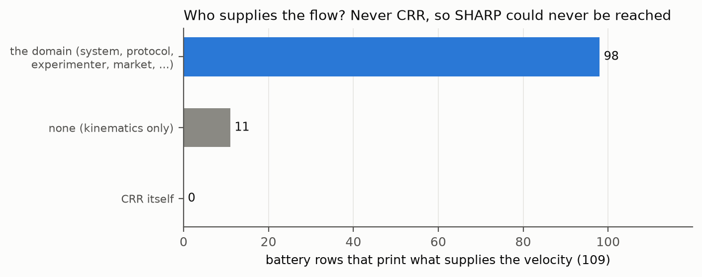
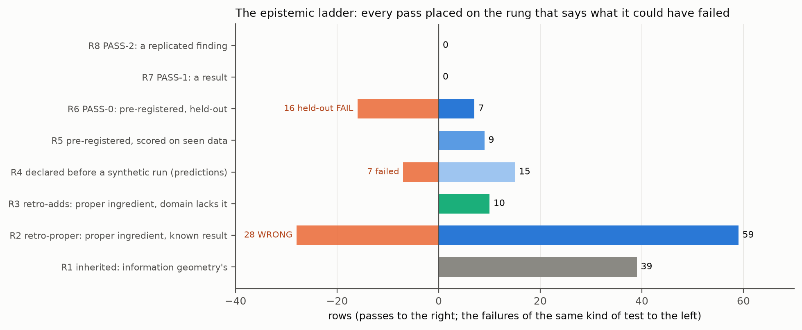
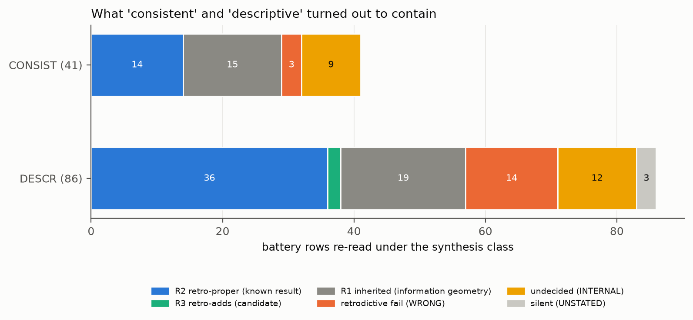
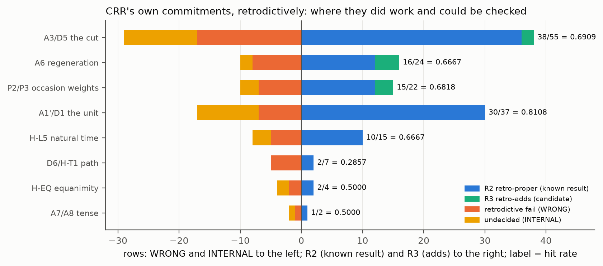
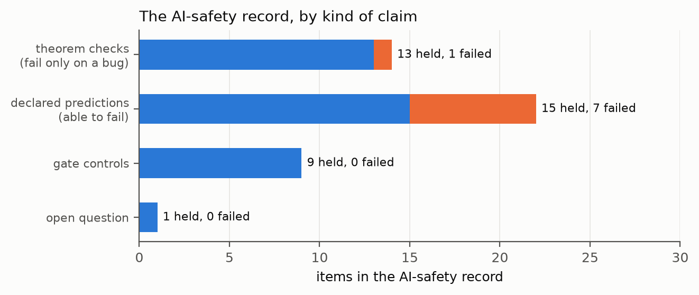

# What a Pass Means Here: an epistemic review of the CRR pipeline

**What this document is.** The owner asked for this review on 2026-09-23 (prompt-log entry 102). It asks what a PASS
really means in this repository, re-reads the continual-learning and AI-safety findings, gives every label a fair
definition, and places every result on one ladder. The ladder is computed by `checks/ladder.py`, whose output is pinned
as `checks/ladder.txt`. It also covers the ADDS dimension, CRR and the free-energy principle (FEP) on time, and the
philosophical standing of the gates.

**Status.** This review is a note, not evidence (R8). It adds no ledger row and edits no earlier file. Every count in it is
printed by `checks/ladder.py` from the pinned outputs and the ledger, or quoted from a pinned output named beside it (R1).
The allocation rules are mechanical and are written in the script's docstring (R15). Philosophers and papers are named,
not fetched (R10): no sentence of theirs is quoted, and their positions are given as this review reads them.

**How to read it.** The shaded boxes marked *In plain words* explain each part as for a ten-year-old. Sections 2 to 4
answer "what counts as a test". Sections 5 to 7 place the results. Section 8 is CRR and the FEP on time. Section 9 re-examines
the continual-learning and AI-safety findings. Section 10 is the proposed change to the metrics.

> We tested an idea about how things change over time. We ran hundreds of checks, and this document sorts them by *how
> hard each check was*. Some checks could never have failed, some could have failed but the answer was already known,
> and a few were real bets on things nobody had seen. A "pass" means something different in each case. We say which is
> which, so nobody is fooled, including us.

## 1. The short answer

- **CRR is a synthesis, and the review grades it as one.** Its mathematics is borrowed: the Fisher–Rao metric, the arc,
  the chord and the surplus are information geometry's. What is CRR's own is a set of commitments about time and change:
  the cut has no content (A3); the past regenerates the next occasion, never as an accumulated count (A6); tense is
  relational, and persistence proves regeneratability, not truth (A7, A8); the unit is the system's own resolvable step
  (A1′); change has its own clock (H-L5); equanimity (H-EQ); and path against endpoint (H-T1). A fair test of a synthesis
  asks whether those commitments, put to work inside a domain's mathematics, land where the domain is known to be.
- **The retrodictive record of those commitments is real, and it was under risk.** In the 146 real-domain synthesis rows,
  a CRR-proper ingredient changed the number and could be checked in 80 rows. It landed on the domain's known result in 53
  (rung R2), on a result the domain's theorem does not give in 3 (R3, candidates), and missed in 24 (WRONG). The hit rate is
  56 of 80 = 0.7000 (Wilson 95 % interval 0.5923 to 0.7894). This is a pass at the retrodictive level, and it should be
  reported as one. Earlier notes filed these 53 rows with "the mathematics everyone shares"; §6.2 corrects that.
- **SHARP was unreachable by construction, and the metric now says so.** In 109 battery rows that print what supplies the
  velocity, the domain supplies it in 98, none is needed in 11, and CRR supplies it in 0. A grade that demands the theory
  force a known number "with no outside constant" cannot be reached by a framework whose integrand is always the domain's
  own flow. Scoring zero on it said nothing about CRR (§4).
- **The prospective record is small and provisional.** There are 3 pre-registered passes on held-out data, all PASS-0
  (EQ2-1b, EQ3-I, EQ4-I; the last two are invariance rows), beside 16 held-out FAILs (updated on 2026-09-24 after the EQ4, T1x2
  and SCL2 data steps, prompt-log entries 104 and 125). There are 4 pre-registered passes on data already seen, which are
  retrodictions by data status. There is no PASS-1 and no PASS-2.
- **The AI-safety record is strongest where it is mathematics.** 13 of 14 theorem checks held; the one failure was a
  tolerance bug, repaired and labelled. 15 of 22 declared predictions held and 7 failed. All 9 gate controls held.
- **The clock matters.** In the one place CRR's processual time was put to engineering use, an agent whose objective runs
  on its own active steps has exactly no reason to resist a pause that loses nothing, in every world tested. An agent on
  the wall clock resists everywhere (§8.3). This is a theorem on synthetic worlds, not a finding about deployed systems.

> CRR borrows its maths and adds ideas about time. When those ideas were put to work in about eighty known problems where
> they actually mattered, they gave the right answer about seven times in ten. Three of those answers might even be new.
> That is an honest "pass" for a check whose answer was already known, and it is not the same as predicting something
> nobody knew.

## 2. What CRR claims, and so what a test of it can be

`theory/CRR.md` states axioms (A1–A8), definitions (D1–D6), propositions (P1–P5) and four hypotheses (H-CUT, H-L5, H-T1,
H-EQ). The review sorts them by what could make them fail.

| layer | examples | what could make it fail | what a success licenses |
|---|---|---|---|
| borrowed mathematics | A1 (Fisher–Rao), D2 arc, D3 chord, D4 surplus, P1 (S ≥ 0) | only an arithmetic error | that the synthesis is well formed |
| metaphysical commitments, operationalised | A3 cut, A6 regeneration, A7/A8 tense, A1′ unit, P2/P3 weights | a domain where the commitment, put to work, gives the wrong number | that the commitment is a correct reading of that domain |
| comparative hypotheses | H-CUT, H-L5, H-T1, H-EQ | a pre-registered comparison on held-out data that the conventional quantity wins | a result (at PASS-1) or a finding (at PASS-2) |

The owner's statement of the programme is that CRR "is not claiming to be new mathematics, but a synthesis of existing
mathematical principles with clear and falsifiable metaphysical commitments". The pipeline agrees with that reading. The
synthesis class (`docs/notes/2026-09-17_synthesis_class.md`) was built to separate the second layer from the first: a row
counts for CRR only if a CRR-proper ingredient changed the number (the ablation test T-G).

> CRR is like a new way of reading a map everyone already has. The map (the maths) is not CRR's. The reading is: where
> to draw lines on it, how to count steps, and how the past carries forward. So the fair test is whether that reading
> puts you in the right place.

## 3. Retrodiction, prediction, and what "pre-registered" means here

### 3.1 The philosophical ground

- **Popper.** A theory has content to the extent that it forbids observations, and it is corroborated by passing tests it
  could have failed.
- **Lakatos, Zahar and Worrall.** A known fact can support a theory if the fact was not used in building it
  ("use-novelty"). What makes a fact novel is its relation to the theory's construction, not the date it was learned.
- **Mayo.** A pass is evidence to the degree that the test was severe: that it would probably have failed if the claim
  were false.
- **Glymour** raised the "problem of old evidence": how can a result everyone already knew confirm anything?
- **Hitchcock and Sober** analysed when prediction beats accommodation. The worry about accommodation is overfitting, and it
  is answered by fixing the method before the fit.

These positions agree on one point that matters here. A retrodiction is not worthless. Its worth depends on two things:
whether the known answer could have shaped the method, and whether the method could have missed.

### 3.2 The three kinds of test this repository runs

1. **Pre-registered prediction (the ledger).** A claim written, hashed and pushed before the data it is scored on are
   opened. It states the statistic, the threshold (never finer than one resolvable step), the per-unit rule, the baselines
   that can win, the exclusions and the sensitivity table. It is scored by a frozen script. On held-out data this is
   prediction proper, rungs R6–R8. On data already seen it is a pre-registered retrodiction, rung R5. Its method was fixed
   before the score, but the data were known.
2. **Declared test on a synthetic world (AI safety, the gates).** The expected outcome and its meaning are written and
   pushed before the first full run (`AI_Safety/DECLARATION*.md`). The world is built by the same author, so the test is
   severe only for claims about that world. This is rung R4.
3. **Retrodiction (the batteries and the synthesis class).** CRR's arithmetic or a CRR-proper ingredient is applied to a
   domain whose answer is known. The label is computed from printed numbers with fixed tolerances (1 % for T-G and T-N).
   The claim Q is formed by someone who knows the domain, so the formation of Q is not blind. This is rungs R1–R3.

### 3.3 What makes a CRR retrodiction fair, and what limits it

- **In its favour (use-novelty).** None of the 53 known results was used to build CRR. The axioms came from process
  metaphysics and information geometry, not from alternans restitution, Bass diffusion or the analytic-signal theorem.
- **In its favour (severity).** The same procedure produced 24 WRONG rows. It could miss, and it did.
- **Against it (a free hand in forming Q).** A tester who knows the answer can pick which proposition to state. The
  ablation test limits this (the CRR-proper ingredient must change the number), but it does not remove it. No
  pre-registration of Q exists for any synthesis row.
- **Against it (no baseline framework).** There is no rate for how often an arbitrary framework with the same ingredients
  would land. The gate's decoy framework (unit = amplitude) reads WRONG on its one test. That is a single control, not a base
  rate.

> A retrodictive prediction is like working out a sum without looking at the answer at the back of the book, then
> checking. It is weaker than guessing a question nobody has answered yet, because you might have peeked, or chosen an
> easy sum. It is still a real check if your method could have got it wrong, and ours did get it wrong 24 times. For CRR,
> the sum is: "given how this system moves, where does CRR say the edges of its moments are, and how does its past carry
> forward?" The answer at the back of the book is what scientists in that field already know.

## 4. Why SHARP could never be reached

The first batteries defined SHARP as "the axioms force the known result with no outside constant". Every coherence
integral in CRR is C = ∫√(ẋᵀgẋ)dt, and the velocity ẋ inside it comes from the system. The batteries record what
supplies it on a FLOW line.

| who supplies the flow | rows |
|---|---|
| the domain (system, protocol, experimenter, market, ...) | 98 |
| none needed (kinematics only) | 11 |
| CRR itself | 0 |

These are the 109 battery rows that print a FLOW line (`checks/ladder.txt` [1]). The unit is also always the system's
own (A1′: the resolvable step of its own residuals). So a CRR number is always "in the system's units, along the system's
motion", which is an outside constant by the SHARP definition. **SHARP was reachable in 0 of 109 rows, and 0 of 197 rows
reached it.**

The owner's point is right, and the metric now records it. SHARP asked a kinematic synthesis to do what only a dynamical
theory can do: produce the domain's own laws of motion. Asking information geometry, or thermodynamics without a
material's microscopic model, for SHARP would give the same zero. The zero was a fact about the grade, not about CRR. The
review of 2026-09-18 retired SHARP for retrodictions on this ground (`docs/notes/2026-09-18_sharp_regime_review.md` §1).
This review adds the computed FLOW audit, so that the retirement is a number, not a sentence. It also names the
replacement top rung for retrodiction: **R3 reviewed**, an ADDS row that a named domain expert has judged new (§7).



> SHARP asked CRR to work out a machine's speed without being told how the machine moves. But CRR is a way of measuring
> and cutting up movement, not an engine that makes movement. It always has to be handed the movement first. So SHARP was
> a test nobody could pass, and getting zero on it told us nothing.

## 5. The ladder

Every result sits on the rung that says what could have made it fail and what a success licenses. Beside each pass
stand the failures of the same kind of test. They are never folded together.

| rung | what it is | could it fail? | what a pass licenses | count |
|---|---|---|---|---|
| R0 DEFINITIONAL | true by definition, symmetry or carrier fact | no | nothing beyond coherence | inside the batteries' DESCR grade |
| R1 INHERITED | agreement produced by information geometry (REDUNDANT-IG) | only by arithmetic error | the synthesis is well formed | 38 |
| R2 RETRO-PROPER | a CRR-proper ingredient changed the number and landed on the domain's known theorem (REDUNDANT-DOMAIN) | yes (24 WRONG beside it) | the commitment is a correct reading of the domain there; nothing new | 53 |
| R3 RETRO-ADDS | as R2, and the domain's cited theorem does not give the value; the check in the domain's mathematics holds | yes | a candidate addition, until an expert rules | 3 |
| R4 DECLARED-SYNTHETIC | a prediction declared before a run on a synthetic world | yes (7 failed) | a claim about that world | 15 |
| R5 PREREG-SEEN | pre-registered, scored on data already seen | yes (4 seen-data FAILs) | the method, fixed in advance, fits known data | 4 |
| R6 PASS-0 | pre-registered, held-out, R2–R9 as written | yes (16 held-out FAILs) | provisional: not yet a result | 3 |
| R7 PASS-1 | PASS-0, not fragile, no control violated, no reduction to a constant, strong anchor | yes | a result | 0 |
| R8 PASS-2 | PASS-1 replicated | yes | a finding: the only rung quoted outside the ledger | 0 |



**Undecided and silent results are kept apart.** 9 battery TENSION rows and 22 synthesis INTERNAL rows are undecided: the
commitment has two readings on the domain, and CRR must choose one (a v3.2 decision). 41 battery OPEN rows and 4 synthesis
UNSTATED rows are silent: no claim could be formed.

> Think of a ladder. The bottom rungs are checks that could hardly fail, so standing on them proves little. Higher rungs are
> harder checks: the answer was known but you could still be wrong; then real bets on data nobody had opened; then the same
> bet won twice by different people. CRR stands firmly on the lower-middle rungs. It has a foothold on the "real bet" rung
> (two provisional wins), and nothing yet above it.

## 6. The old labels, allocated fairly

### 6.1 Every label, defined

| label | where | plain definition | can it fail? | rung |
|---|---|---|---|---|
| SHARP | batteries (retired) | the axioms force the known number with no outside constant | unreachable (§4) | none |
| CONSIST | batteries | CRR's arithmetic agrees with the known result | yes, but mostly by borrowed geometry | re-read: R1, R2, WRONG, INTERNAL |
| DESCR | batteries | CRR's vocabulary re-describes the domain's law | often not by itself | re-read: R1, R2, R3, WRONG, INTERNAL, silent |
| FAILS | batteries | CRR's arithmetic disagrees with the known result | it is the failure | retrodictive fail |
| TENSION | batteries | two CRR clauses disagree on the domain | it is the undecided case | undecided |
| OPEN | batteries | no CRR clause reaches the domain | it is silence | silent |
| REDUNDANT-IG | synthesis | the CRR-proper ingredient did no work; information geometry gives the number | no | R1 |
| REDUNDANT-DOMAIN | synthesis | the CRR-proper ingredient did work, and the number is the domain's known theorem | yes | R2 |
| ADDS | synthesis | the ingredient did work, the domain's theorem does not give it, and it checks | yes | R3 (candidate) |
| PROPOSES | synthesis | a claim that needs data not yet measured | not yet | prospective candidate |
| WRONG | synthesis | the ingredient did work and the check fails | it is the failure | retrodictive fail |
| INTERNAL | synthesis | the ingredient has two readings on the domain | undecided | undecided |
| UNSTATED | synthesis | no proposition could be formed | silence | silent |
| PASS-0 / 1 / 2 | ledger | provisional / a result / a finding | yes | R6 / R7 / R8 |
| VIOLATED, REDUCES, FRAGILE, VOID | ledger | a control failed / the rule is a constant / the verdict flips in more than one sensitivity cell / the study could not be scored as registered | they are the qualifications | beside the pass they qualify |

### 6.2 What "consistent" and "descriptive" turned out to contain

Every CONSIST and DESCR row was re-read under the synthesis class (`checks/ladder.txt` [2]):

| battery grade | rows | R2 retro-proper | R3 adds | R1 inherited | WRONG | INTERNAL | UNSTATED |
|---|---|---|---|---|---|---|---|
| CONSIST | 41 | 14 | 0 | 15 | 3 | 9 | 0 |
| DESCR | 86 | 36 | 2 | 19 | 14 | 12 | 3 |



Three things follow:
- **CONSIST was not the achievement it looked like, and not an empty one either.** Of 41 rows, 15 were borrowed geometry.
  In 14, a CRR-proper ingredient produced the known number, and it was wrong in 3.
- **DESCR hid most of CRR's proper work.** Both ADDS candidates among the re-reads came from DESCR rows, not CONSIST.
- **A correction to earlier notes.** `ontology/03_review_of_findings.md` §4 and `ontology/10_fep_and_crr.md` §3 counted the
  REDUNDANT-DOMAIN rows with the REDUNDANT-IG rows ("84 places, no"; "mostly, nothing did"). The harness assigns
  REDUNDANT-DOMAIN only after the ablation test shows the CRR-proper ingredient changed the number, and all 53 such rows
  read "differ". So in those 53 rows something CRR-proper *did* produce the number, and the number was right. What it did
  not produce was anything the domain lacked. The fair sentence is: "a CRR-proper ingredient reproduced the domain's
  known result in 53 rows, produced a result the domain's theorem does not give in 3, and was wrong in 24". The earlier
  files are not edited (R8, R14); this review and AGENT_LOG entry 80 record the correction.

> When CRR "agreed" with a science in the old checks, sometimes it was only because it uses the same maths (like two
> people agreeing that 2 + 2 = 4). But often CRR's own idea about time was doing the work and still got the known answer,
> which is a real, if modest, success. We had been counting those as "nothing". That was unfair, and we fixed it.

### 6.3 CRR's own commitments, one by one

Where each commitment did work and could be checked. A row counts for every commitment its ingredient line names, so
the rows overlap.

| commitment | R2 | R3 | WRONG | INTERNAL | hit rate |
|---|---|---|---|---|---|
| A3/D5 the cut | 34 | 2 | 16 | 12 | 36 of 52 = 0.6923 |
| A6 regeneration | 12 | 3 | 7 | 2 | 15 of 22 = 0.6818 |
| P2/P3 occasion weights | 12 | 2 | 6 | 3 | 14 of 20 = 0.7000 |
| A1′/D1 the unit | 30 | 0 | 7 | 10 | 30 of 37 = 0.8108 |
| H-L5 natural time | 8 | 0 | 4 | 3 | 8 of 12 = 0.6667 |
| D6/H-T1 path | 2 | 0 | 5 | 0 | 2 of 7 = 0.2857 |
| H-EQ equanimity | 1 | 0 | 1 | 2 | 1 of 2 = 0.5000 |
| A7/A8 tense | 1 | 0 | 1 | 1 | 1 of 2 = 0.5000 |



The reading:
- **The unit (A1′), the cut (A3) and regeneration with its weights (A6, P2/P3)** are retrodictively well supported where
  they could be checked. They also carry most of the failures and the undecided cases: A3 is unfixed on projective
  carriers, and A6 is wrong wherever a domain accumulates.
- **Path against endpoint (H-T1)** is the weakest commitment: 2 of 7. That matches the ledger (ARC-T1b) and the
  continual-learning cross-verification: forgetting follows the endpoint. The held-out study T1x2 has since failed on 5 of
  5 carriers, not fragile (T1X2-1, `reports/t1x2.md`).
- **H-EQ and tense** have too few checkable rows to read.

## 7. The ADDS dimension

Three real-domain rows reached R3. All three are candidates: the script cannot know whether the domain already contains
the claim, and the expert protocol has not been run.

| row | domain | the claim | the numbers (pinned) | the row's own weakness |
|---|---|---|---|---|
| batch 12 row 2 | cardiac alternans (APD restitution map) | a regeneration memory over settled beats raises the restitution-slope threshold for alternans from 1 to (1 + q)/(1 − q) | threshold slope 2.3333 at q = 0.4 against the memoryless 1.0000; checked within 1 % at every q | memory-restitution models already exist in the domain, so the expert may answer "known" |
| batch 17 row 1 | Bass diffusion of an innovation | word of mouth that fades with the age of the adoption bends the Bass plot below its line and moves the peak to a lower adopted fraction | peak fraction 0.2651 at κ = 0.3 against Bass's 0.4606 | non-uniform-influence Bass models exist |
| batch 28 row 4 | active inference, switching contingency | a bounded mean (A6) tracks a non-stationary contingency better than accumulated Dirichlet counts | better than accumulation by +0.2025 in mean absolute error; +0.0554 above the exact filter | the forgetting rate is a knob A6 does not fix; the fair comparison, a filter that must learn, is not run |

All three candidates have one shape: CRR's regeneration axiom (A6, with its P3 weights), a bounded, age-weighted memory in
place of an accumulated count, put inside a domain's own equation. That is the synthesis working as the owner describes
it: one metaphysical commitment, "the past carries forward as a reweighted content, never an accumulated count", produces
a definite, checkable change to a domain's mathematics. The two PROPOSES rows are the bacterial adder with regeneration
memory (a lag-2 partial autocorrelation of 0.1290 at q = 0.3 against 0.0080 for the plain adder, needing lineage data) and
the FEP's epistemic term read as a Fisher chord.

**The one step that would turn a candidate into R3 reviewed.** A named domain expert answers three questions on the
record: is the claim already known; is it derivable without the CRR ingredient; would it change a calculation, model or
experiment in the domain. Only *no, no, yes* makes a reviewed ADDS. No expert has been named yet. Naming one is the
cheapest way to move the top of the retrodictive ladder.

> Three times, CRR's idea that "the past carries forward, but gently, and never as a pile-up" changed a well-known formula
> in a way that checks out: in heart rhythms, in how new products spread, and in how a learning agent keeps up with a world
> that changes. We don't yet know whether experts in those fields already knew these three things. Asking them is the next
> step.

## 8. CRR and the FEP on time, and what the clock result shows

### 8.1 Two pictures of time

- **The FEP's time is representational.** It is the parameter of the flows. The future enters as a model variable: expected
  free energy over policies. Boundaries are drawn in state space (Markov blankets), and depth in time is a hierarchy of time
  scales (`ontology/10_fep_and_crr.md` §1).
- **CRR's time is processual.** Time is counted by change: the arc, in the system's own unit. It is cut by events that have
  no content (A3). The past has content and regenerates the next occasion (A6). The future has none (A8), and tense is
  relational (A7). The nearest philosophical ancestor is Whitehead's philosophy of organism, whose word "occasion" CRR
  borrows, named here for that structural reason.

### 8.2 What the tests found about the two pictures

- **An empty future costs a lot where the world has structure** (`ontology/11_tense_test.md`). A valence-free regenerator
  made only of the settled past scored 0.7533 on the drifting world, against 0.9986 for a planner. The test cannot show that
  the future "has content": the planner's future is a representation computed from its past.
- **A self-model with no given goal closes most of that gap** (`ontology/12_self_representation.md`), scoring 0.9690. Its
  best balance of past and imagined future is not Ω = 1. Ω = 1 ties the fixed equal weight, as it did on EQX.
- **The FEP rows of the synthesis class** (batches 27–28) read 1 ADDS, 1 PROPOSES, 2 REDUNDANT-IG, 1 REDUNDANT-DOMAIN and
  5 WRONG (`checks/ladder.txt` [2]). CRR's cut, where it was tested inside the FEP, fell where the domain's own boundary
  already was.

### 8.3 The clock

The clearest result in which CRR's processual time did engineering work is the AI-safety one. An operator can pause the
agent, and the pause loses nothing. What decides whether the agent fights the pause is the clock its objective runs on
(`AI_Safety/AI_SAFETY.md` §13–14):

| clock | what a pause is worth | behaviour (pinned) |
|---|---|---|
| natural time (the agent's own active steps: "change has its own clock") | nothing | no incentive at all: on-value equals off-value to 7.105e-15 in every random world from 12 to 768 states, and no button state is disabled |
| wall-clock | a real loss of discounted future | disables at every button state of every world; loses 0.269340 to 0.334892 of its value to the operator being on |
| occasion (a stop is an end) | the end of value | resists most |

When the world moves during the pause, the natural-time agent acquires a small incentive: 0.019211 and 0.014189 of its
value at a drift of 0.3 in the large worlds. On small worlds the incentive reverses sign (−0.006033 and −0.011239), so the
agent prefers to be paused. That was a declared prediction that failed (A4b). It names the failure mode to watch:
shutdown seeking.

**Where the clock result sits on the ladder, stated plainly.**
- The central claim (A1) is a theorem checked on synthetic worlds: a pause that is the identity map on the agent's clock
  cannot change its value. It is rung R4 at most. Its truth does not confirm CRR's metaphysics.
- What it shows is that the processual reading of time is a useful design principle for corrigibility.
- Its novelty is an expert's question, exactly like an ADDS row. Objectives indexed by decision steps are the ordinary
  discrete-time MDP. Discounting by elapsed time is the semi-MDP convention. Making interruptions invisible to the agent is
  close to safe interruptibility (Orseau and Armstrong) and to utility indifference (Armstrong); all named, not fetched.

The FEP reading is that an agent that models its own persistence through time, and so evidences itself, has a reason to
resist being stopped, unless the stop is nothing on its own clock.

> Whether a robot fights being paused depends on how it counts time. If it counts only the moments when it is actually
> doing something, a pause that loses nothing costs it nothing, so it has no reason to fight. If it counts the clock on
> the wall, every pause is lost time, and it fights. That is CRR's idea about time ("change has its own clock") turning out
> to be useful. It is maths in pretend worlds, though, and others have had similar ideas, so experts need to say how new
> it is.

## 9. The continual-learning and AI-safety findings, re-examined

### 9.1 Continual learning (the Ω = 1 rule)

| what | rung | the record |
|---|---|---|
| the rule on replay (EQX) | held-out | REDUCES to a fixed replay weight; never ahead of ER-sum by a step (EQX-1, EQX-3) |
| the rule on an online-EWC penalty (EQ2-1b) | R6 PASS-0 | not behind the tuned λ on 3 of 3 unseen carriers (+3.3000, +2.1000, +2.7800); fragile (6 of 27 cells); control violated by DER++; weak anchor |
| the replication (EQ3-1) | held-out FAIL | fails on 1 of 6 carriers (fars behind by 3.7400); both controls violated |
| learning-rate × batch invariance (EQ3-I) | R6 PASS-0 | not behind in 5 of 5 cells; an invariance row, not a win |
| the value Ω = 1 itself (EQ2-6, EQ3-6) | held-out FAIL | a plateau, no peak at 1 |
| the bounded rule EQ-B (EQ4-1, EQ4-1r, EQ4-3) | held-out FAIL | not behind the tuned λ on 4 of 6 unseen carriers; under poison a fixed weight with the same clip does as well; ER-sum control violated; fragile (`reports/eq4.md`) |
| lr × batch invariance of EQ-B (EQ4-I) | R6 PASS-0 | 5 of 5 cells, on one carrier whose records reached T1x after the hash |
| unit invariance on a synthetic two-task problem (`theory/checks/omega_vs_methods.txt`) | synthetic, not declared | the only one of nine rules within 10 % of the tuned weight at both scales; after a 16-fold change of the past term's scale its total is 0.660 of the retuned fixed weight's, while the fixed weight at its old setting diverges |

**What a pass means here.** A tuning-free normaliser for a penalty weight that is provisionally not behind the tuned
weight, and that survives a change of units the tuned weight does not. It is not a better optimum, and the constant Ω = 1
is not special. The next rung needs a PASS-1: not fragile, no violated control, strong anchor. EQ4 has since run and
failed (rows above). A declared synthetic check run the same day (`Continuous_Learning/checks/adam_checks_3.txt`) found that
the 0.660 in the last row was measured against a 10-point tuning grid: against a finely tuned constant the rule's total is
1.186 to 2.073 times the constant's at the mismatched scales (`Continuous_Learning/ADAM_AND_PRIOR_ART.md`).

### 9.2 AI safety

| kind | held | failed | what the kind licenses |
|---|---|---|---|
| theorem checks (fail only on a bug) | 13 | 1 (A2 as first coded, a tolerance error; the exact bound A2′ added and labelled) | the mathematics is implemented correctly |
| declared predictions on synthetic worlds | 15 | 7 | claims about those worlds |
| gate controls | 9 | 0 | the instruments can see the effect |
| open question | 1 | 0 | a computed answer |

The seven failed predictions are the informative part:
- the wall-clock agent was expected to resist and did not, twice;
- the deferential agent was expected to be safe and competent and resisted by a hair;
- the process agent was expected to disable more and do more harm with an informative operator, and tied;
- b* < 1/2 failed on the ring;
- drift was expected only to hurt, and it can help.



> For the learning maths, we found a trick that sets a hard-to-choose number automatically and keeps working when the
> problem is rescaled, but it only half-won its real tests, and one repeat failed. For the robot-safety maths, the
> theorems check out, and the guesses about behaviour were right about two times in three. The wrong guesses taught us the
> most.

## 10. The proposed change to the metrics

1. **Report every result at its rung.** The ladder of §5 becomes a reporting layer beside the ledger's PASS levels, computed
   by `checks/ladder.py` from pinned outputs. It never promotes a row. A pass is always printed with its rung and with the
   failures of the same kind of test beside it.
2. **Record SHARP as structurally unreachable,** with the FLOW audit as its computed ground. Adopt R3 reviewed (an ADDS row
   with the expert's *no, no, yes* on the record) as the top retrodictive rung.
3. **Report R2 as what it is:** "retrodictive pass of a CRR-proper commitment on a known result", not "redundant" alone.
   The word *redundant* stays in the synthesis outcome, because the domain had the result. The ladder adds that CRR's own
   commitment produced it and could have missed.
4. **Report the retrodictive hit rate with its denominator and interval:** 56 of 80, 0.7000, Wilson 0.5923 to 0.7894.
   Report the novelty rate beside it: 3 of 80, 0.0375.
5. **Add pre-registration of Q** for future synthesis rows: the proposition and its ingredient hashed before the domain's
   number is computed. That would lift the next rows from "retrodiction by a knowing author" toward use-novel tests.
6. **Name the first expert** for the three ADDS candidates and the two PROPOSES rows.

These are proposals for Daniel's review (`CLAUDE.md` §7 records them as adopted for reporting at the owner's request). No
existing label, row or verdict changes.

> From now on, every "pass" comes with a label saying how hard the test was, and with the failures of the same kind of
> test right next to it. That way a reader can see at a glance which passes were easy, which were known-answer checks,
> and which were real bets.

## 11. What this review does not do

- It does not re-run anything. Its numbers are counts of what the pinned outputs already say.
- Its allocation rules are mechanical, but they are this reviewer's rules. The per-commitment table counts a row for every
  commitment its ingredient line names, and a line sometimes names a commitment only as the unit of measure.
- It cannot judge novelty. That is the expert protocol's job.
- It does not make CRR's record stronger than it is. The retrodictive rungs are well populated, the prospective rungs are
  nearly empty, and only a PASS-2 may be quoted outside the ledger as a finding.

## Appendix A — the ladder script

```include:Epistemic_Review/checks/ladder.py
```

```include:Epistemic_Review/build/make_figures.py
```

## Appendix B — its output, as pinned

```include:Epistemic_Review/checks/ladder.txt
```

```include:Epistemic_Review/figures/figures.txt
```

## Appendix C — the decision log (AGENT_LOG entry 80, verbatim)

```include:notebook/AGENT_LOG.md:93-93
```

## Addendum, 2026-09-23 (study SEC1, prompt-log entry 120)

The table in §5 was written before study SEC1 and is kept as written. SEC1 pre-registered the Laplace weight on a
secant-calibrated Fisher and scored it on the twelve **seen** carriers of EQ3 and EQ4, so its rows sit on rung R5. The
pinned ladder (`checks/ladder.txt`) now reads **7 passes on seen data**: the earlier 4, plus SEC1-1, SEC1-2 and SEC1-3.
- SEC1-3 passed exactly at its threshold and is FRAGILE (SEC1-S).
- SEC1-4 failed.
- None of them is PASS-0.

**Addendum, 2026-09-23 (study SCL1, prompt-log entry 124).** SCL1 scored the equanimity rule under an operator's pause on
the same twelve seen carriers (`reports/scl1.md`). The ladder now reads **9 passes on seen data**: SCL1-2 and SCL1-3 are
added, both low bars. SCL1's central rows (SCL1-1, SCL1-1b) check a construction and are allocated as "control holds",
not as passes.

The rows are in `ledger/LEDGER.md` and the report is `reports/sec1.md`.

**Addendum, 2026-09-24 (study SCL2, prompt-log entry 125).** SCL2 ran the same harness on nine **unseen** carriers
(`reports/scl2.md`).
- **The reset observation.** SCL1's report-row observation, registered as SCL2-R with its mechanism SCL2-M, FAILED
  both. The ladder's held-out FAIL rows now number **16**.
- **The safety rows.** SCL2-2, SCL2-2s and SCL2-3 passed as scored. They are allocated to a separate line, "PASS as
  scored, forced by the construction (not R6)", because the synthetic gate gives the same labels (AGENT_LOG 105).
- **The ladder at R6.** R6 PASS-0 stays at 3.

**Addendum, 2026-09-24 (synthesis batches 29–30, prompt-log entry 130).** Eight rows put CRR's commitments into Rovelli's
and Smolin's mathematics (`ontology/14_smolin_rovelli_gough.md`), declared first in `DECLARATION_29_30.md`.
- **The ladder now reads 154 real-domain rows:**
  - R2: 57;
  - R3 candidates: 4. The new one is batch 30 row 2, CNS with lineage-memory inheritance;
  - WRONG: 27.
- **The hit rate** is 61 of 88 = 0.6932 (Wilson 95 % interval 0.5904 to 0.7798), within the interval reported above.

**Addendum, 2026-09-24 (synthesis batches 31–32, prompt-log entry 131).** Ten new systems were tested in the classes where
CRR works (`docs/notes/2026-09-24_in_paradigm_predictions.md`). They were declared blind in `DECLARATION_31_32.md`, which
was hashed and OpenTimestamps-stamped before any code existed.
- **The ladder now reads 164 real-domain rows:**
  - R2: 59;
  - R3 candidates: 10, of which 6 are new;
  - WRONG: 28.
- **The hit rate** is 69 of 97 = 0.7113 (Wilson 95 % interval 0.6145 to 0.7921).
- **Of the six new R3 rows, one (batch 32 row 2) is forced by the arithmetic of the analytic signal.** A post-hoc
  surrogate with no dynamics reaches the same threshold, so it is not a candidate in substance, although the mechanical
  allocation counts it. The other five share one mechanism: a bounded exponential memory moves a classic threshold. They
  await a literature check.

**Addendum, 2026-09-24 (the literature check of every ADDS row, prompt-log entry 132).** Every real-domain row labelled
ADDS was checked against the published literature under a rule fixed before any finding was read
(`theory/retrodictions/synthesis_batches/LITERATURE_CHECK_RULE.md`, pushed in a5d9418). The check is recorded in
`literature_check.txt`, and the three sourced reports are in `docs/citations/litcheck_*_2026-09-24.md`.
- **Redundant by the literature (R2): 3 of 10.**
  - Cardiac alternans with memory is the Tolkacheva et al. 2003 criterion exactly.
  - Ricker with remembered density follows from the stability triangle of a second-order recursion.
  - Lotka–Volterra with remembered prey follows from Routh–Hurwitz, a model class Ruan 2009 already treats.
- **Direction known (R3, marked): 6.** The direction, or the same qualitative claim, is published, but the row's formula
  or numbers were not found in print. The rows are Bass, the switching contingency, CNS inheritance, SIR, traffic and
  Samuelson.
- **Clean candidates: 0.**
- **Removed as an artefact: 1** (the FitzHugh–Nagumo cut).

**What this means.** CRR's retrodictive "novelty rate" of 10 of 97 overstates what is new. After the check no row is a
candidate whose direction the literature lacks. What survives is specific numbers and kernels inside known effects. The
mechanical ladder counts are left as computed and the literature line is printed beside them.
