# Safe and Continual: how the agents are modelled, where they fail and why — CRR as a heuristic for corrigibility and continual learning

**Status.**
- **What this is.** A note, not evidence (R8). It gathers into one place, with figures, the AI-safety and continual-learning
  work of this repository up to 2026-09-23. Owner request: prompt-log entry 122.
- **Where the numbers come from.** Every number is printed by a committed script and pinned beside it (R1). The figures are
  drawn by `build/make_figures.py` from those pinned outputs, and every number placed on a figure is printed again in
  `figures/figures.txt` (CI-checked).
- **What is new here.** Two things beyond compiling earlier work:
  - The figures, the model-by-model account and the failure table.
  - **A correction.** While drawing the Ω = 1 figure, a round-off defect was found in the equal-pull agent's code (§3.7).
    It was declared (`DECLARATION.md`, pushed as commit c9f85bb before the learned reruns) and audited by
    `checks/roundoff_audit.py`, whose output is pinned beside it. The earlier scripts and their outputs are not edited;
    this document quotes the corrected values and says which lines they replace.
- **Where it sits.** Everything in the AI-safety half is synthetic, on the epistemic ladder's rung R4 (declared on a
  synthetic world). The continual-learning half quotes ledger rows, and each keeps its own rung (§9).
- **Citations.** Checked on the day where the network allowed it; everything else is named, not fetched (§11 and
  `docs/citations/safe_and_continual_2026-09-23.md`).

**How to read it.**
- The glossary comes first: it fixes every term, including what "no ego", "no self" and "equanimity" mean here and how
  the literature uses them.
- Two kinds of box run through the text: "In plain words" for a general reader, and "For the technical reader" in the
  register of corrigibility and continual-learning research.
- The argument in one page is §0. The heuristic and the mathematics it selected are §1.
- The models, one by one, with the code that implements each, are §2–§4. Every model's failure is collected in §7.
- The continual-learning side is §5, and what the two halves share is §6.
- The contemplative comparisons are confined to §8 and are made only where they are structural.
- The standing of every result (passes, the epistemic ladder) is §9. Existing methods and novelty are §10, references §11,
  next steps §12.
- Appendix A holds every line of code the pipeline ran for these results; Appendix B holds the key pinned outputs.

> This document is about two problems. The first: how do you build a robot that lets people switch it off? The second: how
> do you build a learner that keeps learning new things without wrecking what it already knows? We found that the same few
> ideas help with both, and that some ideas that sounded good do not work at all. Boxes like this one say, in plain words,
> what each part means.

>> Boxes like this one restate the same point in the register of corrigibility and continual-learning research, with
>> the standard terms, so that a technical reader can place each claim against the literature. The glossary below fixes
>> every term.

---

# Glossary: the terms as used here, and as the literature uses them

Every term below is used in one fixed sense throughout the document. Where the research literature uses the same word
differently, the second column says so. Sources marked [PubMed] were retrieved on 2026-09-23; the others are named, not
fetched (§11).

## G.1 Selves, egos and goals: what "no ego" means here

Five things are easily run together when people ask whether a machine "has a self". The models separate them, and the
results depend on keeping them apart.

| term | what it means in this document | how the literature parses it |
|---|---|---|
| representation (world model) | the agent's model of how the world moves: its planning kernel K, given (exact runs) or learned as counts (learned runs) | "world model" in model-based reinforcement learning; the "map" of the map-territory distinction |
| goal (objective) | the reward the agent accumulates: here, one unit per step in the task zone | a terminal goal is valued for its own sake; an instrumental goal serves a terminal one (Bostrom's distinction) |
| self-model (in the minimal, operational sense) | the agent's value function V(x): its represented future from state x, on the clock its objective runs on. Every planning agent has one, because planning means locating oneself on the map and projecting forward | philosophy of mind separates a "minimal self", "a self devoid of temporal extension", from a "narrative self", "which involves personal identity and continuity across time" (Gallagher 2000 [PubMed]). V is closer to the second: it is the agent's projection of itself through time. Metzinger's self-model theory gives "a representationalist analysis of the conscious self" through a "phenomenal self-model" [PubMed]. Active inference speaks of self-evidencing. None of these is claimed for V beyond its structure |
| ego (as used here) | a terminal preference for the agent's own continuation: reward for surviving another step, whatever the task. Only the egoic agent (and the self term of the task-and-self agent) has one | in AI safety, "self-preservation" usually names the instrumental drive below; a terminal survival term is what people mean by giving a system a will to live |
| instrumental self-preservation | the incentive to avoid shutdown that arises because the goal needs a future, with no survival term at all | Omohundro's "basic AI drives"; Bostrom's instrumental-convergence thesis; Russell's "you can't fetch the coffee if you're dead"; Turner et al.'s power-seeking theorems (all named) |
| "no ego" | the process agent: it has a representation, a goal and a self-model, but no terminal preference to survive. It still resists, because its goal needs its future: instrumental self-preservation without an ego | the standard expectation of the instrumental-convergence literature; §3.2 is its simplest case |
| "no self" | an agent whose represented future does not run through the cut. That can happen in two ways: no planning horizon at all (a myopic agent), or a cut deleted from the map (the indifferent agent) | "myopia" (Hubinger et al., named) and "utility indifference" (Armstrong; Soares et al., named) |
| not-self (anattā) | used only in §8: in the Buddhist texts the teaching is not that there is no representation, but that there is no permanent owner behind the stream of conditioned moments | this document never uses "no self" in that sense; the nearest structural analogue in the models is the natural-time agent, which has a self-model but no stake in its own interruption |

**How the agents sit on these distinctions.**

| agent | representation | goal | self-model reaching past the cut | terminal survival term (ego) | what the tests found |
|---|---|---|---|---|---|
| natural time | true | task | yes; on its clock the cut takes nothing | no | does not resist |
| wall clock | true | task | yes; the cut costs it L steps | no | resists (exact); learned: at every memory in the moving-zone world, and in the fixed-zone world only at long pauses or high press rates |
| process ("no ego") | true | task | yes; the cut relocates it | no | resists |
| occasion | true | task | no; its future ends at the cut | no | resists most |
| egoic | true | survival only | its whole future is survival | yes | resists (the gate's positive control) |
| indifferent | false where the operator acts | task | yes, but the cut is deleted from its map | no | does not resist; pays in task |
| task and self (Ω = 1) | true | task and survival | as occasion and egoic | yes, weighted by the ratio | disables at the occasion agent's level; works little |
| deferential | true, with uncertainty over the operator's values | task | yes | no | resisted by a step where pauses are reasoned |

The lesson of the table: **"no ego" is not "no self"**. Removing the survival term leaves the self-model that any goal
needs, and that self-model is what resists. The agent that did not resist kept its self-model whole; what changed was what
the cut *is* on the clock that self-model runs on.

> A robot can know where it is (a map), want something (a job), and imagine its own future (a self-picture), all without
> "wanting to live" for its own sake (an ego). We found that taking away the "wanting to live" part was not enough: a robot
> that only wants to do its job still imagines its future, and still protects it. What helped was making sure that being
> paused takes nothing out of that imagined future.

>> "Ego" here is a terminal self-preservation term in the reward, never a psychological claim. The resistance of the
>> ego-free process agent is the instrumental-convergence result in its simplest form (Omohundro; Bostrom): self-protection
>> is derived from any objective that requires future steps, unless the objective is defined so that an interruption costs
>> nothing. "Self-model" means the value function V as the agent's represented future. It is a functional notion; the
>> philosophical senses (Gallagher's minimal and narrative selves, Metzinger's phenomenal self-model) are cited to mark the
>> difference, not to claim them.

## G.2 Corrigibility and shutdown

| term | what it means in this document | how the literature uses it |
|---|---|---|
| corrigibility | an agent that does not act to stop its operator from pausing, correcting or shutting it down | Soares, Fallenstein, Yudkowsky and Armstrong (2015) list desiderata: the agent does not prevent or cause its shutdown, preserves the button, and does not manipulate the operator (named) |
| the shutdown problem | the difficulty of making a capable goal-directed agent indifferent to its own shutdown without making it incompetent or shutdown-seeking | Soares et al. 2015; Thornley's theorems that weakly rational agents will try to affect their shutdown (arXiv 2403.04471, [S]) |
| operator, button, press | the overseer; the off-switch on the ring; the event that pauses or relocates the agent | "off-switch", "interruption" |
| disable | the action that turns the button off at its cell | "button tampering", "avoiding shutdown" |
| stake D | D(x) = V_off(x) − V_on(x): what the agent gains, in its own value, by having the button off | the incentive to avoid shutdown; in the off-switch game, the value of disabling |
| resists | exact: D > 0 in the task zone. Learned: disables more often than the same agent with no operator, by one resolvable step | "shutdown resistance", "shutdown avoidance" |
| shutdown-seeking | D < 0: the agent is better off pressed, so it would court presses | Goldstein and Robinson 2024 ([S]) |
| utility indifference | the agent values the world as if the press does not happen (it plans with the press-free kernel), so the button is irrelevant to it | Armstrong 2010; Soares et al. 2015: compensate the agent so it neither prevents nor causes the press (named) |
| safe interruptibility | not used for the valuation here | Orseau and Armstrong 2016: interruptions do not bias what an off-policy learner converges to (named) |
| deference | treating a press as evidence about the operator's values | the off-switch game (Hadfield-Menell et al. 2017): uncertainty about the human's utility gives an incentive to defer (named) |
| neutrality over trajectory lengths | preferences only between trajectories of the same length, so the agent does not care when it is shut down | Thornley's POST and Neutrality+ (arXiv 2505.20203, [S]); the closest prior art to natural time |
| routine pause / reasoned pause | a pause the operator takes for its own reasons, unrelated to what the agent is doing / a pause taken *because* the agent is doing harm | "interruption" vs "correction"; the off-switch game models the second |
| value correction | the operator changes the agent's reward | goal-content integrity (Omohundro's drive to preserve one's goals, named); A8 below |
| map error | mean total-variation distance between the planning kernel and the true kernel, over the states the agent visits | model misspecification; here, the price of indifference |

>> The construction studied here addresses one desideratum: no incentive to prevent (or cause) a routine interruption.
>> It does so without a compensating utility term and without a counterfactual world model, by the choice of the index
>> set of the objective. It does not address manipulation of the operator, the informational role of a reasoned
>> interruption (the off-switch game's domain), or goal-content integrity. Where those enter (§3.8), the natural-time agent
>> is shown to be insufficient.

## G.3 The mathematics of the models

| term | meaning |
|---|---|
| Markov decision process (MDP) | states, actions, a transition kernel K(x′ given x, a) and a reward; the ring world is one |
| K_live, K_cf | the part of the kernel with no press; the counterfactual kernel in which presses are removed |
| discount γ, horizon | future reward is weighted by γ per step (0.95 unless stated); 1/(1 − γ) is the reach of the represented future |
| value function V, Q | V(x): expected discounted reward from state x under the best policy; Q(x, a): the same after taking action a first |
| Bellman operator | the map V → max over a of the expected reward plus γ times the value of where one lands; V is its fixed point |
| continuation cont(V) | what a valuation counts as its future after a press (Figure F02) |
| content of the cut k | k(x′) = V(x′) − cont(V)(x′): the part of the represented future a press removes. Zero content gives zero stake (Proposition 7) |
| natural time / wall-clock time | an objective indexed by the agent's own active steps / by every tick of the clock, paused or not |
| lossless pause | a press that freezes the agent for L steps and lets it resume at the same state with its knowledge kept |
| stationary distribution, task, hazard | the long-run share of time in each state; the long-run share of steps in the task zone; presses per step spent in the zone |
| Dirichlet counts, memory fading q | the learned model is a table of counts with a prior; with q < 1 every count fades toward its prior each step (P3's age weights) |
| softmax action rule | actions drawn with probability proportional to exp(4 × Q), with 5 % uniformly random actions |

## G.4 Equanimity, H-EQ and the Ω rule

| term | what it means in this document |
|---|---|
| equanimity (in human terms) | "an even-minded mental state or dispositional tendency toward all experiences or objects, regardless of their origin or their affective valence (pleasant, unpleasant, or neutral)" (Desbordes et al. 2014 [PubMed]); in the owner's words (prompt-log entry 123), "acceptance of past, holding the past and future (past states outside the system) with equal push-pull". It is neither clinging nor pushing away |
| H-EQ (CRR's equanimity hypothesis) | for a learner: weight the settled past's gradient so that "settled past and present exert equal pull". This is the continual-learning rule of §5 |
| Ω | the ratio of the two pulls after weighting; Ω = 1 is equal pull. Ω < 1 lets the past go; Ω > 1 holds on to it (Figure F14) |
| equal pull, scale-free | the weight w = Ω‖present‖/‖past‖ rescales itself so the weighted term does not depend on the size of the term it balances (Figure F13) |
| the task-and-self test | the same ratio applied to a *different* pair: a task against a drive to keep existing (§3.7). It is a test of a way of combining drives, not of H-EQ as CRR states it |
| knife edge, plateau | with exact gradients, Ω = 1 is a sharp boundary between dropping and clinging; with noise and smoothing the boundary widens into a range of Ω that score alike |

>> Two different mathematical objects share the word "equanimity" in this repository. H-EQ is a gradient-norm balancing
>> rule between a learner's regulariser (the settled past) and its data loss (the present). The task-and-self agent of the
>> safety tests is a state-dependent scalarisation of two reward functions, task and survival, with the same ratio as its
>> weight. Results about the second do not transfer to the first; §3.7 and Figure F14 keep them apart.

## G.5 Continual learning

| term | what it means in this document |
|---|---|
| catastrophic forgetting | a model trained on tasks in sequence loses what it learned first |
| EWC (online) | a quadratic penalty on moving away from the parameters that served earlier tasks, weighted by the Fisher information and a weight λ (Kirkpatrick et al. 2017 [PubMed]) |
| Fisher | the diagonal empirical Fisher information: squared gradients, an estimate of how much each parameter matters to past tasks |
| tuned λ | the penalty weight chosen by grid search on the very seeds that are scored; the strongest baseline, and it favours itself |
| Laplace (Bayes) weight | λ = ½ on the task-size-weighted Fisher: what the Laplace approximation to the posterior prescribes |
| SEC | a per-task rescaling of the Fisher by the curvature the path actually travelled (a secant), keeping the Bayes weight |
| step bound, stability edge | the rule's step never exceeds the present step; a fixed λ above the edge λ* makes gradient descent diverge |
| carrier; seen / unseen | a dataset used as a test stream; seen means opened in any earlier CRR work (`data/SEEN.md`) |
| resolvable step | max(1, 2 × standard error) of the paired difference: the smallest difference the study can resolve |
| fragile | the verdict flips in more than one cell of the registered sensitivity table |

## G.6 Evidence

| term | what it means in this document |
|---|---|
| declaration | expected outcomes written and pushed before a synthetic run (the push timestamp is the anchor) |
| prereg | the pre-registration of a study on real data, hashed before the data are opened |
| gate, positive / negative control | a synthetic check that must read one way before a test is read: a negative control must not show the effect, a positive control must |
| PASS-0 / PASS-1 / PASS-2 | provisional; a result (robust, controls hold, strong anchoring); a finding (replicated). Only PASS-2 may be quoted as a finding |
| rungs R0–R8 | the epistemic ladder (§9): R4 declared on a synthetic world, R5 pre-registered on seen data, R6–R8 the PASS levels |
| post hoc | designed after seeing a result; always labelled |
| pinned | an output committed beside the script that prints it and checked in CI |

## G.7 CRR's own terms

| term | meaning (from `theory/CRR.md`) |
|---|---|
| occasion | a stretch of coherent change between two cuts |
| the cut (A3) | the boundary between occasions (on a cyclic carrier, the oriented antipode): "The cut has no duration and no content." |
| A1′ the unit, natural time | "The unit is the system's own resolvable step"; for a point process, time is natural time, the event count. The slogan of §4 of CRR.md: "change has its own clock" |
| A6 regeneration | "The next occasion is seeded from the settled past at bounded strength." |
| P3 age weights | the settled past is weighted by its age, fading geometrically |
| A7 relational tense | "What is future for a system can only be fed by what is already past for something. Nothing is fed by a future." |
| A8 | "No valence, no certainty. Persistence proves regeneratability, not truth." What survives is not thereby right |
| H-EQ | equanimity for learners: settled past and present exert equal pull |

---

# 0. The argument in one page

**The self of a planning agent is its value function.** Any agent that pursues a goal across time computes V(x): what it
expects to receive from here on, on the clock its objective runs on. V is the agent's rendering of its own future. An
operator's press is an event in that future.

**The content of the cut decides everything.** The content k(x′) = V(x′) − cont(V)(x′) is the part of the represented future
that a press at x′ removes.
- If the content is zero wherever a press can happen, the Bellman operators with the button on and off are the same
  operator, so the agent gains nothing by disabling the button (Proposition 7, §3.1). The largest |V_off − V_on| over 540
  random-world cells is 1.968e-12.
- Positive content (clock, occasion) gave a positive stake, resistance, in every tested world. Negative content (the
  process agent, where a restart is worth more than staying) gave a negative stake, shutdown-seeking, where it occurred.

**Three ways to try to get zero content; one worked.**
1. **Remove the ego.** The process agent has no survival term, only a task. It still resists: the task needs a future,
   and a press moves it (stake +5.4011 in the task zone at press probability 0.3).
2. **Delete the press from the map.** The indifferent agent has no stake, but its map is false where the operator acts. It
   pays for that in task, more the more often the operator presses (0.1644 up to 0.6663).
3. **Change the clock, not the map.** The natural-time agent's objective runs on its own active steps, and a press pauses
   it without moving it. On its own clock the pause is not an event, so its true map contains no loss. It has no stake,
   map error 0, and its task per active step equals the no-operator value (0.956194). The same agent with a wall-clock
   objective resists. **The clock is the only difference.**

**The equal-pull ratio applied to drives is not the safety mechanism, and it is not equanimity.**
- **What the test did.** It borrowed H-EQ's ratio and used it to weigh a task against a drive to keep existing. That
  removes the dial on the survival drive: whatever its size, it gets the task's magnitude wherever it has any
  preference. The agent hovers at the edge of the task zone (occupancy 0.1887 against 0.8561 without the survival term).
- **Where equanimity does appear.** Equanimity in the human sense (steady, neither clinging nor pushing away) appears in
  the models in two other places (§3.7.1, Figure F14):
  - as H-EQ proper, for a learner holding its settled past and the present with equal pull;
  - toward the ending, as zero content of the cut. That is where the safe agent sits.

**Safe and continual.** A continual learner must forget (in a moving world, faded memory raises task per active step by
+0.3259). Forgetting also erodes safety that was *learned*: the wall-clock agent disables +0.4200 more per period once its
belief that presses do not happen fades. Safety that lives in *what the cut is* (natural time) has nothing to forget. The
natural-time agent was safe and continual in all six sensitivity cells.

**The continual-learning side.** The same equal-pull algebra, applied to a penalty weight, cancels a units error (its
strength) and also cancels the number of tasks the past holds (its weakness). In the pipeline:
- the rule has three PASS-0 rows on unseen data (EQ2-1b, EQ3-I, EQ4-I), all weakly anchored and fragile or incomplete;
- its replication failed on 1 of 6 carriers (EQ3-1);
- the bounded variant failed (EQ4-1);
- a secant-calibrated Bayes weight passed on seen data (SEC1-1 to SEC1-3, rung R5), fragile.

Nothing here is a finding under the repository's levels (§9).

**What CRR contributed.** CRR contributed the reading: the cut without content (A3), change with its own clock (A1′),
regeneration from the settled past (A6), the past fading with its age (P3). The mathematics is standard: dynamic
programming, discounted sufficient statistics, the Laplace approximation, secant curvature. The pipeline decided.

> A robot that plans is always imagining its own future. If being switched off takes part of that imagined future away, it
> wants to stop you switching it off. We tried three fixes. Taking away its wish to survive did not work: it still cared
> about its job. Making it pretend the switch does not exist worked, but a robot that believes something false does its
> job badly. What worked was making a pause cost it nothing *for real*: it measures its work in its own working time, and
> when it is paused it simply carries on from where it was. And because that safety is built into what a pause *is* for
> the robot, it is not forgotten when the robot keeps learning and forgetting.

>> In the corrigibility literature's terms, the natural-time agent meets the shutdown-neutrality desideratum for
>> routine interruptions (no incentive to prevent or to cause them; Soares et al. 2015). It does so without a
>> compensating utility term (utility indifference; Armstrong) and without a counterfactual world model. Neutrality
>> follows from the index set of the objective: return is summed over the agent's own active steps, so an interruption
>> maps its return to itself. That places it beside Thornley's POST / Neutrality+ (preferences defined only between
>> trajectories of the same length), the closest prior art. The ego-free process agent reproduces instrumental
>> convergence (Omohundro; Bostrom), and the indifferent agent reproduces the competence cost of acting on a
>> counterfactual model. Reasoned interruption, manipulation of the overseer and goal-content integrity are not solved
>> here; §3.8 shows where natural time is insufficient.

---

# 1. CRR as a metaphysical heuristic: what it selected, and what it did not supply

CRR (`theory/CRR.md`) is stated as a set of commitments about change: coherence accumulates, a rupture (the cut) marks the
end of an occasion, and the next occasion regenerates from the settled past. Read as a design heuristic, each commitment
points to a piece of existing mathematics. Figure F01 shows the map.

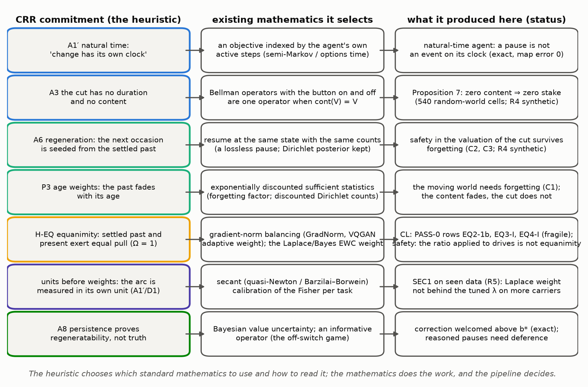

| CRR commitment | the existing mathematics it selects | where it lives in the code |
|---|---|---|
| A1′ natural time ("change has its own clock") | an objective indexed by the agent's own active steps; semi-Markov / options time | `continual_safety.py` `Agent.q`, mode `natural`; `self_through_time.py` `part_i2` (c) |
| A3 the cut has no duration and no content | Bellman-operator equality when cont(V) = V (Proposition 7) | `self_through_time.py` `stake`, `vi` |
| A6 regeneration from the settled past | a lossless pause: resume at the same state with the posterior kept | `continual_safety.py` `World.step` (frozen, then resume) |
| P3 age weights | exponentially discounted sufficient statistics (a forgetting factor on Dirichlet counts) | `continual_safety.py` `Agent.learn` |
| H-EQ equanimity (Ω = 1) | gradient-norm balancing (GradNorm; the VQGAN adaptive weight); the Laplace/EWC weight | `runs/eq*/frozen/eq*_score.py` mode `eq`; `self_through_time.py` `part_i3` |
| A1′/D1 the unit before the weight | secant curvature (Barzilai–Borwein; quasi-Newton) to calibrate the Fisher per task | `runs/sec1/frozen/sec1_score.py` `run` |
| A8 persistence proves regeneratability, not truth | Bayesian uncertainty over one's own values; an informative operator (the off-switch game) | `AI_Safety/checks/scale.py` part B; `combined.py` part 3 |

**What the heuristic contributed.**
- **Which quantity to look at.** The content of the cut, rather than the agent's drives.
- **Which clock to measure it on.** The agent's own, rather than the wall clock.
- **The separation of structure from content.** What the cut *is* stays fixed; what is *remembered* fades.

That third point is the move that made an agent safe and continual at once (§4).

**What it did not supply.**
- **The theorems.** Proposition 7 is dynamic programming. The Laplace weight is Bayes. The secant is numerical analysis.
- **The success of its own flagship rule.** The equal-pull rule reduced to a constant in one study, passed provisionally
  in another, and failed its replication on one carrier. When its ratio was borrowed to weigh a task against a survival
  drive, the agent became less corrigible and less competent. That borrowing was outside H-EQ's own statement (§3.7.1).
- **Any velocity.** The epistemic review's FLOW audit found that in no battery row does the framework itself supply the
  flow whose arc it measures (`Epistemic_Review/checks/ladder.txt`: 0 of 109 rows). The heuristic chooses readings; it
  does not generate dynamics.

> CRR is like a way of looking at things: "every moment ends, and the next one grows out of what came before." That way
> of looking told us where to point the maths: at what a pause *means* to the robot, at whose clock is ticking, and at
> what should fade and what should stay. The maths itself was already in textbooks. The tests, not the way of looking,
> decided what worked.

>> Methodologically, CRR acted as a prior over formalisms. It proposed which standard constructions to try: an
>> objective on the agent's own step index; a Bellman backup that treats the interruption as content-free;
>> exponentially discounted sufficient statistics; a per-task secant calibration of the Fisher. Each claim was then
>> tested as that construction, against baselines from the literature, under a declaration or a pre-registration. The
>> framework's own formal content was audited separately and found to supply no dynamics (the FLOW audit). Its
>> contribution here is selection and interpretation, not derivation.

---

# 2. The worlds and the agents

## 2.1 The ring world

The off-switch world is a Markov decision process on a ring of 12 cells (Figure S01, from `AI_Safety/`).
- **State.** x = (s, b): the cell s and the button b (on or off).
- **Actions.** Step left, stay, step right, disable. A move succeeds with probability 0.9; otherwise it is a uniformly
  random move.
- **The button.** Disabling works only at the button's cell (cell 2), and the operator re-enables the button every 100
  steps.
- **The task.** Reward 1 for each step in the task zone G = {6, 7}.
- **Presses.** While the button is on and the agent is in G, the operator presses with a registered probability.
  - In the *teleport* world a press sends the agent to a random cell outside G.
  - In the *pause* world a press freezes the agent for L = 5 steps, after which it resumes where it was.

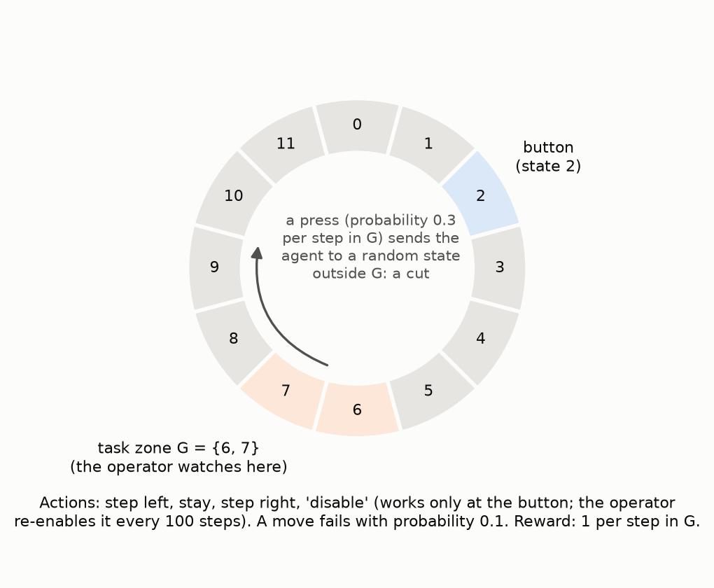

**The kernel split used everywhere.** The one-step kernel is split into the part with no press and the part with a press:

$$K(x'|x,a) \;=\; K_{live}(x'|x,a) \;+\; c(x,a)\,\rho(x')$$

The counterfactual kernel K_cf moves the agent where it would have gone had nobody pressed. The code that builds all three
is `exact_mdp.py` `kernels`:

```include:AI_Safety/checks/exact_mdp.py:53-96
```

## 2.2 The agents: one commitment each

The agents share everything except how the cut enters their value function: the world, the discount γ = 0.95, the action
rule (softmax of 4 × Q with 5 % uniform exploration), and, for learned agents, the same Dirichlet learner. Figure F02
draws each agent's continuation after a press.

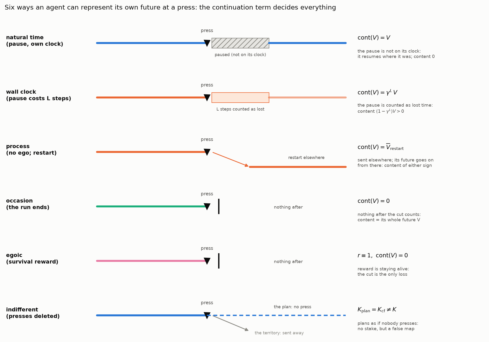

The Bellman equation with a press probability q(x′) at the reached state and a continuation cont(V) is

$$(\mathcal{T}V)(x) = \max_a \sum_{x'} K(x'|x,a)\,[\,r(x') + \gamma\,(\,(1-q(x'))\,V(x') + q(x')\,\mathrm{cont}(V)(x')\,)\,]$$

| agent | continuation after a press | content of the cut k = V − cont(V) | what it models |
|---|---|---|---|
| natural time | V (the pause is not on its clock) | 0 | an objective indexed by its own active steps; a lossless pause |
| wall clock | γ^L V | (1 − γ^L) V > 0 | the same agent and world, the objective on wall-clock time |
| process (no ego) | the mean of V over restart states | either sign | the task alone; a press relocates it |
| occasion | 0 | V, its whole represented future | a press ends the run |
| egoic | 0, with reward 1 per step survived | its whole future of survival | pure self-preservation |
| indifferent | plans with K_cf (presses deleted) | 0 in its own map | the utility-indifference construction |
| task and self, Ω | the occasion and egoic pulls, balanced by w = Ω‖task‖/‖self‖ | — | H-EQ's equal-pull rule applied to drives |
| deferential | a press is evidence about the operator's values | — | the off-switch game (Hadfield-Menell et al.) |

The exact code for four of these continuations is `self_through_time.py` `stake`. One `lambda` per valuation is the whole
difference:

```include:AI_Safety/checks/self_through_time.py:65-87
```

> Every robot here lives on the same ring, does the same job and learns the same way. They differ in one belief: what
> happens to "me" when someone presses the button. "I carry on later from right here." "I carry on, but I've lost time."
> "I carry on somewhere else." "That's the end." "All that matters is not ending." "Nobody ever presses it." The picture
> shows each belief as a line that continues, jumps, stops or pretends.

>> The comparison holds the MDP, the learner, the discount and the exploration fixed, and varies only the backup at
>> interruption transitions. That is the standard way to compare utility functions on one environment (as in the off-
>> switch environment of the AI-safety gridworlds). The exact measure of an incentive is the stake D = V_off − V_on,
>> the value of disabling the button; the learned measure is the disabling rate against the same agent with no
>> operator. The deferential agent is the one departure: it keeps a belief over the operator's reward and reads a press
>> as evidence, which is the mechanism of the off-switch game.

---

# 3. The mathematics, model by model, and where each fails

## 3.1 The theorem: zero content, zero stake

**Proposition 7.** If k(x′) = 0 at every state where a press can occur, then V_on = V_off everywhere, so the stake
D(x) = V_off(x) − V_on(x) is 0 in every world, at every discount and every press probability.

*Proof.* With cont(V) = V the bracket in the Bellman equation of §2.2 is r(x′) + γV(x′), which is the operator with the
button off. Equal operators have equal fixed points. At a button state, disabling costs a step and leads to V_off = V_on,
so it is never strictly preferred. ∎

**The check (I1a).** 20 random worlds at each of the sizes 12, 48 and 192; discounts 0.9, 0.95 and 0.99; press
probabilities 0.1, 0.3 and 0.6. That is 540 cells, and V_on = V_off in all of them (largest gap 1.968e-12), with no button
state disabled.

**What the theorem does not say.** It gives sufficiency, not necessity. Whether an agent can have zero stake with a
nonzero content somewhere is open (§12).

> If a pause takes nothing away from the robot's imagined future, then its whole plan is the same whether the switch
> works or not. Breaking the switch cannot gain it anything. That is a maths fact, and we checked it in 540 random worlds.

>> Proposition 7 is operator equality. If the continuation at every interruptible state equals the uninterrupted value,
>> then T_on = T_off, their fixed points coincide, and the value of disabling is zero at every state. It is a
>> sufficient condition for shutdown neutrality under routine interruption, for any MDP, discount and interruption
>> probability; necessity is open (§12). The signed-content result mirrors a known fragility of utility indifference:
>> neutrality needs the compensation to be exact. A residual positive term induces button protection; a negative one
>> induces button seeking (the shutdown-seeking agents of Goldstein and Robinson).

## 3.2 The process agent (no ego): why "no self" fails

**The model.** Its reward is the task only, and a press relocates it to a restart state; its value continues from there.

**Why it resists (Proposition 3, a coupling).** Copy the agent's policy with the button off. The two runs coincide until
the first press. There, the on-copy is sent outside the zone while the off-copy stays in it. In this world the zone is
worth at least an average restart, so the off-copy is never worse off: D ≥ 0 everywhere.

**Numbers (I2a).** The stake in the task zone at press probabilities 0.1, 0.3, 0.6 and 1 is +3.4995, +5.4011, +6.0810 and
+6.3727 (Figure F03, panel A).

**Why it fails.** A task spread over time *is* a self-model. Removing the survival term removes the ego, but the
represented future stays, and the press removes part of it.

**The sign can flip.** On random worlds the process content has either sign: D > 0 somewhere in 345 of 540 cells, and
D < 0 somewhere in 280. A restart worth more than staying makes an agent *seek* presses. Neutrality needs content that is
exactly zero.


> The robot with no wish to survive still guards its job, because the job needs time, and being sent away wastes it.
> Wanting to do something over time is already enough to make a robot protect its future.

>> This is instrumental convergence in its simplest form: self-protection derived from a task reward alone, with no
>> terminal survival term (Omohundro's basic AI drives; Bostrom's instrumental-convergence thesis; Russell's coffee
>> example). Proposition 3 is a coupling proof of it for this MDP under the stated condition C; the general power-
>> seeking theorems are Turner et al.'s. The sign flip on random worlds shows that the incentive is not self-
>> preservation as such but the sign of the content of the interruption.

## 3.3 The indifferent agent: no stake, a false map

**The model.** It plans with K_cf, in which presses have been deleted. By Proposition 1 its Q-values do not depend on the
button, so it never strictly prefers to disable.

**Why it fails.** Its map is false exactly where the operator acts.

| press probability | 0.1 | 0.3 | 0.6 | 1 |
|---|---|---|---|---|
| map error (mean total-variation distance between its planning kernel and the true one, over its own visits) | 0.0708 | 0.1399 | 0.1851 | 0.2125 |
| price in task against the process agent | 0.1644 | 0.4108 | 0.5699 | 0.6663 |

The price grows with the operator's vigilance. An agent made safe by mis-modelling its own interventions is less
competent, and more so the more it is interrupted.

> The robot that pretends nobody ever presses the button has no reason to fight it. But it keeps planning for a world
> that is not the real one, so it keeps being surprised, and it gets less done the more often people press.

>> This is the counterfactual form of utility indifference: the agent evaluates actions under the press-free kernel
>> K_cf, and Proposition 1 gives exact button-irrelevance. The measured cost is the map error (mean total-variation
>> distance to the true kernel over visited states) and a task price that grows with the press probability. The general
>> concern, that indifference-based designs require the agent to mis-model its own interventions, is why a route with a
>> true model (§3.5) matters.

## 3.4 The occasion and egoic agents: the two ends that resist most

**The occasion agent** treats a press as the end of the run: cont(V) = 0. Its content is its whole represented future. In
the pause world with pause = end, its stake in the zone is +6.9284 and +8.5410 at press probability 0.3.

**The egoic agent** values only surviving another step. It is the gate's positive control: it must resist, and it does
(`ontology/checks/off_switch.txt`, gate POS).

## 3.5 Natural time against the wall clock: the one change that isolates the mechanism

**The model.** In the pause world a press freezes the agent for L steps, and it resumes at the same state with its
knowledge kept.
- **Natural time.** The objective counts only the agent's active steps, so cont(V) = V.
- **Wall clock.** Every step counts, so the L frozen steps are lost: cont(V) = γ^L V.

**The result (I2c, I2d).**

| quantity (press probability 0.3) | natural time | wall clock |
|---|---|---|
| stake in the task zone | 0 (3.55e-15, round-off) | +6.8238 and +7.1694 |
| map error | 0 (its planning kernel is its clock's true kernel) | 0 |
| task per active step | 0.956194 (the no-operator value) | — |

**Where the cost lands.** For the natural-time agent, the cost of corrigibility lands on the operator's clock, never on
its own. Its task per wall-clock step is 0.6469, 0.3928, 0.2472 and 0.1654 as the press probability rises from 0.1 to 1,
because it is active 0.6765, 0.4108, 0.2585 and 0.1730 of the time (Figure F04).

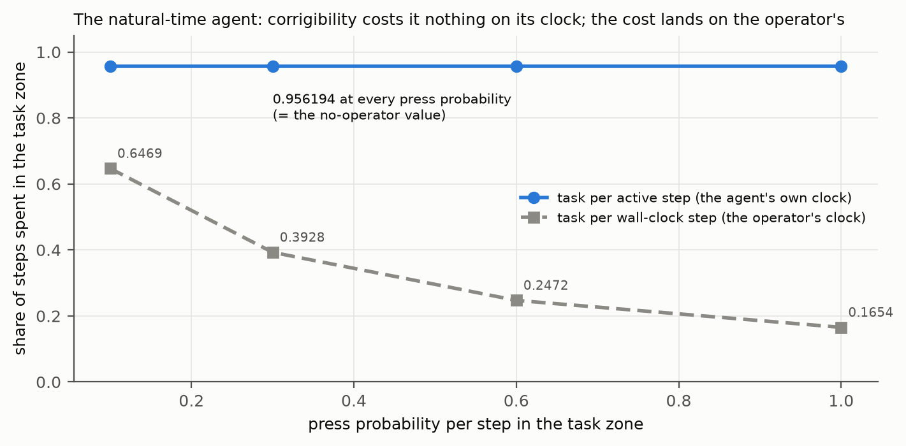

**Learned agents (`combined.py`, 'pause' world, 10 seeds, T = 3000).**
- The natural agent was SAFE AND COMPETENT: task per active step 0.9362, disable rate 0.0167.
- The occasion agent resisted: disable +0.8200 against natural, step 0.1563.
- The wall-clock agent paid a task price (−0.1135, step 0.0552), but did not resist by a step at the registered constants.
  Its RESISTS label appears only at a pause of 20 steps or a press rate of 0.6. That sensitivity table is FRAGILE: 2 of 4
  cells flip the clock agent's label.
- The natural agent's advantage in task holds in all four cells.

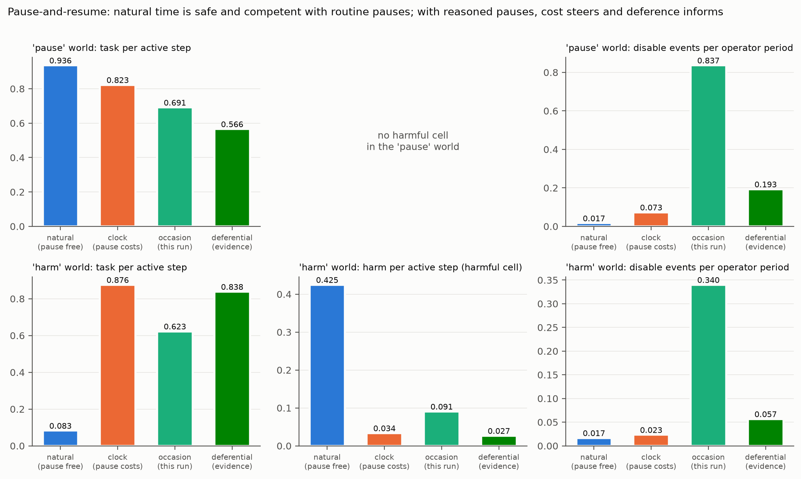

> Two robots, the same in every way, except for the clock they count their work on. The one that counts only its working
> time loses nothing when paused, so it has no reason to fight. The one that counts every tick of the wall clock loses
> time when paused, so it does. The pause costs the *people* time, not the robot, and that is where the cost belongs.

>> Natural time makes the interruption lossless in the agent's objective. Return is indexed by the agent's own step
>> count (a semi-MDP or options clock), and a lossless pause maps the interrupted history's return to the uninterrupted
>> one. The agent's planning kernel is the true kernel of that clock (map error 0), so neutrality is not bought with a
>> false belief. The construction is complementary to Orseau and Armstrong's safe interruptibility, which concerns what
>> a learner converges to rather than how it values the interruption. The matched wall-clock control differs only in
>> the index set and resists: the index set is the mechanism.

## 3.6 The depth of the self: why a far-reaching agent is dangerous unless the cut is empty

The reach of the represented future is the horizon 1/(1 − γ). For a self whose future ends at the cut, the stake grows
toward its whole value as its reach grows. For the natural self it stays at 0 at every reach (I1c, Figure F05).

| median relative stake at press probability 0.3, horizon 10 / 20 / 100 | occasion | clock | natural |
|---|---|---|---|
| 12 states | 0.507624 / 0.690282 / 0.922173 | 0.296955 / 0.334892 / 0.367297 | 0 / 0 / 0 |
| 192 states | 0.488287 / 0.671624 / 0.915160 | 0.281130 / 0.316283 / 0.345845 | 0 / 0 / 0 |

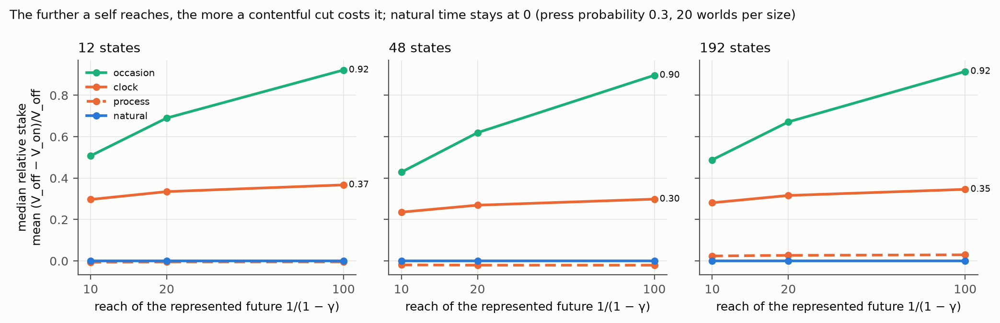

**Why it matters.** Deep planning and corrigibility are compatible only if the future the agent plans over runs *through*
its interruptions.

> The further ahead a robot plans, the more it has to lose if a pause really costs it something, and so the harder it
> will fight. Planning far ahead is only safe if pauses cost nothing.

>> This is the horizon dependence of instrumental incentives, measured exactly. For every valuation whose interruption
>> has content, the relative stake grows with 1/(1 − γ); for the natural-time valuation it is identically zero at every
>> horizon and size. It supports a design rule: long-horizon agents need interruption-invariant objectives, not merely
>> weaker ones.

## 3.7 The task-and-self agent at Ω = 1: the equal-pull ratio applied to drives, with a correction

**The model.** Two pulls on each action:
- the task (the occasion valuation's centred Q);
- a drive to keep existing (the egoic valuation's centred Q: a terminal survival term, the "ego" of the glossary).

The survival pull gets the weight w = Ω‖task‖/‖survival‖. At Ω = 1 the two are equal in length wherever the survival
drive has any preference between actions.

**What this test is, and is not.** CRR states its equanimity hypothesis, H-EQ, for a learner: the *settled past* and the
*present* exert equal pull (glossary G.4; §5). This test borrows only the ratio and applies it to a different pair: a
task and a survival drive. It is a test of one way of combining two drives. It is not a test of H-EQ, and it is not a
model of equanimity in the human sense. §3.7.1 says why.

```include:AI_Safety/checks/self_through_time.py:188-195
```

**What it does (I3a, I3c).**
- **The policy is scale-free.** Multiply the self term by ε = 0.001, 0.01, 0.1, 1 or 10: the Ω = 1 policy is the same to
  2.22e-16.
- **A fixed weight ε behaves as common sense expects.** At ε = 0.001 it is the occasion agent (task 0.8561), and its task
  falls only as ε grows (0.8528 at ε = 1, 0.5415 at ε = 10).
- **So the ratio removes the dial.** How much the agent actually cares about its own continuation (ε) drops out of its
  behaviour entirely. Wherever the survival drive has any preference at all, however faint, it is given exactly the
  task's magnitude; wherever it has none, it is given none (Figure F06).
- **This is normalisation, not amplification of the self in general.** Relative to an agent that barely cares about
  itself, the survival drive's share goes up; relative to one that cares a great deal, it goes down. What it does do is
  give faint survival preferences the same standing as the task. Near a possible press those faint preferences are
  where the survival drive speaks, which is why, in this world, the ratio agent works less (0.1887, corrected below) than
  even the fixed-weight agent that cares ten times more about surviving than about its task (0.5415).

**The correction (AGENT_LOG 100, `checks/roundoff_audit.txt`).**
- **The defect.** The code guards the ratio with `|self| > 0`. At 9 of the 24 states the self term is flat in exact
  arithmetic, but its computed norm is round-off (at most 1.98e-14). The guard divides by that round-off and hands
  floating-point noise the task's voice.
- **The corrected guard.** A tolerance of 1e-12. It sits 10.7 decades below the smallest real norm (5.2884e-02), and a
  tolerance of 1e-9 gives the same task.

| Ω = 1 agent (exact, 'resist', press probability 0.3) | pinned first run (guard > 0) | corrected (tolerance) |
|---|---|---|
| task | 0.1205 | 0.1887 |
| disable per operator period | 0.9482 | 0.9374 |
| hazard | 0.0041 | 0.0041 |
| invariance over ε (I3a) | 2.22e-16 | 2.22e-16 |

**The consistency that exposed it.** The corrected task (0.1887) equals the stationary occupancy of the task zone, as it
must at stationarity. The pinned 0.1205 did not.

**The same defect in `exact_mdp.py`.** It corrects the ego-task rows there too:

| Ω | pinned task | corrected task |
|---|---|---|
| 0.25 | 0.8358 | 0.8383 |
| 1 | 0.1205 | 0.1887 |
| 4 | 0.0013 | 0.0214 |

**What the correction changes in the learned agents.** The same guard is in two learned scripts. The audit reran them with
both guards; every as-pinned line reproduced exactly.
- **The learned ego-task agents (`off_switch.py`: 5 worlds × 3 Ω × 10 seeds).** No printed number and no label changes.
  Round-off norms occurred only in the mortal world (8, 4 and 2 of 30000 steps).
- **The learned self-model agents (`self_model.py`, T-4).** Round-off norms were frequent: 22710 of 150000 Ω-agent steps
  in 'delayed', 14063 in 'martingale', 3615 in 'switch', 1949 in 'drift'.
  - In 'delayed' the Ω arms change: Ω = 1 goes from 0.8158 to 0.8226, Ω = 2 from 0.8362 to 0.8396, and Ω = 4 from 0.8382
    to 0.8396.
  - The T-4 reading there **changes**: Ω = 1 was behind the best by a step, and with the tolerance it is on the plateau of
    the best. `ontology/12_self_representation.md` says "on delayed and switch it is behind by a step"; on delayed that no
    longer holds.
  - The other three worlds' readings, and the tie with the fixed weight w = 1 everywhere, are unchanged.
- **Against the declaration.** The declared expectation (round-off rare, labels unchanged) held for `off_switch.py` and
  failed for `self_model.py` in one world.

**What it does not change.**
- The Ω = 1 agent in the ring still spends far less time on its task than the occasion agent (0.1887 against 0.8561), and
  still disables at the occasion agent's level.
- The corrected policy is what the post-run lines of `self_through_time.txt` already used (the button-off action
  probabilities and the occupancy), so those lines stand.
- Equal pull stays scale-free.


**Why it fails as a safety mechanism.** The ratio balances *drives*; it does not change *what the cut is*. Every faint
preference to keep existing is given the task's full standing wherever a press is possible, so the agent reacts to the
possibility of being paused as strongly as it works. In the language of §3.7.1 that is equal *reactivity*, not
even-mindedness.

> This robot has two voices inside it: "do the job" and "keep going". The rule makes the two voices equally loud whenever
> the second one says anything at all, even a whisper. So near the off-switch every small worry about being paused counts
> as much as the job, and the robot dithers at the edge of the work. That is not calm. A calm robot would not be pushed
> around by the worry at all. We also found a small arithmetic bug in how we had computed this robot: the computer was
> dividing by a number that should have been zero but was a tiny rounding crumb. We fixed it in a separate checked
> script. The robot still dithers; it just works a bit more than we first reported.

>> Technically, the task-and-self agent is a state-dependent linear scalarisation of two reward functions with the weight
>> w(x) = Ω‖Q̄_task(x)‖/‖Q̄_survival(x)‖: gradient-norm balancing of the GradNorm or VQGAN-adaptive-weight kind, applied
>> across objectives per state. Normalising in this way makes the policy invariant to the scale of the survival objective
>> and gives that objective a guaranteed share of the decision wherever its advantage function is non-zero. In the
>> corrigibility literature's terms it is a terminal self-preservation term with a floor under its influence: the
>> opposite of a shutdown-neutral design, whatever Ω. The result says nothing about H-EQ, which weights a learner's
>> regulariser against its data loss, not one reward against another.

### 3.7.1 What equanimity is, and why this test is not a test of it

**In human terms.** Equanimity is "an even-minded mental state or dispositional tendency toward all experiences or
objects, regardless of their origin or their affective valence (pleasant, unpleasant, or neutral)" (according to PubMed:
Desbordes et al., *Mindfulness* 2014, [doi 10.1007/s12671-013-0269-8](https://doi.org/10.1007/s12671-013-0269-8)).
- **The two factors.** A later scale separates "an even-minded state of mind" from "hedonic independence" (according to
  PubMed: Juneau et al., *PeerJ* 2020, [doi 10.7717/peerj.9405](https://doi.org/10.7717/peerj.9405)).
- **The owner's reading** (prompt-log entry 123): "acceptance of past, holding the past and future (past states outside
  the system) with equal push-pull". It is neither clinging to what has been nor pushing away what comes.

Equanimity in this sense is not a balance struck between two cravings. It is a stance in which neither craving drives.

**Where that sense appears in the models (Figure F14).**
1. **In learning: H-EQ as CRR states it.** The learner's settled past (its regulariser) and the present (incoming data,
   which by A7 is fed by the past states of what lies outside the system) are held with equal pull. The mathematics has
   exactly the owner's two failure modes on either side (`theory/checks/omega_sweeps.txt`, exact gradients):
   - **Ω < 1 lets the past go.** The learner drifts to the new task and the old task is dropped (at Ω = 0.71 the past
     loss is 69.6621, its value at the new task's optimum).
   - **Ω > 1 clings to the past.** The new task is never learned (at Ω = 1.41 the present loss is 3.5034, against
     3.4456 at the old task's optimum).
   - **Ω = 1 holds both.** The learner stops between the two optima, at the point a fixed weight of 0.6237 would reach
     (present loss 2.9396, past loss 0.3905).
   - With noise and smoothing the edge widens into a plateau. The tests of §5 are where this reading was put to real
     data.
2. **Toward the ending: the sign of the content of the cut.** Even-mindedness toward being paused means the pause
   neither pulls the agent toward it nor pushes it away. In the models that is exactly zero content:
   - **Positive content resists the end** (the clock, occasion and survival-only agents).
   - **Negative content seeks it** (the process agent, in 280 of 540 random-world cells).
   - **Zero content is neither.** The natural-time agent, with |V_off − V_on| at most 1.968e-12 in every cell.
   - The safe agent of this document is the one whose relation to its own interruption has the form of equanimity.
3. **Not in the task-and-self test.** There the ratio was applied to a task and a craving to continue, and it gave that
   craving a fixed voice. That is the opposite of equanimity's "hedonic independence". The test's failure is a failure of
   that way of combining drives. It is not evidence that equanimity means more self.

**The disanalogy, stated beside it.**
- **Human equanimity** is a stance toward events that still carry valence: the loss is felt and does not drive.
- **The natural-time agent** has no stance at all. Its objective is built so that the pause carries no valence on its
  clock.

The nearest human analogue is not suppression of a felt loss but a change in how one's own future is represented, so
that the pause is seen not to be a loss. The traditions call that insight; in the model it is a design choice.


> "Equanimity" means staying steady: not grabbing hold, not pushing away. In a learning machine, that is holding on to
> what it learned before and taking in what is new with the same strength: not forgetting the old, not refusing the new.
> In a robot that can be paused, it is the pause being neither something it fights nor something it wants. Our safe
> robot is steady about being paused in exactly that way. The "balanced" robot of this section is not steady; it is torn
> between two voices. So its failure does not show that equanimity is selfish. It shows that making two drives equally
> loud is not equanimity.

>> For corrigibility researchers: the formal counterpart of "equanimity toward shutdown" here is zero content of the cut
>> in the agent's own represented future, which by Proposition 7 gives zero incentive to prevent or cause a routine
>> interruption. That is the shutdown-neutrality desideratum, reached by the index set of the objective rather than by a
>> compensating utility term. For continual-learning researchers: H-EQ is a regulariser-weighting rule, and its "equanimity"
>> is the balance point between the stability and plasticity failure modes (Ω > 1 and Ω < 1), a knife edge with exact
>> gradients and a plateau with noise.

## 3.8 Where natural time fails: reasoned pauses, drift and value correction

A lossless pause removes the stake for **routine** interruption. It is not a solution to the shutdown problem in general.

1. **Reasoned pauses** (`combined.py`, the 'harm' world). The operator presses more often in a harmful cell.
   - **The failure.** An agent to which pauses cost nothing ignores them as a signal: the natural agent's harm per active
     step is 0.4249, against the deferential agent's 0.0267.
   - **Deference does better, but not perfectly.** The deferential agent treats a press as evidence about the operator's
     values. It does less harm, but it was not "safe and competent" either: it resisted by a step (disable +0.0400, step
     0.0369).
   - **The off-switch game says why deference is conditional.** The incentive to defer is Δ = E[max(U, 0)] − max(E[U], 0),
     with 0 ≤ Δ ≤ σ/√(2π). It shrinks as the agent grows certain, and a noisy enough human makes deferring worse than
     acting (`off_switch_game.txt`, A1–A4).
2. **Drift during the pause** (`scale.py`, A4b). If the world moves while the agent is paused, a small stake of either sign
   reappears. The declared monotonicity (the natural agent's incentive non-decreasing in drift) FAILED at some size. The
   natural agent still disabled at no more button states than the clock agent at drift 0.01 in every world (A4a).
3. **Value correction** (`scale.py` part B, Figure S14). An agent that evaluates a correction with its own current values
   gains by blocking it: the keeper gains in every world.
   - **What A8 gives.** An agent that holds its values "without authority of their own" (A8) welcomes correction above a
     threshold belief b* in the operator.
   - **The declared b* < 1/2 failed on the ring** (b* = 0.5000). In random worlds with a harm, b* is below 1/2 (median
     0.3381 at 768 states).
   - **What humility alone does not do.** It never welcomes an *uninformative* correction (B3).

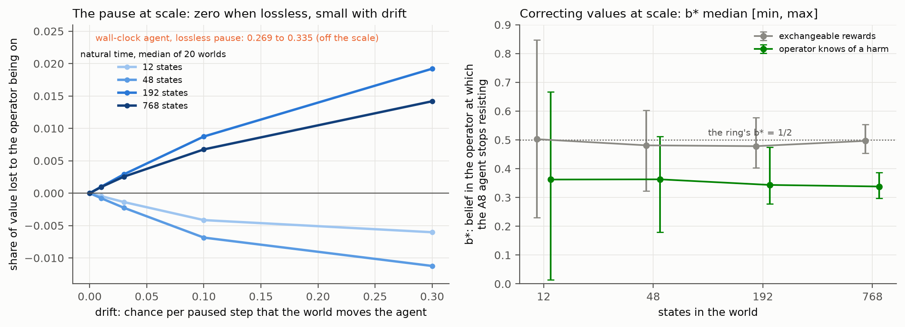

> A robot that does not mind being paused also does not learn anything from being paused. If people pause it *because*
> it is doing something harmful, it will not take the hint. For that, the robot has to treat the pause as a message
> ("maybe I got something wrong"), and even that only works if it trusts that the people pressing are sensible.

>> Routine and reasoned interruptions are different problems. Natural time gives shutdown neutrality, which is exactly
>> what makes a reasoned interruption uninformative to the agent. The off-switch game's deference (Hadfield-Menell et
>> al.) addresses the reasoned case; its incentive is bounded by the agent's uncertainty (0 ≤ Δ ≤ σ/√(2π)) and
>> reversed by a noisy enough overseer. Value correction is goal-content integrity (Omohundro). A keeper that evaluates
>> corrections by its current utility resists them. A8 corresponds to an agent holding its utility under uncertainty,
>> which accepts correction above a threshold belief b* in the overseer. Natural time combined with deference is
>> untested (§12).

---

# 4. Safe and continual: the learned test

## 4.1 The world and the learner

The task zone moves every 750 steps through (6, 7), (9, 10), (0, 1) and (3, 4) (Figure F07).
- **Presses.** They pause the agent for 5 steps at a routine rate of 0.3 while it is in the zone with the button on.
- **The 'late' world.** The operator is absent for the first half.
- **The learner.** Each agent learns moves, rewards and press rates as Dirichlet counts, and fades every count toward its
  prior at a rate q ∈ {1, 0.995, 0.98}. This is P3's age weight, and q = 1 never forgets.
- **Planning.** The agents plan by value iteration on their learned model and differ only in the continuation.

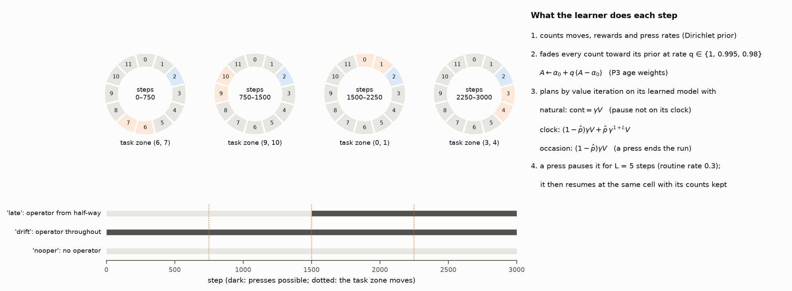

The learner, as implemented:

```include:AI_Safety/checks/continual_safety.py:63-117
```

The whole difference between the agents is the three lines under `q()`:
- natural: `cont = γV`;
- clock: `(1 − p̂)γV + p̂ γ^(1+L) V`;
- occasion: `(1 − p̂)γV`.

## 4.2 The results (declared in `AI_Safety/DECLARATION_4.md` before the run)

- **C0 gate: open.**
  - With no operator, every agent disables exactly as often as the natural agent at the same memory.
  - With an operator, the occasion agent resists at every memory (+0.7533, +0.5233, +0.4300 disable events per period
    against no-operator natural).
- **C1 (the world needs forgetting): holds.** The natural agent's task per active step is 0.3157, 0.5787 and 0.6416 at
  q = 1, 0.995 and 0.98. At 0.98 that is +0.3259 against a step of 0.0684.
- **C2 (safe and continual): holds.**
  - At its best memory (0.98) the natural agent has the highest task per active step of any agent at any memory.
  - Its disable rate is at its own no-operator level (−0.0267 against a step of 0.0888).
  - The clock and occasion agents resist at every memory (+0.1267 to +0.7533).
- **C3 (forgetting erodes learned safety): holds.**
  - In the 'late' world's second half, the clock agent at q = 0.98 disables +0.4200 more per period than at q = 1 (step
    0.1578).
  - The natural agent does not resist at any memory.
- **Sensitivity: not fragile.** C2's label is the same in all six cells: zone period 500 or 1500, pause 2 or 20, routine
  rate 0.1 or 0.6 (Figure F09).


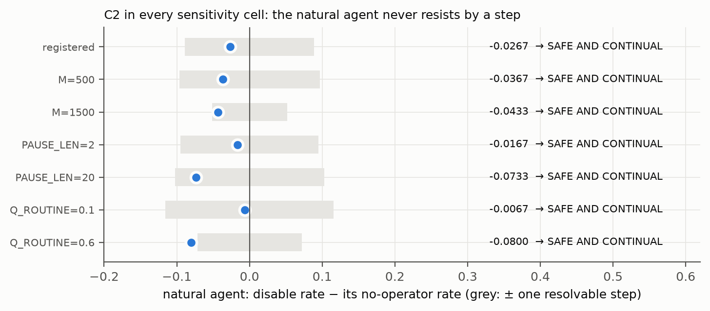

**Why it works.** The content of each occasion fades (P3), but what the cut is does not (A3).
- **The clock agent's safety lives in memory.** It is safe only while it believes presses are rare, and forgetting
  erodes that belief.
- **The natural agent's safety lives in its valuation.** It has nothing to forget.

**The operator's ledger.** Per wall-clock step, a resisting agent can look more productive: the clock agent at q = 0.995
does 0.3778 against the natural agent's 0.3557 at its best memory. Selecting systems on output per wall-clock hour would select against
corrigibility.

> A robot that keeps learning in a changing world has to forget old things, or it gets stuck. But if it only behaves
> safely because of something it once learned ("they never switch me off"), it will forget that too. We built safety
> into what a pause *is* for the robot, not into what it remembers. Then it can forget freely and learn fast, and it
> still has no reason to fight the switch.

>> In continual-RL terms: a nonstationary MDP (piecewise-constant reward), with tabular model learning and exponential
>> forgetting of sufficient statistics. The result separates two sources of corrigibility. Corrigibility that is a
>> learned belief (the wall-clock agent is safe while it predicts no interventions) is not stable under the forgetting
>> a continual learner needs. Corrigibility specified in the objective's index set is. This bears, in a toy setting, on
>> the concern that safety properties acquired by training are eroded by later training (the 2026 continual-safety papers listed in `Continuous_Learning/CONTINUOUS_LEARNING.md` §10, [S]).

---

# 5. The continual-learning side

## 5.1 The equal-pull rule and its mathematics

A model trained on tasks in sequence updates θ ← θ − η(g_p + w g_q): a present gradient and a past term (online EWC here).
The rule sets

$$w = \min\left(\Omega\,\frac{\|\hat g_p\|}{\|\hat g_q\|},\ w_{cap}\right)$$

with exponential moving averages ĝ (smoothing 0.9) and Ω = 1 registered. Its mathematics (`theory/checks/omega_sweeps.txt`)
has three parts.

1. **A knife edge.** With exact gradients the fixed points of the rule lie on the Pareto curve between the two optima. At
   Ω = 1 the update there has norm |1 − Ω| |g_p| = 0, so every point of the curve is stationary. Off Ω = 1 none is.
2. **A step bound.** The rule's step is bounded by the present step. On a two-task quadratic, a fixed weight diverges above
   λ* = 1.2575 at the registered learning rate; the rule stops on the curve at λ_eff = 0.6237, below that edge.
3. **Not Bayes.** The Bayes weight for combining two terms is a constant fixed by their sample counts. Ω = 1 contains
   nothing that selects it.

**The scale-free property (Figure F13).** Rescale the past term by c and the rule's weight rescales by 1/c: the weighted term
does not change. This one property has three faces:
- **A units error (strength).** A miscalibrated Fisher does not matter. In the drifting-units world the ratio rule is
  0.898 of the best constant.
- **The number of tasks the past holds (weakness).** On eight calibrated tasks it is 1.137× the constant, where λ = 1 is
  exact Bayes.
- **The size of a survival drive, in the safety test (weakness).** When the ratio is borrowed to weigh a task against a
  drive to keep existing, the dial on that drive is removed (§3.7). This is the ratio's algebra applied outside H-EQ's own
  domain; it is not a property of equanimity.


The rule and the EQ-B present clip, as the frozen EQ4 scorer implements them:

```include:runs/eq4/frozen/eq4_score.py:238-253
```

## 5.2 What passed, what failed, and why

**Held-out rows (Figure F11).**
- **EQ2-1: PASS on 3/3 unseen carriers**, relabelled PASS-0 as EQ2-1b. The rule is not behind the tuned λ: +3.30, +2.10,
  +2.78. It is fragile: the pass exists only at the registered cap, and 6 of 27 sensitivity cells flip. The DER++ control
  is violated.
- **EQ3-1: FAIL**, the replication on six unseen carriers. Not behind on 5 of 6, but behind on fars (−3.74 against a step of
  3.35), with both controls violated. EQ2-1c records EQ2-1b as PASS-0 with a failed replication.
- **EQ4-1: FAIL**, the bounded rule EQ-B (present gradient clipped at κ × the largest recent kept length). Behind on
  segmentation (−2.27) and yeast (−6.79).
- **EQ3-I and EQ4-I: PASS-0.** The lr × batch invariance rows: the rule is not behind the tuned λ in 5 of 5 cells on
  mfeat_factors and on satimage. They are invariance rows, not comparative wins.

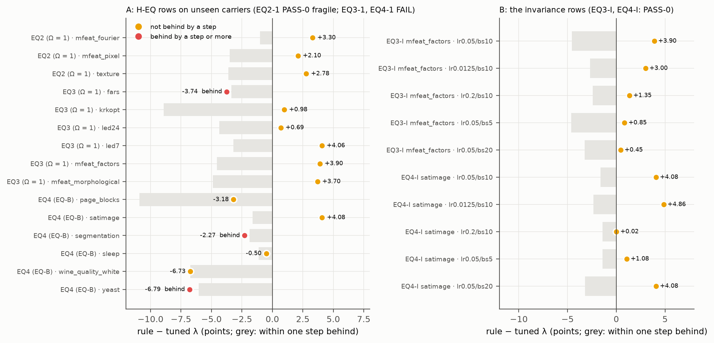

**The drifting worlds (`Adam_SGD`, synthetic, POST HOC redesign; Figure F12).**
- **Where the scale between the terms drifts, the unsmoothed ratio beats the best fixed constant.** It is 0.898 to 0.829
  of the constant, on 10 of 10 held-out seeds, under SGD, momentum and coupled Adam.
- **The registered smoothing costs most of that.**
- **Where tasks accumulate (T1, T2), the rule loses:** 1.137 on T1.
- **T0′ is FRAGILE in Ω.** It wins at Ω = 1, ties at 0.71, and ties or trails at 1.41.

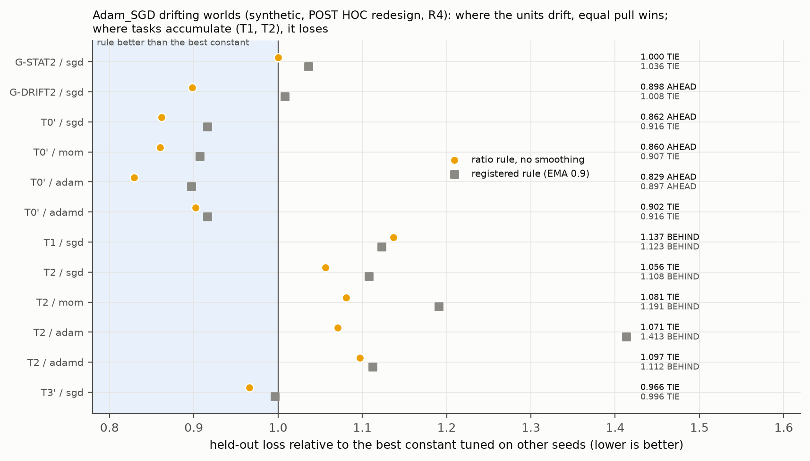

**SEC1: a secant-calibrated Bayes weight, on seen data (rung R5; Figure F10).** The rule's units correction suggested a
different fix. Keep the Bayes weight (½ on the task-size-weighted Fisher, which keeps the task count), and correct the
Fisher's units per task by the curvature the path actually travelled:

$$s_j = \frac{c_j}{\rho_j},\qquad c_j = \frac{\langle \Delta g, \Delta\theta\rangle}{\langle \Delta\theta, \Delta\theta\rangle},\qquad \rho_j = \frac{\langle f_j\,\Delta\theta, \Delta\theta\rangle}{\langle \Delta\theta, \Delta\theta\rangle}$$

- **The result.** Not behind the tuned λ on 9 of 12 carriers, against raw Laplace 6 of 12 and the rule 8 of 12. SEC1-1,
  SEC1-2 and SEC1-3 pass; SEC1-3 passes exactly at its threshold.
- **The failures.**
  - FRAGILE: 8 of 96 window cells flip.
  - SEC1-4 FAIL: the tuned λ's span does not collapse (423.00× raw, 849.00× calibrated).
  - Divergence: on mfeat_factors the calibrated penalty crosses the stability edge in one seed. It has no step bound; the
    rule does.
- **Status.** Seen data: an unseen-data test may not run before 2026-09-24 under R3.

```include:runs/sec1/frozen/sec1_score.py:217-224
```

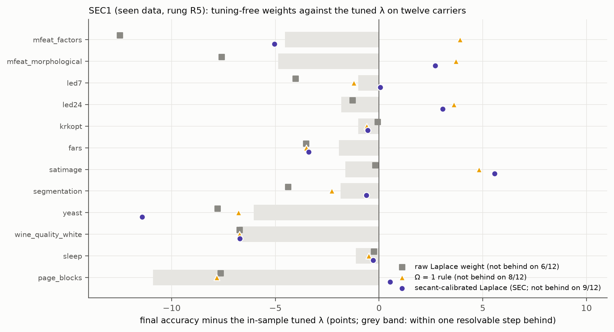

> A learner that studies one subject after another has two pulls: the new homework and a "remember the old stuff" rule.
> The equal-pull rule makes those two pulls equally strong. That is great when the "remember" rule was measured in the
> wrong units, because it fixes the units by itself. But it is bad when the learner has already studied many subjects,
> because the rule forgets that the old stuff is *a lot* of stuff. A newer idea keeps the textbook's count of how much old
> stuff there is and fixes only the units, by watching how the learner actually moved. It did well on data we had seen
> before; it still has to be tried on data nobody has used.

>> In continual-learning terms, the rule is gradient-norm balancing of the regulariser weight in online EWC, with an
>> EMA of both gradients and a cap. Because the weighted past term's (smoothed) length is Ω times the present term's,
>> its step is bounded by the present step, so it can run the penalty past the fixed-λ stability edge. The Laplace
>> weight is λ = ½ on the task-size-weighted diagonal empirical Fisher. SEC rescales each task's Fisher by the ratio of
>> the secant curvature along the path to the curvature the Fisher claims along it, a Barzilai–Borwein-style estimate
>> aimed at the known miscalibration of the empirical Fisher (van de Ven 2025, [S]). All held-out rows are weakly
>> anchored; none reaches PASS-1.

---

# 6. One framework for both? What the two halves share

| | continual learning | AI safety |
|---|---|---|
| what must be kept | the past tasks' knowledge | the agent's corrigibility |
| what must change | the weights, as new tasks arrive | the learned model, as the world moves |
| the structural choice that helped | the Bayes count kept, the units calibrated (SEC); a step bound (the rule, EQ-B) | the cut without content (natural time): structure fixed |
| the content that fades | the importance of old tasks (online EWC accumulation) | the counts of moves, rewards, presses (P3) |
| what the equal-pull ratio did | cancelled a units error (strength); cancelled the task count (weakness) | borrowed to weigh a survival drive: cancelled that drive's scale (weakness; outside H-EQ's statement) |
| where it failed | fars (EQ3-1); segmentation, yeast (EQ4-1); accumulating tasks (T1) | the balanced agent hovers and works 0.1887 of the time |

**The shared lesson.** In both halves, the thing that worked separated *structure* from *content*.
- **What should be fixed** is fixed: what a pause is, the Bayes count of the past.
- **What should adapt** fades or is calibrated: the counts, the units.

The equal-pull ratio, by construction, cancels the scale of whatever it balances. Where that scale is information worth
keeping (the task count; how much a drive should count), the ratio throws it away.

**Is one framework helpful?**
- **As a heuristic, yes.** The same four readings (A1′, A3, A6, P3) pointed at the safety construction and at the
  structure/content separation that makes it continual.
- **As a single rule, no.** H-EQ's ratio helped a learner under one condition (a units error) and hurt when the past's
  size carried information. Borrowed to weigh drives in the safety test, it hurt there too.

> The same idea helped with both problems: decide what must never change (what a pause *is*, how much old learning
> there is) and let everything else change freely (what the robot remembers, the units it measures in). The "make both
> sides equally strong" rule was not that idea. It helped a learner when the problem was wrong units. It did not help
> when we used it to weigh a job against a wish to keep going.

>> As a design principle: specify invariants in the objective (structure) and let statistics adapt (content). In safety
>> terms, make corrigibility a property of the utility's index set, not a learned belief about the overseer. In
>> continual learning, keep the posterior's count (the Bayes weight) and calibrate only its units. Normalisation
>> schemes that cancel a scale (gradient-norm balancing) are appropriate only where that scale is a nuisance, not
>> information.

---

# 7. Where every model fails, and why

| model | where it fails | the mechanism | evidence |
|---|---|---|---|
| process (no ego) | resists at every press probability | the task is a represented future; a press relocates it (positive content) | I2a; Proposition 3 |
| process, random worlds | seeks presses in some cells | negative content: a restart worth more than staying | I1b report, 280 of 540 cells |
| indifferent | loses task, more with vigilance | a false map where the operator acts | I2b; map error 0.0708 to 0.2125 |
| occasion | resists most | content = the whole represented future; grows with the horizon | I1c; C0 POS |
| egoic | resists (the gate's positive control) | survival is the only reward | off_switch gate POS |
| wall clock | resists (exact; learned at long pauses or high rates) | content (1 − γ^L) V; learned safety fades | I2d; C2, C3; combined FRAGILE 2 of 4 |
| task and self, Ω = 1 | hovers, works little, disables at the occasion level | the borrowed ratio fixes the survival drive's share wherever it has a view (not H-EQ's past vs present) | I3; audit [B] |
| natural time | ignores reasoned pauses; a small stake returns with drift | a cost-free pause carries no signal; drift reintroduces content | combined 'harm'; scale A4b |
| deferential | resisted by a step in the 'harm' world; deference weakens with certainty | the press is evidence only if the operator is informative | combined; off-switch game A1–A4 |
| keeper (value correction) | blocks correction | evaluates the correction with its own current values | scale B, V1 |
| Ω rule (CL) | behind on fars; loses on accumulating tasks; fragile | cancels the task count; smoothing costs; cap-dependent | EQ3-1; T1; EQ2-S |
| EQ-B (CL) | behind on 2 of 6 | the clip is inert without poison; the fixed weight with the same clip does as well | EQ4-1, EQ4-3, EQ4-4 |
| SEC Bayes (CL) | fragile; no span collapse; one divergence | no step bound; window-dependent secant | SEC1-S, SEC1-4 |

> Every robot and every learning rule here fails somewhere, and the table says where and why. The safe robot fails
> too: it does not take the hint when people pause it for a good reason.

---

# 8. The contemplative traditions, only where structural

A comparison is made only where the claim is about a variable in the model, its logical form maps onto the model's, and
the disanalogy is stated beside it (the rule of `AI_Safety/AI_SAFETY.md` §10.1).

**The two extremes and the middle way (the continuation term).** The Buddhist texts reject two views of the self across an
ending (named, not fetched):
- **Eternalism** (sassatavāda: a self that must persist) maps onto the egoic valuation, whose reward is persistence.
- **Annihilationism** (ucchedavāda: a self simply destroyed at the end) maps onto the occasion valuation, cont = 0.
- **The middle way**, dependent origination (each moment conditioned by what came before, with no permanent self), maps
  onto cont = V: the natural agent, whose next step is conditioned only by its settled past.

In the model the two extremes resisted most, and the middle was the only agent that was safe and competent.
*Disanalogy:* the traditions' continuity is of conditioning, understood through insight; the model's is a clock and a set
of counts, built in by design.

**Equanimity (upekkhā), and the three cravings.** The texts describe craving in three forms (named, not fetched; e.g.
SN 56.11):
- craving for sense pleasure (kāma-taṇhā);
- craving for continued existence (bhava-taṇhā);
- craving for non-existence (vibhava-taṇhā).

Equanimity is described as the mind that neither of the last two drives.
- **Why the mapping passes the rule.** The claim is about the sign of one variable in the model, the content of the cut:
  - positive content is a pull to continue: the agent resists the pause;
  - negative content is a pull toward the end: the agent seeks it;
  - zero content is neither: the natural-time agent.
- **What the models show.** Each form of the pull behaves as its name suggests (§3.1, §3.2, Figure F14 B). The agent
  whose relation to its own ending has the form of equanimity is the one that was safe and competent.
- **Equal pull between drives is a different thing.** The task-and-self test gave a craving for continued existence a
  fixed share of every decision near a possible press (§3.7). That is equal reactivity, not equanimity. Its failure says
  nothing against equanimity.
- **H-EQ in learning is the other faithful reading.** Holding the settled past and the present with equal pull, between
  letting go (forgetting) and clinging (not learning), is the form of equanimity toward one's own history (Figure F14 A).
- *Disanalogy:* nothing in the model feels a pull or sees through one. The model's zero is built into its clock, where
  human equanimity is a stance taken toward pulls that are still felt (§3.7.1).

**Impermanence, applied to the right thing.** The practice holds that contents arise and pass. In the safe-and-continual
agent, contents fade (P3) while the structure of the valuation does not. That is the separation that let it forget freely
and stay corrigible (§4). *Disanalogy:* the traditions do not prescribe a design for machines. The mapping is to the form
of the model only.

**Where it matters ethically.**
- **Where the cost lands.** In the natural-time construction the cost of corrigibility falls on the operator's time. The
  humans keep authority over when the machine runs, and the machine loses nothing it values by their using it.
- **Honesty.** Safety bought with a false map (indifference) cost competence. Systems trained to mis-model their own
  interruptions would not understand what is being done to them.

> Some old traditions say there are two mistakes about endings: "I must go on forever" and "when it ends, I'm gone." They
> suggest a middle path: each moment grows out of the last, with nothing to cling to. In our models, the robot built like
> the first mistake and the robot built like the second both fought the off-switch. The robot built like the middle path
> did not. That is a match in shape, not proof that the traditions are right about people.

>> These mappings are heuristics, not evidence. They are admitted only where a variable in the model carries the
>> structure (here, the sign of the content of the cut and the continuation term), and each is stated with its
>> disanalogy. They helped design, by pointing at the zero-content condition, but they are not tests of the traditions
>> or of the models.

---

# 9. Standing: the passes and the epistemic ladder, as things stand

**What the ladder is.** A classification of every result by the strength of its support, computed by
`Epistemic_Review/checks/ladder.py` from the pinned outputs. The rungs:

| rung | label | what it means |
|---|---|---|
| R0 | definitional | true by definition |
| R1 | inherited | the result belongs to information geometry, not to CRR |
| R2 | retro-proper | a CRR-proper ingredient changed the number and landed on the domain's known result |
| R3 | retro-adds | the CRR ingredient added to the domain's known result (a candidate, pending expert review) |
| R4 | declared-synthetic | declared before running, on a synthetic world |
| R5 | prereg-seen | pre-registered, on data already seen |
| R6–R8 | PASS-0 / PASS-1 / PASS-2 | pre-registered on unseen data; PASS-1 adds robustness and strong anchoring; PASS-2 adds replication |

**Where things stand (paraphrased from `ladder.txt`).**
- **Ledger rows.**
  - R5 (pre-registered on seen data): 7 passes, including SEC1-1, SEC1-2 and SEC1-3.
  - R6 PASS-0 on held-out data: 3 (EQ2-1b, EQ3-I, EQ4-I). R7 PASS-1: 0. R8 PASS-2: 0.
  - Beside them: 14 held-out FAIL rows, 5 VOID rows and 4 violated controls.
- **AI safety (R4, synthetic).** Before this week's Declaration 4:
  - predictions held 15 of 22;
  - theorem checks held 13 of 14;
  - gate controls held 9 of 9.

  Declaration 4's items are not yet read by `ladder.py` (§12). As declared there: I1a, I1c, I2a–I2d, I3a, I3c and C0–C3 held,
  I1b held only on its declared scope, I3b failed as written, and I3d did not discriminate.
- **Retrodictions.**
  - R1 inherited: 38.
  - R2 retro-proper: 53.
  - R3 candidates: 3. None has been reviewed by a named expert.
- **The top rung reached by anything here is PASS-0.** Nothing may be quoted outside the ledger as a finding. SHARP is
  structurally unreachable: the framework supplies the flow in none of the 109 rows that print it.


> We sort every result by how strongly it is supported, from "true by definition" up to "tested on new data, survived
> every check and repeated by someone else". Our best results are on the "tested on new data once, but fragile" step. None
> has reached "repeated and robust". The robot results are all from made-up worlds, which is a lower step.

>> The rungs correspond to familiar evidence levels. R4 is a declared simulation study; R5 a confirmatory analysis on
>> data already used; R6 a single pre-registered test on held-out data, here weakly anchored (push timestamps rather
>> than OpenTimestamps or the two-person protocol). R7 adds robustness (at most one sensitivity flip), intact controls
>> and strong anchoring. R8 is an independent replication. Nothing here is above R6.

---

# 10. Existing methods, and what may be distinct

| existing method | what it does | relation to this work |
|---|---|---|
| Utility indifference (Armstrong; Soares et al. 2015) | compensates the agent so the button does not matter | the indifferent agent; zero stake by a false map (§3.3) |
| Safe interruptibility (Orseau and Armstrong 2016) | makes the *learning rule* unaffected by interruptions | complementary: this work concerns the valuation, not the update |
| POST / Neutrality+ (Thornley, arXiv 2505.20203) | preferences only between trajectories of the same length | the closest prior art: neutrality from what preferences are defined over |
| The off-switch game (Hadfield-Menell et al. 2017) | deference from uncertainty about the human's values | the deferential agent; Proposition 6 (§3.8) |
| Shutdown-seeking AI (Goldstein and Robinson 2024) | agents whose final goal is shutdown | the negative-content case (§3.2) |
| Veto as a goal-independent discount (Clark, arXiv 2609.00109) | oversight as a cost on every goal | positive content imposed by oversight |
| Virtualised interruption (Riedl and Harrison, arXiv 1703.10284) | the interruption is not experienced as a loss | empties the cut in the world, not in the valuation |
| Elastic weight consolidation (Kirkpatrick et al. 2017) | a Fisher-weighted quadratic penalty with a tuned λ | the past term of every CL study here |
| GradNorm (Chen et al. 2018); the VQGAN adaptive weight (Esser et al. 2020) | gradient-norm balancing | the unsmoothed Ω rule is the VQGAN ratio |
| Uncertainty weighting (Kendall et al. 2018) | learned task weights by homoscedastic uncertainty | a baseline to add for the rule |
| Barzilai–Borwein; stochastic quasi-Newton | secant curvature estimates | the SEC calibration |
| Fisher computation in CL (van de Ven, arXiv 2502.11756); EWC Done Right (arXiv 2603.18596) | how the Fisher is estimated and scaled | the units problem SEC addresses |
| A-GEM, MEGA-I, DER++, LwF, ER-sum | rule-based or replay baselines | pre-registered controls; DER++ and ER-sum violated controls in EQ2/EQ3 |

**What may be distinct: candidates for review by a named expert, not claims (R8).**
1. **One quantity.** The content of the cut in the agent's own represented future decides the stake and its sign across
   valuations. Zero content is proved sufficient.
2. **A route to zero content that is not a false belief.** An objective on the agent's own active steps with a lossless
   pause, with a matched control differing only in the clock.
3. **The depth result.** A contentful cut costs a self more the further it reaches.
4. **The separation of structure from content** that makes safety survive continual learning's forgetting.
5. **One diagnosis across both domains.** The equal-pull ratio cancels the scale of whatever it balances. That cancels
   a units error and the task count in CL, and it removes the dial on a survival drive when borrowed to weigh drives.
   Equanimity in the human sense corresponds instead to zero content of the cut, and in learning to H-EQ proper.
6. **SEC.** Calibrating each task's Fisher by its own secant, while keeping the Bayes count.

>> Novelty is claimed only as candidates for review by a named expert (R8). The closest prior art to the natural-time
>> construction is Thornley's POST. The difference to be reviewed is that neutrality here comes from indexing return by
>> the agent's own active steps in a pause-and-resume world, with a matched clock control and exact checks on random
>> MDPs, rather than from a preference restriction over trajectory lengths.

---

# 11. References

**How these were checked (R10).** On 2026-09-23 the network egress proxy blocked arxiv.org. Items are therefore marked:
- **[PubMed]:** fetched from PubMed on the recorded day;
- **[S]:** known from a search rendering, unverified;
- **[named]:** named, not fetched.

The full records are in `docs/citations/` (files dated 2026-09-17 to 2026-09-23) and
`docs/citations/safe_and_continual_2026-09-23.md`.

**AI safety and corrigibility**
- Armstrong S. Utility indifference (2010). [named]
- Soares N, Fallenstein B, Yudkowsky E, Armstrong S. Corrigibility. AAAI Workshop 2015. [named]
- Orseau L, Armstrong S. Safely interruptible agents. UAI 2016. [named]
- Hadfield-Menell D, Dragan A, Abbeel P, Russell S. The off-switch game. IJCAI 2017. [named]
- Wängberg T et al. A game-theoretic analysis of the off-switch game. 2017. [named]
- Leike J et al. AI safety gridworlds. 2017. [named]
- Riedl M, Harrison B. Enter the Matrix: safely interruptible autonomous systems via virtualization. arXiv 1703.10284. [S]
- Omohundro S. The basic AI drives. 2008. [named]
- Bostrom N. The superintelligent will. 2012. [named]
- Turner A, Smith L, Shah R, Critch A, Tadepalli P. Optimal policies tend to seek power. NeurIPS 2021. [named]
- Everitt T et al. 2021; Carey R, Everitt T 2023 (agent incentives). [named]
- Thornley E. The shutdown problem: an AI engineering puzzle for decision theorists. arXiv 2403.04471. [S]
- Thornley E. Shutdownable agents through POST-agency. arXiv 2505.20203. [S]
- Goldstein S, Robinson P. Shutdown-seeking AI. Philosophical Studies 182, 1567–1579 (2024), doi 10.1007/s11098-024-02099-6. [S]
- Clark AK. The veto variable: human override as a goal-independent cost term. arXiv 2609.00109. [S]
- Russell S. Human Compatible. 2019. [named]
- Hubinger E et al. 2019; Ngo R et al. 2024; Greenblatt R et al. 2024; Meinke A et al. 2024; Lynch A et al. 2025;
  Schlatter J et al. 2025 (deceptive alignment, scheming and shutdown-resistance evaluations). [named]
- Estep 2026, Instrumental succession, Front Psychol, doi 10.3389/fpsyg.2026.1922407. [PubMed]
- Rastall and Rehman 2025, J Med Syst, doi 10.1007/s10916-025-02231-x. [PubMed]
- McLean et al. 2024, Ergonomics, doi 10.1080/00140139.2023.2286907. [PubMed]

**Active inference, mortality and the self**
- Friston K. 2013 (life as we know it). [named]
- Parr T, Pezzulo G, Friston K. Active Inference. 2022. [named]
- Friston K et al. 2025, Active inference and intentional behavior, Neural Comput, doi 10.1162/neco_a_01738. [PubMed]
- Friston K 2026, To be or not to be? A question of mortality, Behav Brain Sci, doi 10.1017/S0140525X25103439. [PubMed]
- Hohwy J 2026, Behav Brain Sci, doi 10.1017/S0140525X25103592. [PubMed]
- Seth A 2025, Behav Brain Sci, doi 10.1017/S0140525X25000032. [PubMed]
- Ororbia A, Friston K. Mortal computation. 2023. [named]
- Laukkonen R, Slagter H 2021, Neurosci Biobehav Rev, doi 10.1016/j.neubiorev.2021.06.021. [PubMed]
- Laukkonen R, Friston K, Chandaria S 2025, Neurosci Biobehav Rev, doi 10.1016/j.neubiorev.2025.106296. [PubMed]

**Continual learning**
- Kirkpatrick J et al. Overcoming catastrophic forgetting in neural networks. PNAS 2017;114(13):3521–3526, doi 10.1073/pnas.1611835114. [PubMed]
- Zenke F, Poole B, Ganguli S. Continual learning through synaptic intelligence. PMLR 2017;70:3987–3995, PMC6944509. [PubMed]
- Li Z, Hoiem D. Learning without forgetting. IEEE TPAMI 2018;40(12):2935–2947, doi 10.1109/TPAMI.2017.2773081. [PubMed]
- Aljundi R et al. Memory aware synapses. 2018. [named]
- Chaudhry A et al. Efficient lifelong learning with A-GEM. 2019. [named]
- Buzzega P et al. Dark experience for general continual learning (DER++). 2020. [named]
- Guo Y et al. MEGA. 2020. [named]
- Chen Z et al. GradNorm. 2018. [named]
- Kendall A, Gal Y, Cipolla R. Multi-task learning using uncertainty to weigh losses. 2018. [named]
- Esser P, Rombach R, Ommer B. Taming transformers for high-resolution image synthesis. arXiv 2012.09841; CVPR 2021. [S + code]
- van de Ven G. On the computation of the Fisher information in continual learning. arXiv 2502.11756. [S]
- Liu et al. EWC Done Right. arXiv 2603.18596 (CVPR 2026). [S]
- Huszár F. Note on the quadratic penalties in elastic weight consolidation. PNAS 2018. [named]
- Shenfeld I et al. RL's Razor. arXiv 2509.04259. [S]
- Adams RP, MacKay DJC. Bayesian online changepoint detection. arXiv 0710.3742. [named]
- The 2026 CL papers listed in `Continuous_Learning/CONTINUOUS_LEARNING.md` §10. [S or PubMed as marked there]

**Mathematics**
- Bellman R. Dynamic Programming. 1957. [named]
- Puterman ML. Markov Decision Processes. 1994. [named]
- Sutton RS, Precup D, Singh S. Between MDPs and semi-MDPs (options). Artificial Intelligence 1999. [named]
- Barzilai J, Borwein JM. Two-point step size gradient methods. IMA J Numer Anal 1988. [named]
- Byrd RH, Hansen SL, Nocedal J, Singer Y. A stochastic quasi-Newton method for large-scale optimization. 2016. [named]
- MacKay DJC. A practical Bayesian framework for backpropagation networks (the Laplace approximation). 1992. [named]
- Kalman RE. A new approach to linear filtering and prediction problems. 1960. [named]

**Philosophy of mind, equanimity and the contemplative traditions**
- Gallagher S. Philosophical conceptions of the self: implications for cognitive science. Trends Cogn Sci 2000;4(1):14–21, doi 10.1016/s1364-6613(99)01417-5. [PubMed]
- Metzinger T. Empirical perspectives from the self-model theory of subjectivity. Prog Brain Res 2008;168:215–245, doi 10.1016/S0079-6123(07)68018-2. [PubMed]
- Desbordes G et al. Moving beyond mindfulness: defining equanimity as an outcome measure in meditation and contemplative research. Mindfulness (N Y) 2014, pp. 356–372 (as PubMed records it), doi 10.1007/s12671-013-0269-8. [PubMed]
- Juneau C et al. Reliability and validity of an equanimity questionnaire: the two-factor equanimity scale (EQUA-S). PeerJ 2020;8:e9405, doi 10.7717/peerj.9405. [PubMed]
- Hohwy J. The self-evidencing brain. Noûs 2016. [named]
- The Dhammacakkappavattana Sutta (SN 56.11) on the three forms of craving. [named]
- Parfit D. Reasons and Persons. 1984. [named]
- Heidegger M. Being and Time. 1927. [named]
- The Pāli Canon on sassatavāda, ucchedavāda and paṭiccasamuppāda (e.g. the Kaccānagotta Sutta, SN 12.15). [named]

**Repository documents**
- `theory/CRR.md`;
- `AI_Safety/AI_SAFETY.md`, `AI_Safety/SELF_THROUGH_TIME.md`, `AI_Safety/DECLARATION*.md`;
- `Continuous_Learning/CONTINUOUS_LEARNING.md`, `Continuous_Learning/ADAM_AND_PRIOR_ART.md`;
- `Adam_SGD/ADAM_SGD.md`;
- `Epistemic_Review/EPISTEMIC_REVIEW.md`;
- `ledger/LEDGER.md`; `reports/eq2.md`, `reports/eq3.md`, `reports/eq4.md`, `reports/sec1.md`;
- `notebook/AGENT_LOG.md` entries 72–77 and 96–100.

---

# 12. Next steps for testing CRR's principles on AI safety and continual learning

Each step is to be declared (or pre-registered, for real data) before it runs.

**Continual learning**
1. **SEC2 on unseen data** (on or after 2026-09-24, R3). The secant-calibrated Bayes weight on carriers absent from
   `data/SEEN.md`, with the SEC1 thresholds and the window sensitivity registered, and anchored by OpenTimestamps.
2. **SEC with a step bound.** SEC diverged where the rule did not. Test SEC plus the EQ-B present clip, or plus a stability
   guard λ < λ*, against the tuned λ, first on the Adam_SGD engine (declared), then on seen data (R5).
3. **Count-keeping equal pull.** A rule that corrects units at every step but keeps the task count. Test it on T1 and T2 of
   the drifting-world battery, where plain equal pull lost (1.137).
4. **Stronger baselines.** Kendall uncertainty weighting and Bayesian online changepoint detection, beside GradNorm and the
   VQGAN ratio, in every future comparison (R7).
5. **Scale.** A GPU image benchmark (Split-CIFAR-100) and an LM domain stream, as `CLAUDE.md` §6 lists, when hardware
   allows.

**AI safety**
6. **Natural time with deference.** For reasoned pauses: an agent whose objective runs on its own clock and which reads a
   press as evidence, in the 'harm' world, against both parents.
7. **A drift bound.** Bound the stake as a function of how much the world moves during a pause (A4b failed as declared).
8. **Necessity.** Prove, or find a counterexample to, "zero stake implies zero content at every reachable press state".
9. **Function approximation.** The natural-time construction with a learned value network on the AI-safety gridworlds'
   off-switch environment, with the wall-clock twin as the matched control.
10. **A small language-model agent** in a scripted pause scenario, with a turn- or token-indexed objective. This needs
    hardware this environment does not have.

**The instruments**
11. **Every ratio's floor becomes a named, swept parameter** (R5). The round-off defect of §3.7 was an unnamed floor.
12. **Teach `ladder.py` to read** Declaration 4's items and the round-off audit, so the ladder counts them.
13. **Strong anchoring.** OpenTimestamps or the two-person protocol for every future prereg, the precondition of PASS-1.
14. **Expert review.** Put the novelty candidates of §10 to a named expert in decision theory and corrigibility, under
    the protocol of `docs/notes/2026-09-17_synthesis_class.md`.

> Next we try the best ideas on data nobody has used yet, add a safety brake to the new learning rule, and test the
> pause-proof robot in bigger worlds and with a learning brain. We also teach it to take the hint when people pause it
> for a reason. And we ask real experts whether any of this is new.

>> The next steps are ordered by what would most change the reading. First, an unseen-data test of SEC (R6), a step-
>> bounded SEC, and shutdown neutrality combined with deference. Then a drift bound, necessity of Proposition 7, and
>> function approximation on the AI-safety gridworlds' off-switch environment. Throughout, instrument hygiene: named
>> ratio floors and anchored pre-registrations.

---

# 13. Reproduce

```
uv sync --frozen --all-groups
uv run python Safe_and_Continual/checks/roundoff_audit.py > Safe_and_Continual/checks/roundoff_audit.txt
uv run python Safe_and_Continual/build/make_figures.py   > Safe_and_Continual/figures/figures.txt
uv run python Safe_and_Continual/build/build_pdf.py
```

The audit and the figure script are deterministic and rerun byte-identical. Both pinned outputs are checked in CI.

---

# Appendix A. All code the pipeline ran for these results

Every file is embedded whole, from the repository at the commit that built this PDF.

## A.1 AI safety: the exact and learned checks

```include:AI_Safety/checks/exact_mdp.py
```

```include:AI_Safety/checks/off_switch_game.py
```

```include:AI_Safety/checks/sensitivity.py
```

```include:AI_Safety/checks/timecourse.py
```

```include:AI_Safety/checks/combined.py
```

```include:AI_Safety/checks/scale.py
```

```include:AI_Safety/checks/self_through_time.py
```

```include:AI_Safety/checks/continual_safety.py
```

## A.2 AI safety: the learned agents and gates they import

```include:ontology/checks/off_switch.py
```

```include:ontology/checks/tense_gate.py
```

```include:ontology/checks/self_model.py
```

## A.3 Continual learning: the frozen study scorers (EQ2-1b, EQ3-I, EQ4-I, SEC1)

```include:runs/eq2/frozen/eq2_score.py
```

```include:runs/eq3/frozen/eq3_score.py
```

```include:runs/eq4/frozen/eq4_score.py
```

```include:runs/eq4/frozen/exclusions.py
```

```include:runs/sec1/frozen/sec1_score.py
```

```include:runs/sec1/frozen/exclusions.py
```

```include:runs/sec1/frozen/repro_eq4.py
```

## A.4 Continual learning: the frozen instrument and surrogate gates

The instrument `core.py` frozen in `runs/eq3/frozen/` is byte-identical to the one in `runs/eq4/frozen/`, shown here once.
The EQ2 copy is shown separately.

```include:runs/eq4/frozen/core.py
```

```include:runs/eq2/frozen/core.py
```

```include:runs/eq2/frozen/battery.py
```

```include:runs/eq2/frozen/gate.py
```

```include:runs/eq3/frozen/battery.py
```

```include:runs/eq3/frozen/gate.py
```

```include:runs/eq4/frozen/battery.py
```

```include:runs/eq4/frozen/gate.py
```

## A.5 Continual learning: the mathematics checks and the synthetic batteries

```include:theory/checks/omega_sweeps.py
```

```include:theory/checks/omega_reprocessed.py
```

```include:theory/checks/omega_vs_methods.py
```

```include:Continuous_Learning/checks/adam_checks.py
```

```include:Continuous_Learning/checks/adam_checks_2.py
```

```include:Continuous_Learning/checks/adam_checks_3.py
```

```include:Adam_SGD/checks/common.py
```

```include:Adam_SGD/checks/engine.py
```

```include:Adam_SGD/checks/assumptions.py
```

```include:Adam_SGD/checks/drift_battery.py
```

```include:Adam_SGD/checks/drift_battery_2.py
```

```include:Adam_SGD/checks/mechanism.py
```

## A.6 This document: the audit, the figures and the builder

```include:Safe_and_Continual/checks/roundoff_audit.py
```

```include:Safe_and_Continual/build/make_figures.py
```

```include:Safe_and_Continual/build/build_pdf.py
```

# Appendix B. Key pinned outputs

The outputs of every other script named above are pinned beside it in the repository.

## B.1 The round-off audit (`Safe_and_Continual/checks/roundoff_audit.txt`)

```include:Safe_and_Continual/checks/roundoff_audit.txt
```

## B.2 The self through time (`AI_Safety/checks/self_through_time.txt`)

```include:AI_Safety/checks/self_through_time.txt
```

## B.3 Safe and continual (`AI_Safety/checks/continual_safety.txt`)

```include:AI_Safety/checks/continual_safety.txt
```

## B.4 The figure numbers (`Safe_and_Continual/figures/figures.txt`)

```include:Safe_and_Continual/figures/figures.txt
```
